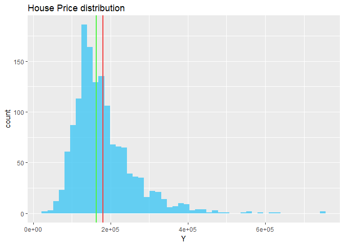
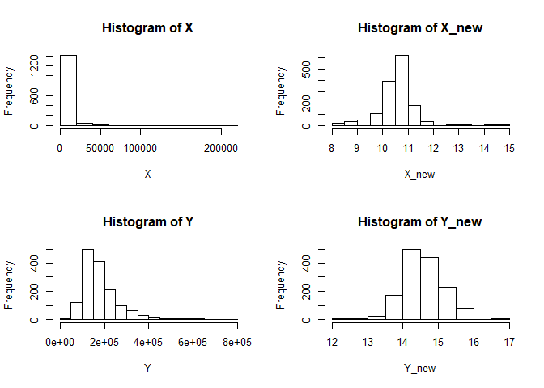
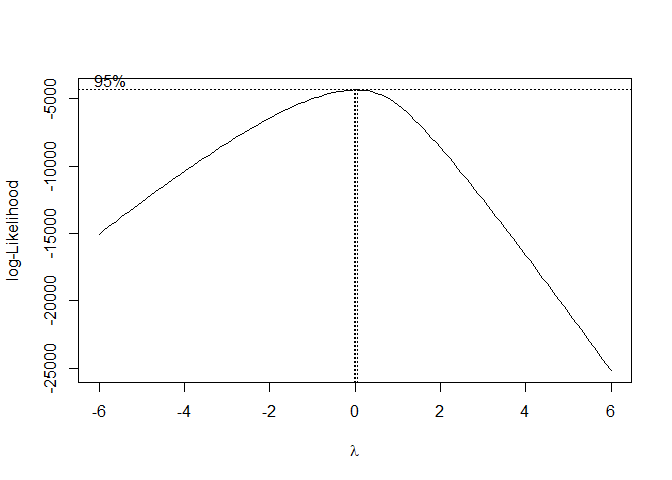
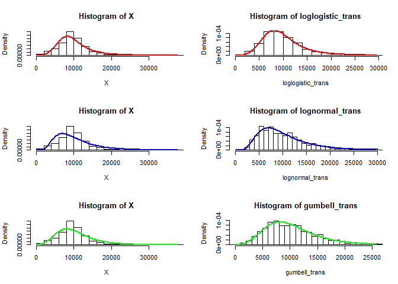

YMai\_final\_project\_part1
================
Yun Mai
December 17, 2017

``` r
install.packages('geoR')
remove.packages(tidyr)
install.packages("tidyr")
packageVersion("tidyr")
install.packages('Hmisc')
install.packages('fitdistrplus')
install.packages('actuar')
install.packages('flexsurv')
install.packages('vtreat') # One-hot-encoding and data cleaning
install.packages('Metrics') #rmse()
install.packages('broom') #glance() 
install.packages('ranger') # random forest model
install.packages('xgboost') # gradient boost model
```

#### Load the packages

``` r
suppressWarnings(suppressMessages(library(tidyr)))
suppressWarnings(suppressMessages(library(dplyr)))
suppressWarnings(suppressMessages(library(knitr)))
suppressWarnings(suppressMessages(library(ggplot2)))
suppressWarnings(suppressMessages(library(graphics)))
#suppressWarnings(suppressMessages(library(gplots)))
suppressWarnings(suppressMessages(library(pastecs)))
suppressWarnings(suppressMessages(library(MASS)))
suppressWarnings(suppressMessages(library(fitdistrplus)))
suppressWarnings(suppressMessages(library(actuar)))
suppressWarnings(suppressMessages(library(geoR))) #boxcoxfit
suppressWarnings(suppressMessages(library(Hmisc))) 
suppressWarnings(suppressMessages(library(flexsurv))) #dllogis

suppressWarnings(suppressMessages(library(vtreat)))  # One-hot-encoding and data cleaning
suppressWarnings(suppressMessages(library(magrittr)))  # use_series suppressWarnings(suppressMessages(library(Metrics))) #rmse()
suppressWarnings(suppressMessages(library(broom)))  #glance() 
suppressWarnings(suppressMessages(library(ranger))) # random forest model
suppressWarnings(suppressMessages(library(xgboost))) # gradient boost model
#suppressWarnings(suppressMessages(library( )))
```

Data source
-----------

compete in the House Prices: Advanced Regression Techniques competition. <https://www.kaggle.com/c/house-prices-advanced-regression-techniques> .

Pick one of the quantitative independent variables from the training data set (train.csv) , and define that variable as X. Pick SalePrice as the dependent variable, and define it as Y for the next analysis.

Data fields

Here's a brief version of what you'll find in the data description file.

SalePrice - the property's sale price in dollars. This is the target variable that you're trying to predict.

MSSubClass: The building class

MSZoning: The general zoning classification

LotFrontage: Linear feet of street connected to property

LotArea: Lot size in square feet

Street: Type of road access

Alley: Type of alley access

LotShape: General shape of property

LandContour: Flatness of the property

Utilities: Type of utilities available

LotConfig: Lot configuration

LandSlope: Slope of property

Neighborhood: Physical locations within Ames city limits

Condition1: Proximity to main road or railroad

Condition2: Proximity to main road or railroad (if a second is present)

BldgType: Type of dwelling

HouseStyle: Style of dwelling

OverallQual: Overall material and finish quality

OverallCond: Overall condition rating

YearBuilt: Original construction date

YearRemodAdd: Remodel date

RoofStyle: Type of roof

RoofMatl: Roof material

Exterior1st: Exterior covering on house

Exterior2nd: Exterior covering on house (if more than one material)

MasVnrType: Masonry veneer type

MasVnrArea: Masonry veneer area in square feet

ExterQual: Exterior material quality

ExterCond: Present condition of the material on the exterior

Foundation: Type of foundation

BsmtQual: Height of the basement

BsmtCond: General condition of the basement

BsmtExposure: Walkout or garden level basement walls

BsmtFinType1: Quality of basement finished area

BsmtFinSF1: Type 1 finished square feet

BsmtFinType2: Quality of second finished area (if present)

BsmtFinSF2: Type 2 finished square feet

BsmtUnfSF: Unfinished square feet of basement area

TotalBsmtSF: Total square feet of basement area

Heating: Type of heating

HeatingQC: Heating quality and condition

CentralAir: Central air conditioning

Electrical: Electrical system

1stFlrSF: First Floor square feet

2ndFlrSF: Second floor square feet

LowQualFinSF: Low quality finished square feet (all floors)

GrLivArea: Above grade (ground) living area square feet

BsmtFullBath: Basement full bathrooms

BsmtHalfBath: Basement half bathrooms

FullBath: Full bathrooms above grade

HalfBath: Half baths above grade

Bedroom: Number of bedrooms above basement level

Kitchen: Number of kitchens

KitchenQual: Kitchen quality

TotRmsAbvGrd: Total rooms above grade (does not include bathrooms)

Functional: Home functionality rating

Fireplaces: Number of fireplaces

FireplaceQu: Fireplace quality

GarageType: Garage location

GarageYrBlt: Year garage was built

GarageFinish: Interior finish of the garage

GarageCars: Size of garage in car capacity

GarageArea: Size of garage in square feet

GarageQual: Garage quality

GarageCond: Garage condition

PavedDrive: Paved driveway

WoodDeckSF: Wood deck area in square feet

OpenPorchSF: Open porch area in square feet

EnclosedPorch: Enclosed porch area in square feet

3SsnPorch: Three season porch area in square feet

ScreenPorch: Screen porch area in square feet

PoolArea: Pool area in square feet

PoolQC: Pool quality

Fence: Fence quality

MiscFeature: Miscellaneous feature not covered in other categories

MiscVal: $Value of miscellaneous feature

MoSold: Month Sold

YrSold: Year Sold

SaleType: Type of sale

SaleCondition: Condition of sale

load packages.

``` r
house <- read.csv('https://raw.githubusercontent.com/YunMai-SPS/DATA605_homework/master/data605_final_project/train.csv')

kable(head(house,5))
```

|   Id|  MSSubClass| MSZoning |  LotFrontage|  LotArea| Street | Alley | LotShape | LandContour | Utilities | LotConfig | LandSlope | Neighborhood | Condition1 | Condition2 | BldgType | HouseStyle |  OverallQual|  OverallCond|  YearBuilt|  YearRemodAdd| RoofStyle | RoofMatl | Exterior1st | Exterior2nd | MasVnrType |  MasVnrArea| ExterQual | ExterCond | Foundation | BsmtQual | BsmtCond | BsmtExposure | BsmtFinType1 |  BsmtFinSF1| BsmtFinType2 |  BsmtFinSF2|  BsmtUnfSF|  TotalBsmtSF| Heating | HeatingQC | CentralAir | Electrical |  X1stFlrSF|  X2ndFlrSF|  LowQualFinSF|  GrLivArea|  BsmtFullBath|  BsmtHalfBath|  FullBath|  HalfBath|  BedroomAbvGr|  KitchenAbvGr| KitchenQual |  TotRmsAbvGrd| Functional |  Fireplaces| FireplaceQu | GarageType |  GarageYrBlt| GarageFinish |  GarageCars|  GarageArea| GarageQual | GarageCond | PavedDrive |  WoodDeckSF|  OpenPorchSF|  EnclosedPorch|  X3SsnPorch|  ScreenPorch|  PoolArea| PoolQC | Fence | MiscFeature |  MiscVal|  MoSold|  YrSold| SaleType | SaleCondition |  SalePrice|
|----:|-----------:|:---------|------------:|--------:|:-------|:------|:---------|:------------|:----------|:----------|:----------|:-------------|:-----------|:-----------|:---------|:-----------|------------:|------------:|----------:|-------------:|:----------|:---------|:------------|:------------|:-----------|-----------:|:----------|:----------|:-----------|:---------|:---------|:-------------|:-------------|-----------:|:-------------|-----------:|----------:|------------:|:--------|:----------|:-----------|:-----------|----------:|----------:|-------------:|----------:|-------------:|-------------:|---------:|---------:|-------------:|-------------:|:------------|-------------:|:-----------|-----------:|:------------|:-----------|------------:|:-------------|-----------:|-----------:|:-----------|:-----------|:-----------|-----------:|------------:|--------------:|-----------:|------------:|---------:|:-------|:------|:------------|--------:|-------:|-------:|:---------|:--------------|----------:|
|    1|          60| RL       |           65|     8450| Pave   | NA    | Reg      | Lvl         | AllPub    | Inside    | Gtl       | CollgCr      | Norm       | Norm       | 1Fam     | 2Story     |            7|            5|       2003|          2003| Gable     | CompShg  | VinylSd     | VinylSd     | BrkFace    |         196| Gd        | TA        | PConc      | Gd       | TA       | No           | GLQ          |         706| Unf          |           0|        150|          856| GasA    | Ex        | Y          | SBrkr      |        856|        854|             0|       1710|             1|             0|         2|         1|             3|             1| Gd          |             8| Typ        |           0| NA          | Attchd     |         2003| RFn          |           2|         548| TA         | TA         | Y          |           0|           61|              0|           0|            0|         0| NA     | NA    | NA          |        0|       2|    2008| WD       | Normal        |     208500|
|    2|          20| RL       |           80|     9600| Pave   | NA    | Reg      | Lvl         | AllPub    | FR2       | Gtl       | Veenker      | Feedr      | Norm       | 1Fam     | 1Story     |            6|            8|       1976|          1976| Gable     | CompShg  | MetalSd     | MetalSd     | None       |           0| TA        | TA        | CBlock     | Gd       | TA       | Gd           | ALQ          |         978| Unf          |           0|        284|         1262| GasA    | Ex        | Y          | SBrkr      |       1262|          0|             0|       1262|             0|             1|         2|         0|             3|             1| TA          |             6| Typ        |           1| TA          | Attchd     |         1976| RFn          |           2|         460| TA         | TA         | Y          |         298|            0|              0|           0|            0|         0| NA     | NA    | NA          |        0|       5|    2007| WD       | Normal        |     181500|
|    3|          60| RL       |           68|    11250| Pave   | NA    | IR1      | Lvl         | AllPub    | Inside    | Gtl       | CollgCr      | Norm       | Norm       | 1Fam     | 2Story     |            7|            5|       2001|          2002| Gable     | CompShg  | VinylSd     | VinylSd     | BrkFace    |         162| Gd        | TA        | PConc      | Gd       | TA       | Mn           | GLQ          |         486| Unf          |           0|        434|          920| GasA    | Ex        | Y          | SBrkr      |        920|        866|             0|       1786|             1|             0|         2|         1|             3|             1| Gd          |             6| Typ        |           1| TA          | Attchd     |         2001| RFn          |           2|         608| TA         | TA         | Y          |           0|           42|              0|           0|            0|         0| NA     | NA    | NA          |        0|       9|    2008| WD       | Normal        |     223500|
|    4|          70| RL       |           60|     9550| Pave   | NA    | IR1      | Lvl         | AllPub    | Corner    | Gtl       | Crawfor      | Norm       | Norm       | 1Fam     | 2Story     |            7|            5|       1915|          1970| Gable     | CompShg  | Wd Sdng     | Wd Shng     | None       |           0| TA        | TA        | BrkTil     | TA       | Gd       | No           | ALQ          |         216| Unf          |           0|        540|          756| GasA    | Gd        | Y          | SBrkr      |        961|        756|             0|       1717|             1|             0|         1|         0|             3|             1| Gd          |             7| Typ        |           1| Gd          | Detchd     |         1998| Unf          |           3|         642| TA         | TA         | Y          |           0|           35|            272|           0|            0|         0| NA     | NA    | NA          |        0|       2|    2006| WD       | Abnorml       |     140000|
|    5|          60| RL       |           84|    14260| Pave   | NA    | IR1      | Lvl         | AllPub    | FR2       | Gtl       | NoRidge      | Norm       | Norm       | 1Fam     | 2Story     |            8|            5|       2000|          2000| Gable     | CompShg  | VinylSd     | VinylSd     | BrkFace    |         350| Gd        | TA        | PConc      | Gd       | TA       | Av           | GLQ          |         655| Unf          |           0|        490|         1145| GasA    | Ex        | Y          | SBrkr      |       1145|       1053|             0|       2198|             1|             0|         2|         1|             4|             1| Gd          |             9| Typ        |           1| TA          | Attchd     |         2000| RFn          |           3|         836| TA         | TA         | Y          |         192|           84|              0|           0|            0|         0| NA     | NA    | NA          |        0|      12|    2008| WD       | Normal        |     250000|

``` r
Y <- house$SalePrice
X <- house$LotArea         # Lot size in square feet
# X <- house$OverallCond   #Overall condition rating
# X <- house$OverallQual   #Overall material and finish quality

summary(X)
```

    ##    Min. 1st Qu.  Median    Mean 3rd Qu.    Max. 
    ##    1300    7554    9478   10517   11602  215245

``` r
summary(Y)
```

    ##    Min. 1st Qu.  Median    Mean 3rd Qu.    Max. 
    ##   34900  129975  163000  180921  214000  755000

**View the distribution of independent and dependent variables.**

``` r
p <- ggplot(house,aes(x=Y))
p <- p + geom_histogram(bins=50, fill = "#41c7f4",alpha = .8)
p <- p + ggtitle('House Price distribution')
p <- p + geom_vline(xintercept = mean(Y), color='#f44141',size=1, show.legend = T)
p <- p + geom_vline(xintercept = median(Y), color='#50f442', size=1, show.legend = T)

p
```



**The house orice skewed to the right and mean(red) greater than the median(green) **

1.Probability
-------------

#### Calculate as a minimum the below probabilities a through c. Assume the small letter "x" is estimated as the 1st quartile of the X variable, and the small letter "y" is estimated as the 2d quartile of the Y variable. Interpret the meaning of all probabilities.

#### a. P(X&gt;x | Y&gt;y) b. P(X&gt;x & Y&gt;y) c. P(X<x | Y>y)

1.  P(X&gt;x | Y&gt;y)

1st quartile of X and 1st Quartile of Y

``` r
x <- quantile(X, 0.25)
cat('The first quatile of X is' , x)
```

    ## The first quatile of X is 7553.5

``` r
y <- quantile(Y, 0.25)
cat('The first quatile of Y is' , y)
```

    ## The first quatile of Y is 129975

*P*(*A*|*B*)=*P*(*A* ∩ *B*)/*P*(*B*)

``` r
sub_xy <- subset(house , !is.na(LotArea | SalePrice) & (LotArea > x & SalePrice > y))
sub_y <- subset(house , !is.na(SalePrice) & SalePrice > y)

# remove rows containing NA in SalePrice if any
sale_NoNA <- house %>% drop_na(SalePrice)

p_xy <- nrow(sub_xy)/nrow(sale_NoNA)
p_y <- nrow(sub_y)/nrow(sale_NoNA)

p_a <- p_xy/p_y
  
cat('
P(X>x | Y>y) is the probability of LotArea is higer then 1st quantile (more then 7553.5) given that SalePrice is higher then 1st quantile (higer then 129975). P(X>x | Y>y) = ',round(p_a,4))
```

    ## 
    ## P(X>x | Y>y) is the probability of LotArea is higer then 1st quantile (more then 7553.5) given that SalePrice is higher then 1st quantile (higer then 129975). P(X>x | Y>y) =  0.8201

1.  P(X&gt;x & Y&gt;y)

``` r
sub_xy <- subset(house , !is.na(LotArea | SalePrice) &(LotArea > x & SalePrice > y) )
sub_y <- subset(house , !is.na(SalePrice) & SalePrice > y)
p_b <- nrow(sub_xy)/nrow(sale_NoNA)
cat('
P(X>x & Y>y) is the probability of LotArea is higer then 1st quantile (more then 7553.5) and  SalePrice is higher then 1st quantile (higer then 129975). P(X>x | Y>y) = ',round(p_b,4))
```

    ## 
    ## P(X>x & Y>y) is the probability of LotArea is higer then 1st quantile (more then 7553.5) and  SalePrice is higher then 1st quantile (higer then 129975). P(X>x | Y>y) =  0.6151

1.  P(X<x | Y>y)

``` r
sub_xy <- subset(house , !is.na(LotArea | SalePrice) &(LotArea < x & SalePrice > y) )
sub_y <- subset(house , !is.na(SalePrice) & SalePrice > y)

p_xy <- nrow(sub_xy)/nrow(sale_NoNA)
p_y <- nrow(sub_y)/nrow(sale_NoNA)
p_c <- p_xy/p_y
  
cat('
P(X>x & Y>y) is the probability of LotArea is lower then 1st quantile (more then 7553.5) given that SalePrice is higher then 1st quantile (higer then 129975). P(X>x | Y>y) = ',round(p_c,4))
```

    ## 
    ## P(X>x & Y>y) is the probability of LotArea is lower then 1st quantile (more then 7553.5) given that SalePrice is higher then 1st quantile (higer then 129975). P(X>x | Y>y) =  0.1799

#### Does splitting the training data in this fashion make them independent? In other words, does P(XY)=P(X)P(Y))? Check mathematically, and then evaluate by running a Chi Square test for association.

P(X&gt;x & Y&gt;y) = P(X&gt;x)P(Y&gt;y)?

``` r
sub_x <- subset(house , !is.na(LotArea) & (LotArea > x))
sub_y <- subset(house , !is.na(SalePrice) & SalePrice > y)
sub_xy <- subset(house , !is.na(LotArea | SalePrice) &(LotArea < x & SalePrice > y) )

p_x <- nrow(sub_x)/nrow(sale_NoNA)
p_y <- nrow(sub_y)/nrow(sale_NoNA)
p_xy <- nrow(sub_xy)/nrow(sale_NoNA)

p_xy == p_x*p_y
```

    ## [1] FALSE

So we know *P*(*X* &gt; *x* ∩ *Y* &gt; *y*)≠*P*(*X* &gt; *x*)*P*(*Y* &gt; *y*). Splitting the training data in this fashion does not make X and Y independent.

P(X<x | Y>y) = P(X<x)P(Y>y)?

``` r
sub_x <- subset(house , !is.na(LotArea) & (LotArea < x))
sub_y <- subset(house , !is.na(SalePrice) & SalePrice > y)
sub_xy <- 

p_x <- nrow(sub_x)/nrow(sale_NoNA)
p_y <- nrow(sub_y)/nrow(sale_NoNA)
p_xy <- p_c

p_xy == p_x*p_y
```

    ## [1] FALSE

So we know *P*(*X* &lt; *x* ∩ *Y* &gt; *y*)≠*P*(*X* &lt; *x*)*P*(*Y* &gt; *y*). Splitting the training data in this fashion does not make X and Y independent.

**Chi Square test**

Null hypothesis (H0): the row and the SalePrice of the LotArea are independent.

Alternative hypothesis (H1):the SalePrice of the LotArea are dependent

To test the hypothesis whether the SalePrice is independent of the LotArea at .05 significance level, first the contingency table will be created:

``` r
house$SalePrice_ctg =  ifelse(house$SalePrice <= y ,'<= Q1','>Q1')
house$LotArea_ctg =  ifelse(house$LotArea <= x ,'<= q1','>q1')

(tbl <- table(house$SalePrice_ctg,house$LotArea_ctg))
```

    ##        
    ##         <= q1 >q1
    ##   <= Q1   168 197
    ##   >Q1     197 898

``` r
mosaicplot(tbl, shade = TRUE, las=2, main = '', xlab ="LotArea", ylab="SalePrice",)
```


``` r
chisq.test(tbl) 
```

    ## 
    ##  Pearson's Chi-squared test with Yates' continuity correction
    ## 
    ## data:  tbl
    ## X-squared = 113.27, df = 1, p-value < 2.2e-16

As the p-value 9.273e-09 is less than the .05 significance level, the null hypothesis is rejected and the conclusion is that the SalePrice of the LotArea are dependent.

2. Descriptive and Inferential Statistics.
------------------------------------------

#### Provide univariate descriptive statistics and appropriate plots for both variables. Provide a scatterplot of X and Y. Transform both variables simultaneously using Box-Cox transformations.

``` r
var_NoNA <- house[,c('SalePrice','LotArea')] %>% drop_na()
kable(stat.desc(var_NoNA))
```

|              |     SalePrice|       LotArea|
|--------------|-------------:|-------------:|
| nbr.val      |  1.460000e+03|  1.460000e+03|
| nbr.null     |  0.000000e+00|  0.000000e+00|
| nbr.na       |  0.000000e+00|  0.000000e+00|
| min          |  3.490000e+04|  1.300000e+03|
| max          |  7.550000e+05|  2.152450e+05|
| range        |  7.201000e+05|  2.139450e+05|
| sum          |  2.641449e+08|  1.535457e+07|
| median       |  1.630000e+05|  9.478500e+03|
| mean         |  1.809212e+05|  1.051683e+04|
| SE.mean      |  2.079105e+03|  2.612216e+02|
| CI.mean.0.95 |  4.078355e+03|  5.124101e+02|
| var          |  6.311111e+09|  9.962565e+07|
| std.dev      |  7.944250e+04|  9.981265e+03|
| coef.var     |  4.391000e-01|  9.490756e-01|

``` r
p <- ggplot(var_NoNA,aes(x=LotArea, y = SalePrice))
p <- p + geom_point(color='#414af4')
p + geom_smooth(method = lm)
```


**Transform both variables simultaneously using Box-Cox transformations.**

``` r
#library(geoR)
bc <- boxcoxfit(X, lambda2 = TRUE)

lambda1 <- bc$lambda[1]

#X.new = (X ^ lambda - 1) / lambda
(X_new <- (X^lambda1 - 1) / lambda1)
```

    ##    [1] 10.433649 10.602777 10.813940 10.595842 11.131535 11.117796
    ##    [7] 10.668152 10.706908 10.009006 10.262037 10.807995 10.891666
    ##   [13] 11.004033 10.741102 10.774223 10.009006 10.812872 10.758380
    ##   [19] 11.077215 10.286672 11.127286 10.267177 10.622283  9.526158
    ##   [25] 10.401332 11.128703 10.222399 10.840726 11.313410 10.051974
    ##   [31] 10.441454 10.448286 10.789885 10.728537 10.242903 11.049785
    ##   [37] 10.766754 10.446426 10.348378  9.991776 10.465830 11.360902
    ##   [43] 10.543404 10.546290 10.352206 10.303655 10.988857 10.795548
    ##   [49]  9.595447 10.318045 11.094171 10.034446 10.437089 12.858989
    ##   [55] 10.210279 10.680104  8.924420 10.860021 11.075940 10.222399
    ##   [61] 11.014742 10.222399 10.076219 10.696352 10.571290 10.601531
    ##   [67] 11.581914 10.742728  9.638972 11.251848 11.072894 10.293456
    ##   [73] 10.675650 10.683369  9.936470  8.284748 10.437557 10.462308
    ##   [79] 10.756773 10.714326 11.007337  9.608193 10.684151 10.501150
    ##   [85] 10.446116 11.291567 10.890208  9.439738 10.436776 10.372823
    ##   [91] 10.222399 10.441454 11.043973 10.222399 10.565900 10.625416
    ##   [97] 10.691692 10.774345 10.737721 10.563482 10.734960 10.547155
    ##  [103] 10.188711 10.709470 10.320769 10.571290 10.759491  9.983078
    ##  [109] 10.441454 10.872130 10.592362 10.319408 10.652365 11.655061
    ##  [115] 10.233143  9.180203 10.856690 10.447046 10.941441 10.435370
    ##  [121] 11.684110  9.996104 10.583832 10.343369 11.371891 10.143356
    ##  [127]  9.726229  9.575508 10.291894 10.513166 11.125866 10.924902
    ##  [133] 10.256343 10.157429 10.700868 10.709214 10.703441 10.792418
    ##  [139] 10.526834 11.237334 10.721957 10.860021 10.444564 10.700868
    ##  [145] 10.531797  8.863695 10.009006 10.589571 10.276169 10.034446
    ##  [151] 10.703570 11.096301 11.181809 11.057962 10.824576 10.602777
    ##  [157] 10.222399 10.900496 10.960347 11.545820 10.798430 11.076528
    ##  [163] 10.920297  9.869339  9.845393 10.671051 10.748089 10.729799
    ##  [169] 10.401012 11.341904 10.939493 12.222004  9.822488 10.682977
    ##  [175] 10.945761 10.967052 10.660878 11.072796 11.401713 10.444564
    ##  [181]  8.641230 10.291546 10.525956 10.834663 10.265229 11.776049
    ##  [187] 10.649961 10.710494 10.188711  9.724908 10.730807 10.271239
    ##  [193] 10.519650  8.863695 10.218738  8.735348 10.577082 11.915684
    ##  [199]  9.874078 10.601531 10.448596 10.673550 10.185333  9.590198
    ##  [205]  9.283419 10.883456 11.075056 10.954038 11.141306 10.401973
    ##  [211]  9.893800 10.711772 10.463075 11.064706 10.771778 10.658489
    ##  [217] 10.433649 10.644470 11.257629  9.089720 10.515675 10.372495
    ##  [223] 10.840377 10.721957 11.055175  8.349243 10.650362  8.483619
    ##  [229] 10.444719  9.160982 10.481338 11.211941  8.349243 10.740852
    ##  [235] 10.336494  8.349243 10.483302 10.582288 10.903501 10.478462
    ##  [241] 10.517148  9.416314  9.745103 10.754793 10.499360 10.709214
    ##  [247] 10.537903 10.821040 10.821865 14.497694  9.833258  9.678394
    ##  [253] 10.420434 10.567747 10.425799 10.478008 10.486016 10.489477
    ##  [259] 10.947808 10.976259 11.540065 10.601116 10.436932  9.869339
    ##  [265]  9.804178 10.910155 10.808829 10.425799 10.166413 10.347545
    ##  [271] 10.750576 12.509185 10.873607 10.602777 10.412190 10.234050
    ##  [277] 10.545714 11.528908 11.149334 10.657692 10.818322 10.222399
    ##  [283]  9.761404 10.604436 10.363295  9.534409 10.628271 10.381796
    ##  [289] 10.632745 10.476795 11.253404  9.913008 10.832675 11.341094
    ##  [295] 10.602777 10.350876 11.078685 10.258303 10.866317 11.106802
    ##  [301] 11.265357 11.305530 11.078097 10.630170 11.474554 10.707421
    ##  [307] 11.055375 10.348045 10.937759 10.941657 10.308297 10.361316
    ##  [313] 10.327893 14.938511 10.602777 10.327047 11.007852 10.517148
    ##  [319] 10.643665 11.117796 11.308272 10.911151 10.706652  9.943228
    ##  [325] 10.816902  9.745103 10.765157 10.854849 10.887623 10.068049
    ##  [331] 10.737596 10.390064 10.741478 10.393616 10.523320 14.548393
    ##  [337] 11.121789 10.536887 11.120650 10.944034 11.125014 10.425799
    ##  [343] 10.448286 10.494727  8.898596 10.074793 10.983622 11.415390
    ##  [349]  8.825763 11.617700 10.331273  9.813859 10.529464 10.444564
    ##  [355] 10.425799 10.813821 10.553193  9.526158 10.172117 10.901387
    ##  [361] 10.283180 10.538193 10.240740  8.349243 11.504739 10.745847
    ##  [367] 10.588872 10.539063 10.327893 10.634233 10.381145 11.377986
    ##  [373] 10.217821 10.738849 10.393938 10.659684 10.494278 10.801187
    ##  [379] 10.830918 10.381471  9.745103 10.222399 10.552763 10.517148
    ##  [385] 12.935773  9.160982 10.427372 10.222399 10.572281 10.952000
    ##  [391] 10.426586 10.923259 10.416160 10.266646 10.674732 10.598759
    ##  [397] 10.222399 10.291894 10.512280 10.381796 11.196282 10.482396
    ##  [403] 10.683369 10.910155 10.704598 10.655830 10.719418 11.250377
    ##  [409] 11.121505 10.759491 10.598759 12.341760  9.579932 10.511245
    ##  [415] 10.811327 10.502192 10.335317 11.744181 10.387476 10.433649
    ##  [421] 10.196559 11.339146 11.702835 10.546290 10.517148  9.237772
    ##  [427] 10.986556 10.455854 10.139863 10.838281  8.349243  9.889598
    ##  [433]  8.517623 10.764296  8.497728 10.742977  9.579048  9.983078
    ##  [439]  9.543215 10.939059 11.237770 10.912145 10.034446  9.430220
    ##  [445] 10.479825 10.637609 11.327485 10.809662 10.456932  9.983078
    ##  [451]  9.912318 13.339450 10.561060 10.517148 10.560204 10.602777
    ##  [457]  9.628507 12.938933  9.770886 10.188148 10.361976 10.222399
    ##  [463] 10.406931 10.898824 10.430514  9.115852 10.738097 10.586074
    ##  [469] 10.834897 10.559347 10.151085 10.894802  9.346273 11.197541
    ##  [475]  9.828373 10.438337 11.020168 11.077019 10.739225  9.966616
    ##  [481] 11.289380 10.882892  8.852531  9.608193 10.320769 10.602777
    ##  [487] 10.694930 10.926980 10.759491  8.228438  8.934034 10.587474
    ##  [493] 11.250551 10.349877  9.935114 10.341193 10.975204 10.534708
    ##  [499] 10.327893 10.282306  8.497728 10.630577 10.541958 11.252626
    ##  [505]  8.750857 10.292935 10.596398 10.338342 10.602777 10.602777
    ##  [511] 11.159443 10.145679 10.531797 10.544415 10.733828 10.924464
    ##  [517] 10.715346 10.684412 10.593198 10.773979 10.759491 10.898824
    ##  [523]  9.745103 12.543879 10.876218 10.276169 11.037933 11.194931
    ##  [529] 10.531505 12.260436 10.683369 10.016476 10.222399  9.745103
    ##  [535] 10.525371 10.185333 10.505909 10.979735 10.849425 10.834312
    ##  [541] 11.163318 10.783957 10.675519  9.474279 11.376722 11.091068
    ##  [547] 10.477856 10.230420 10.399568 10.571290  9.469491  9.983078
    ##  [553] 10.801546 10.483906 10.737721 10.063534 11.186076 10.788798
    ##  [559] 11.710455  9.166617 10.824693 10.658357 11.097847 11.704712
    ##  [565] 11.042566 10.158388 10.807757 10.679580 10.936131 10.191332
    ##  [571] 11.017713 10.246320 11.023637 10.652632 10.721957 10.438337
    ##  [577] 10.045324 10.875084  9.321129 10.916778 11.161843 10.976470
    ##  [583] 10.882328 11.057962 10.009006 10.836648 10.692081 10.478311
    ##  [589] 11.898129 10.531797 10.413144 11.055773 10.108017  9.589321
    ##  [595] 10.359664 10.820095  9.319698  9.430220 11.005686  8.537218
    ##  [601] 10.775077 10.517148 10.662469  9.160982 10.986870 11.067869
    ##  [607] 10.950926 10.327893 10.918758 10.351874 10.790006 10.708574
    ##  [613] 10.887286 10.426113  8.199337 10.487372 10.338174 10.227327
    ##  [619] 10.865632 10.927089 10.401653 10.759491 10.197305  8.641230
    ##  [625] 10.709214 10.657027 10.937759 10.602777 10.855539 10.520091
    ##  [631] 10.517148  9.633891 10.888972 10.553480 10.181382 10.771289
    ##  [637] 10.009006  9.983078 10.483906  9.449837 10.973620 10.194695
    ##  [643] 11.093299 10.758627 10.544415 10.725757 10.222399 10.715855
    ##  [649] 10.310869  8.528110 10.381796 10.529464 10.479825 10.698934
    ##  [655] 10.713943  8.349243 10.657958 10.222399 11.407911 10.648624
    ##  [661] 10.942306 12.752782 11.063915 10.658622 11.648306 10.807280
    ##  [667] 11.479263 10.381796 11.123497 10.854849 10.462002 10.113773
    ##  [673] 10.813940 11.148589 10.546290  8.740353 10.602777 10.520384
    ##  [679] 10.882666 10.649694 10.363295  9.608193  9.036296 10.813702
    ##  [685] 11.350066  9.761146 10.684282  9.772162 10.375929 10.289633
    ##  [691]  9.586687 11.689305 11.955974  9.845393 10.009006 11.088542
    ##  [697]  9.983078 10.071731 10.433649  9.543820 11.138213 10.602777
    ##  [703] 10.948131 10.298824 10.425799  9.892867 14.032577 10.034446
    ##  [709] 10.519797 10.215434  9.497029 10.474062  9.656605 10.640034
    ##  [715] 11.059651 10.675519 10.759491 10.657027 10.727274 10.646348
    ##  [721] 10.100637  9.586687 10.380983 10.389418 11.036521 10.177797
    ##  [727] 11.699386 10.243083 10.840377 10.034446  9.842732 10.601393
    ##  [733] 10.832089 10.657027 10.513904 10.759491 10.448286 10.717256
    ##  [739] 10.759491 10.562485 10.602777 10.141028 10.433649 10.995530
    ##  [745]  9.844184 10.511688 10.486619 10.866317 10.733703 10.426586
    ##  [751] 10.487372 10.319408 10.551471 10.688577 10.349711  9.180203
    ##  [757] 10.755660 10.856690  8.735348 10.928510 10.531797 10.168507
    ##  [763] 10.463075 10.579054 10.595703 11.162028 10.711900 10.955645
    ##  [769] 10.531797 12.946203 10.231873 10.498913 10.331104 10.676831
    ##  [775] 11.128325  9.608193 10.809186 11.042968 10.425799 10.725757
    ##  [781] 10.340523 10.213779 11.310429 10.531943 10.046989 10.628814
    ##  [787] 10.759491 10.675782  9.983078 10.922821  9.160982 10.823751
    ##  [793] 10.646348 10.540222 10.763435 10.425799 10.393455 10.306923
    ##  [799] 11.059750 10.222399 10.986347  9.692004 10.393777 11.096301
    ##  [805] 10.517148 10.930364 10.623373 11.679724 11.047984 10.377725
    ##  [811] 10.675519  9.590198 10.474062 10.623373 10.401653 10.915346
    ##  [817] 10.834546 11.034399 10.489778 10.061683 10.227144  9.983078
    ##  [823] 10.943386 10.643665 10.809900 11.181809 10.011145 10.445961
    ##  [829] 12.082066  8.874764 10.888972  9.160175 10.595564 10.657559
    ##  [835] 10.340523 10.602777 10.377725  8.349243 10.592362 10.873948
    ##  [841] 10.917328 10.714326 10.520091 10.361316 10.972351 11.340120
    ##  [847] 10.563055 11.245783 12.722867 10.602777  9.589321  9.166617
    ##  [853] 10.209172 10.910708 11.439780 10.165841 10.780315 10.381796
    ##  [859] 10.709214 10.787469 10.300897 10.857725 10.612702 10.349877
    ##  [865] 10.463075 10.479825 10.741603 10.179685 11.178076 10.648758
    ##  [871] 10.108017 10.479825 10.501150 10.916117  9.920569 10.517148
    ##  [877] 11.908504 10.492480 10.875651 10.185333 10.189835 11.083378
    ##  [883] 10.607748 10.026864 10.213227  9.775729 10.424696 11.325354
    ##  [889] 11.275169 10.917878 10.371840 10.806087 10.428001 11.036319
    ##  [895] 10.188711 10.195814 10.482094 10.188711 10.998958 10.184017
    ##  [901] 10.247757 10.474062 10.340523 11.186891 10.020301 10.646348
    ##  [907] 11.058061 10.843284 10.500106 10.964289 10.854849 10.558633
    ##  [913] 10.009006 10.040732  9.085456  8.569870 10.517148 11.379565
    ##  [919] 11.020168 10.787469 10.435526 10.483906 10.688187 10.363295
    ##  [925] 10.688577 11.253404 10.900050 10.643665 10.881989 11.007955
    ##  [931] 10.506058 10.531797 10.862887 10.439429 12.030985  9.944351
    ##  [937] 10.668020 10.613114 10.481338 11.842244 10.969704 10.480582
    ##  [943] 10.312752 11.892940 11.142335 10.490379 10.387962 11.157316
    ##  [949] 11.107378 10.569165 10.222399 10.327893 10.222399 10.793021
    ##  [955] 10.574825 10.210648  8.027836 10.262037 10.433649  8.888719
    ##  [961] 10.223678 10.925230  8.750857 10.891554 10.821748 10.688187
    ##  [967] 10.602777 10.256699  9.966616 10.706908 10.759491  8.728645
    ##  [973] 10.343369 10.859333 10.833260  8.927311  9.961084  9.541398
    ##  [979] 10.581867 10.489778 10.913691 10.922601  9.160982 10.813940
    ##  [985] 10.673550 10.769330  9.823471 10.678010 10.905279 10.381796
    ##  [991] 10.582147 11.420838 10.624735 10.494278 10.950067  9.667958
    ##  [997] 10.741978 10.868257 10.628271 10.139863 10.684151  9.845393
    ## [1003] 10.895361 10.843284  9.160982 10.423435 10.917328  8.699769
    ## [1009] 10.913250  9.983078 11.673471 10.633556 10.733577 10.222399
    ## [1015] 10.862200 10.425799 10.887061  9.941879 10.757515  9.090996
    ## [1021] 10.189835 10.259549 10.580320  9.160982 11.243610 10.310869
    ## [1027] 10.560632 10.591664 10.587754  8.349243 10.200653 11.274999
    ## [1033] 11.157778 10.381796 10.048029 10.843284 10.996778 10.552045
    ## [1039]  8.234180  8.187511 11.020168 10.536161  9.840794 10.882102
    ## [1045] 10.602777 11.075743 11.291315 10.552763 11.702835 10.796029
    ## [1051] 10.516117 10.805013 10.588872 10.451071 10.827751 10.827046
    ## [1057] 10.195068 12.141186 10.820803 10.816902  9.724115 11.445812
    ## [1063] 11.067869  9.983078 10.783957 11.106802 10.334138 10.624735
    ## [1069]  9.443982 10.602777 10.677093 10.866317 10.291025 10.353037
    ## [1075] 10.450143 11.020168 10.759491 11.275594  9.589321 10.483604
    ## [1081] 10.788798 10.276169 10.479674 10.487372 11.010530 10.527273
    ## [1087]  8.552686 10.731311  8.863695  9.213959 10.448286  8.666723
    ## [1093] 10.425799 10.550609  9.953970 10.563055 10.162979  9.353620
    ## [1099]  9.983078 10.886723 10.425799 10.624463 10.185333 10.503829
    ## [1105]  8.579320 10.928400 10.703698 11.794183 10.371676 10.827163
    ## [1111] 10.361316 10.719418 10.203993 10.505761  9.845393 10.909602
    ## [1117] 10.319408 10.625280 11.089903 10.286672 10.404055 10.668152
    ## [1123] 10.506206 10.575531 10.535435 10.713560  9.349426 11.160644
    ## [1129] 10.877238 10.222399 10.328570 10.748587 10.643665 10.633962
    ## [1135] 10.483302 10.021786 10.602777 10.055701 10.632745 10.476947
    ## [1141] 10.249550 10.696869 10.652365 10.517148 10.920077 10.034446
    ## [1147] 10.807995 10.900162  9.915992 10.517148 10.406772 11.427257
    ## [1153] 11.117796  9.958865 11.077705 10.755536 10.567747  9.745363
    ## [1159] 10.892563 10.534708  8.735348 11.179534 10.475884 10.996985
    ## [1165] 11.299778 10.594590 10.718782 10.765894 11.080447 12.385356
    ## [1171] 10.640976 10.534708  9.461149 11.448067 11.333042 10.744351
    ## [1177] 10.176095  9.439411 10.307610 10.415525 10.804416  9.889832
    ## [1183] 11.254439 10.759491 12.360894 10.621737 10.736467 10.950604
    ## [1189] 10.507542 10.276169 12.251754  8.924420 10.602777  9.608193
    ## [1195] 10.569732 10.366095 11.111975 10.494877 10.531797 10.812159
    ## [1201] 10.568173 10.709214  9.983078 10.623373 10.675519 11.170946
    ## [1207] 10.502341 10.536887 10.321619 10.681019 10.810138 10.915015
    ## [1213] 10.566327 10.689356 10.684021 10.202880 10.506800 10.463075
    ## [1219] 10.034446  8.349243 10.327893 10.401973 10.721450 10.744600
    ## [1225] 11.233659 10.719672 11.163042 10.498166 10.482698 10.346377
    ## [1231] 11.511215 10.315657 10.635854 10.917878 10.445340 11.020883
    ## [1237]  8.916192 10.943278 11.014742 10.522587 10.387152 10.636799
    ## [1243] 10.737721 11.096301 10.835714 10.910155 10.381796 10.936239
    ## [1249] 10.602777 10.222399 10.803221  9.142296 10.638013 11.410923
    ## [1255] 10.172307 10.034446 11.135583  9.474917 10.600977 10.623373
    ## [1261] 11.875431 10.602777 10.813940 11.059453  9.474917  9.367157
    ## [1267] 10.672893 11.029231 11.116367 10.825047 11.813882 10.539932
    ## [1273] 11.060545 10.844677  9.836180 10.825164 11.000721 11.436073
    ## [1279] 10.585094 10.276169 10.631255 10.369381 10.487372 10.574825
    ## [1285] 10.608024  9.983078 10.628814 12.413698  9.907713 10.791815
    ## [1291] 11.117510  8.349243 10.108017 10.675519 10.389418 10.425799
    ## [1297] 10.472237  9.346273 13.195301 10.276169 10.754793 10.276169
    ## [1303] 10.672893 10.470409  9.232050 11.025063 10.176852 10.373150
    ## [1309] 10.900162 10.213779 11.407679 10.489477 10.598898 11.179169
    ## [1315] 10.392325 10.793021 10.686756  9.527996 11.179807 10.685324
    ## [1321] 10.425799 10.113377 10.681541  9.828373 10.655164  9.332520
    ## [1327]  9.540185 10.108017 10.714326 10.529464 10.657027 10.757021
    ## [1333] 10.498913 10.222399  8.783484 10.609677 10.552906  9.493264
    ## [1339] 11.052982 10.597232 10.409005 11.077215 10.571290 10.286323
    ## [1345] 10.796389  9.983078 11.640799 11.226810 11.303032  9.808655
    ## [1351] 10.859792 10.553050  9.983078 11.174241 10.698418 10.682325
    ## [1357] 10.585654 10.958746  8.641230 11.347405 10.635854 11.299861
    ## [1363] 10.956180 10.441298  9.160175 10.276169 10.543259  8.934034
    ## [1369]  9.589321 10.738974  9.845393 10.602777 10.623373 10.831621
    ## [1375] 10.737721 10.782865 10.045324 10.783714  8.539162 10.621327
    ## [1381] 10.395871 10.999581 10.222399 11.911370 10.525956  9.854063
    ## [1387] 11.343767 10.444564 11.189878  9.983078 10.531797 10.508876
    ## [1393] 10.334307 10.759491  9.470130 10.972351 13.039858 10.009006
    ## [1399] 10.222399 10.019877  9.983078 10.261149 10.139863 11.222401
    ## [1405] 10.710494  9.403605 10.432866 10.484358 10.317704 11.625200
    ## [1411] 10.946192 10.602777 10.222399 10.783229 11.012792  9.332166
    ## [1417] 10.824576 11.331818 10.546867 11.318365 10.866317  9.469491
    ## [1423]  9.589321 11.567505 10.589291 10.749706 10.777150 10.775443
    ## [1429] 10.222399 10.959707 11.714063  9.726229 10.759491 10.691303
    ## [1435] 11.399926 10.425799 10.517148 10.948776 10.259727 10.853005
    ## [1441] 10.846300  9.586687 10.784321 10.495476 10.441454 10.425799
    ## [1447] 11.954089 10.657027 10.873948  8.234180 10.517148 10.555200
    ## [1453]  9.346273 11.385626 10.276169 10.347545 11.025267 10.523320
    ## [1459] 10.618869 10.648624

``` r
(Y_new <- (Y^lambda1 - 1) / lambda1)
```

    ##    [1] 14.89198 14.68982 14.99358 14.31370 15.15790 14.34430 15.46059
    ##    [8] 14.83121 14.20578 14.06767 14.20134 15.63343 14.35437 15.32204
    ##   [15] 14.47936 14.22887 14.40369 13.68050 14.49769 14.30336 15.54627
    ##   [22] 14.30750 15.03556 14.20578 14.45143 15.19447 14.25912 15.45576
    ##   [29] 14.88495 13.29359 12.54062 14.40708 14.67694 14.55577 15.31146
    ##   [36] 15.47019 14.36436 14.44200 13.95393 13.54819 14.50678 14.59470
    ##   [43] 14.35437 14.20965 14.32397 15.52148 15.09605 15.15613 14.00556
    ##   [50] 14.17329 14.65331 14.02447 13.96701 15.79647 14.20689 14.68178
    ##   [57] 14.61590 14.80546 15.99154 14.14931 14.48856 13.84492 14.84934
    ##   [64] 14.31370 14.96714 15.50800 14.67775 15.00986 13.51316 15.00337
    ##   [71] 15.12222 14.20134 14.71761 14.36337 13.93277 13.69623 14.26924
    ##   [78] 14.17329 14.27718 13.96701 14.78303 14.44672 15.12823 14.16761
    ##   [85] 14.58184 15.21555 14.62847 14.54698 13.59921 14.13427 13.96571
    ##   [92] 13.81058 14.53814 14.24946 14.86547 14.71761 14.93003 13.75376
    ##   [99] 13.56539 14.19522 14.86725 14.66150 14.07935 14.82317 14.59042
    ##  [106] 15.15790 13.83071 14.03072 14.03072 14.75644 14.28140 14.67775
    ##  [113] 15.79249 14.95039 15.21272 14.64508 14.30336 14.46080 15.52194
    ##  [120] 14.54248 14.67775 13.83071 14.27189 14.45049 14.68580 13.59083
    ##  [127] 14.18457 13.63227 14.46080 14.41336 15.00986 15.12222 14.42057
    ##  [134] 14.97047 14.67775 14.62847 14.34430 14.60322 15.03556 15.04509
    ##  [141] 14.03072 15.21555 14.56015 14.86011 14.15046 14.20689 13.90043
    ##  [148] 14.98701 14.32397 14.03072 14.11554 15.74697 14.75644 15.06709
    ##  [155] 14.15046 13.49532 13.96049 15.26837 15.18642 15.52194 14.52925
    ##  [162] 15.89930 14.97047 13.87571 14.43252 14.17894 14.75644 15.54774
    ##  [169] 14.70576 15.02277 14.19018 14.93685 15.09184 14.53370 14.70972
    ##  [176] 15.11620 14.90939 14.61590 16.19269 13.83071 14.65331 14.83194
    ##  [183] 14.09180 14.83121 14.17329 16.11025 14.62010 14.26125 14.44519
    ##  [190] 15.35595 15.49864 14.70972 14.77169 14.20689 14.17329 14.39883
    ##  [197] 15.48387 15.06709 13.88675 15.29759 14.31370 14.60745 13.99283
    ##  [204] 14.40369 13.96701 14.68178 14.35336 14.32397 15.30880 14.36436
    ##  [211] 13.80187 14.72546 15.17355 14.47011 14.52254 14.25537 14.90245
    ##  [218] 13.92743 15.48211 14.57095 14.86654 14.83121 14.67694 13.78723
    ##  [225] 15.80130 13.99283 15.37644 13.91399 14.15046 14.77548 14.39395
    ##  [232] 15.86455 13.75000 14.18682 14.94701 13.67257 14.72154 14.79055
    ##  [239] 15.51266 14.00556 15.22963 13.97351 13.49532 14.09180 14.86725
    ##  [246] 15.10711 14.28245 14.31370 14.67775 15.30880 13.44976 15.06709
    ##  [253] 14.62010 14.48856 14.36436 15.03556 14.88495 14.97047 15.04509
    ##  [260] 13.78723 14.64508 15.30347 14.42297 14.20689 13.38348 14.64094
    ##  [267] 14.71761 14.67370 14.09777 14.39395 15.24912 15.10711 15.37644
    ##  [274] 14.30336 14.14470 14.86725 14.83849 14.32397 15.90939 14.77169
    ##  [281] 15.02598 14.71761 14.88495 15.12583 14.67127 14.54875 14.49769
    ##  [288] 13.64852 14.11554 14.44743 15.05600 14.27083 14.21792 15.06709
    ##  [295] 14.56886 14.33925 14.43252 15.09184 14.63680 14.49313 14.47936
    ##  [302] 15.25464 14.86725 14.41240 15.40168 15.45528 15.00337 13.67257
    ##  [309] 13.55682 15.69662 14.55665 14.22887 14.09060 15.75731 14.66150
    ##  [316] 14.74489 15.21555 15.27109 15.21555 14.73715 15.62326 15.67165
    ##  [323] 15.43142 14.16391 15.11014 13.63227 15.54034 14.36685 14.93344
    ##  [330] 13.47726 14.07978 14.30336 15.34560 14.88143 14.77169 15.02886
    ##  [337] 15.76690 14.93003 14.84934 14.46080 14.85222 13.54819 13.64042
    ##  [344] 15.24912 13.59921 14.31576 14.42775 14.48397 14.45143 15.98599
    ##  [351] 15.51295 14.75644 13.75752 13.91264 14.31370 14.65741 14.62010
    ##  [358] 14.25054 14.20689 15.32468 14.47011 14.36436 14.82023 14.06767
    ##  [365] 14.75644 14.38416 14.49769 14.55138 14.22887 14.52478 14.61506
    ##  [372] 14.25518 14.15046 14.12727 14.96714 13.13022 14.39395 15.61177
    ##  [379] 15.83252 14.66965 14.17329 14.73909 14.92661 13.44047 15.09797
    ##  [386] 14.77169 13.53078 14.15046 14.76409 15.94737 14.07978 14.93685
    ##  [393] 13.92072 13.83071 13.95393 14.19577 14.12727 14.59042 13.26235
    ##  [400] 15.10407 15.13122 14.55130 13.94074 15.20420 14.57752 14.41336
    ##  [407] 14.03072 14.65331 15.32468 15.61068 13.10698 14.36436 14.98372
    ##  [414] 14.03072 15.02277 14.68688 14.40853 15.09184 14.16192 14.33417
    ##  [421] 14.87648 14.93685 14.00556 15.49864 14.30336 14.26125 15.29812
    ##  [428] 13.95404 14.79728 14.63680 13.60588 13.51138 14.12142 14.68580
    ##  [435] 13.53078 14.91630 14.04314 14.07978 13.68602 13.96701 16.34407
    ##  [442] 14.06767 14.53281 14.61590 14.90245 14.17894 14.75644 14.83048
    ##  [449] 14.08580 14.09180 13.96701 15.32468 14.86011 14.90245 14.74103
    ##  [456] 14.64094 13.80187 15.19275 14.51581 13.96701 15.23486 14.46080
    ##  [463] 13.16176 14.74644 14.13891 14.66753 14.56886 14.37923 15.15790
    ##  [470] 14.73326 14.91630 14.75644 14.39395 15.99569 15.16376 14.23432
    ##  [477] 14.89478 15.77702 15.41165 13.67211 15.54945 15.75334 14.46080
    ##  [484] 14.54257 14.23432 14.38416 14.47011 14.63680 14.50678 13.61583
    ##  [491] 14.03072 14.23975 14.61830 14.46080 13.70091 12.35170 15.96133
    ##  [498] 14.70972 14.20689 14.09180 14.00556 15.01439 14.31370 15.37134
    ##  [505] 14.38416 14.14470 14.93685 14.89058 14.51581 14.14470 14.55051
    ##  [512] 14.85053 14.20578 14.25054 13.77986 15.86404 14.48856 15.24358
    ##  [519] 14.90939 15.06083 13.91736 14.41336 14.49769 14.71564 15.50215
    ##  [526] 14.64508 14.22887 16.01682 13.61583 14.83576 14.63680 14.18457
    ##  [533] 13.93410 12.51612 14.66150 13.93410 14.74103 13.98320 14.48856
    ##  [540] 15.28196 15.49864 15.14610 14.92490 14.23975 14.67504 15.02918
    ##  [547] 14.90245 14.20134 14.15046 15.23243 14.31370 13.99921 15.18988
    ##  [554] 13.94074 15.34560 14.00556 14.32397 13.94074 14.63680 15.06083
    ##  [561] 14.10964 14.59470 13.94074 14.71761 15.26015 14.18457 15.54490
    ##  [568] 14.93003 15.50613 14.27147 14.34026 14.09180 15.00011 14.59470
    ##  [575] 14.30336 14.07374 14.36436 14.54698 14.37429 14.22341 14.69302
    ##  [582] 15.17713 14.07374 15.54490 14.23975 15.73694 14.20689 14.28245
    ##  [589] 14.34430 13.50427 14.72467 16.03577 14.29294 14.31370 13.96701
    ##  [596] 15.51731 14.02452 14.78831 14.95375 14.42297 15.29812 14.32397
    ##  [603] 14.97047 14.42297 14.97711 14.86725 14.43252 15.00337 15.69290
    ##  [610] 14.07374 15.48921 14.39395 15.22401 14.38416 13.43113 14.28771
    ##  [617] 14.70338 13.90723 15.49776 15.45093 13.26235 15.09797 14.26125
    ##  [624] 14.58184 14.55270 14.50678 14.31267 14.44200 14.26125 14.58184
    ##  [631] 14.13891 14.89897 13.55682 14.30750 14.35437 14.83121 13.10698
    ##  [638] 13.72719 13.59921 15.24114 15.29276 15.00986 15.63343 14.43252
    ##  [645] 15.74087 14.34683 13.80623 14.46080 14.46080 13.59083 14.87400
    ##  [652] 13.94074 14.76409 14.26125 15.65478 13.64852 14.36934 14.40369
    ##  [659] 13.79457 14.56886 14.81582 15.86085 13.96701 14.28771 15.93682
    ##  [666] 15.03875 14.19577 14.78303 14.57752 14.28771 14.62429 13.88124
    ##  [673] 14.55138 15.20134 14.31370 14.39883 13.63227 13.96049 15.74736
    ##  [680] 14.19018 14.34430 14.50164 14.62010 15.35078 14.97711 14.88495
    ##  [687] 15.02196 14.40175 15.82331 14.79205 14.32397 16.80969 15.58980
    ##  [694] 13.94709 14.32908 14.64508 13.66460 14.13310 14.29816 14.80175
    ##  [701] 15.48685 14.31370 15.70452 14.31370 14.92318 12.98484 15.43632
    ##  [708] 15.18122 14.67403 13.96571 12.90628 13.86983 14.74875 14.19577
    ##  [715] 14.21242 14.55138 14.50224 14.47936 15.61613 14.19018 15.29812
    ##  [722] 14.34430 14.14470 14.26125 15.52194 14.09777 14.98372 14.79055
    ##  [729] 13.96701 13.87294 15.07642 14.73715 14.98701 14.22231 13.94074
    ##  [736] 14.53370 13.73483 15.09735 14.66965 14.75644 14.22887 14.33417
    ##  [743] 14.66965 14.63680 14.67775 15.42551 15.07331 15.24900 15.21781
    ##  [750] 13.80187 13.77986 14.52478 14.95039 15.30080 14.47011 14.61590
    ##  [757] 14.91630 14.49678 14.67289 15.37644 14.17894 13.83071 14.93821
    ##  [764] 15.59863 15.27109 15.23875 14.80546 14.50678 14.94929 16.29725
    ##  [771] 14.26019 13.85899 13.92743 14.02447 15.83467 14.52478 14.98042
    ##  [778] 14.33925 14.35437 14.26125 14.64508 14.64425 14.73404 14.55577
    ##  [785] 14.18457 14.52030 14.30336 15.05456 13.93941 14.73715 14.50859
    ##  [792] 14.38219 15.26995 15.00337 14.79055 14.60322 14.34934 13.96701
    ##  [799] 16.14149 14.63680 14.83121 13.96571 14.74875 16.41807 14.06767
    ##  [806] 15.02071 14.26658 14.99358 14.50632 13.91399 14.68580 14.35937
    ##  [813] 13.00993 14.48764 14.04314 15.00272 14.28245 15.27654 14.46080
    ##  [820] 14.99685 14.70179 13.72719 15.00337 14.30854 15.05204 15.79647
    ##  [827] 13.96049 14.74875 14.71761 14.38808 14.56015 14.42297 15.07951
    ##  [834] 14.56886 14.31318 14.18457 14.44672 13.83071 14.35437 14.21242
    ##  [841] 14.31370 14.48397 14.63597 14.32397 14.45049 14.60322 14.92318
    ##  [848] 14.24515 15.09797 14.73326 14.22341 14.93685 14.54257 14.48856
    ##  [855] 14.59470 14.17329 14.38416 14.62847 14.43252 15.15790 14.75606
    ##  [862] 14.22341 14.43252 14.23432 15.16130 14.39883 15.15142 14.19577
    ##  [869] 14.58614 15.07331 13.96049 14.83486 14.04314 14.23975 13.25179
    ##  [876] 15.44353 14.23160 15.65478 14.39395 14.27718 14.47936 14.73715
    ##  [883] 14.66150 14.07374 13.83071 15.56257 14.36436 14.26658 15.26015
    ##  [890] 14.40853 14.12610 14.61590 14.45612 14.55138 14.07807 14.31370
    ##  [897] 13.92072 14.34383 16.49066 14.26125 13.96701 14.44200 14.67775
    ##  [904] 15.09797 14.15620 14.18457 15.18700 15.15790 14.21792 14.62847
    ##  [911] 14.45425 14.34934 13.64852 14.36436 14.62624 13.42172 12.36788
    ##  [918] 14.26125 15.08569 14.64920 14.83849 14.37330 14.59462 14.77926
    ##  [925] 14.88495 14.63680 15.35078 14.64508 15.07642 14.98372 14.83849
    ##  [932] 14.06157 15.52194 14.75644 15.11014 13.51138 14.71682 15.17543
    ##  [939] 15.09674 15.12463 14.42201 14.93003 14.41336 14.34430 14.28771
    ##  [946] 14.14931 14.34430 15.27109 14.77548 14.81287 14.19577 14.09060
    ##  [953] 14.24946 14.61168 14.17894 14.36436 14.13891 14.22887 14.71761
    ##  [960] 14.46080 14.04931 15.28196 14.46080 15.09184 14.93617 14.66883
    ##  [967] 14.50678 14.26125 12.46583 14.31370 14.26125 14.62010 13.82355
    ##  [974] 14.69382 14.57320 14.55138 13.60755 14.83048 13.96701 14.30336
    ##  [981] 14.66477 15.59422 14.50583 15.19218 14.16192 14.15046 14.05545
    ##  [988] 15.83539 14.79429 14.80917 15.64628 14.57752 14.73326 14.62764
    ##  [995] 15.60083 14.11082 14.27718 14.71761 13.69623 14.87436 13.54819
    ## [1002] 13.61583 15.04825 14.28145 14.68580 14.41240 14.53814 13.64852
    ## [1009] 15.09797 13.85899 14.26125 13.83071 14.55138 13.59921 14.08219
    ## [1016] 15.01633 14.85294 14.73715 14.50678 14.92654 14.64508 14.78680
    ## [1023] 13.63227 14.76409 15.36110 13.99921 14.57320 15.39202 13.90043
    ## [1030] 14.06767 14.50678 14.80917 15.47497 15.03556 14.08880 13.58240
    ## [1037] 15.50098 15.36110 13.78723 13.51316 14.46080 14.62010 14.80175
    ## [1044] 15.22840 15.31411 14.30957 16.34835 14.36436 14.03072 13.59754
    ## [1051] 14.64908 14.83224 14.55138 14.35937 15.18700 14.67775 14.72428
    ## [1058] 15.14610 15.58980 14.97047 14.92661 13.53078 13.68050 13.97351
    ## [1065] 14.45143 15.55851 14.66150 14.57666 14.42680 14.26125 14.26125
    ## [1072] 14.45143 13.70403 14.50224 14.78680 14.96714 14.59470 14.30128
    ## [1079] 14.46918 14.16192 14.36436 14.23975 14.77169 14.50678 14.73715
    ## [1086] 14.38416 13.57392 15.16961 14.28771 14.80917 13.72566 14.50678
    ## [1093] 14.27718 14.37429 14.19577 14.64864 14.17329 14.59470 14.18457
    ## [1100] 14.47936 13.10698 14.08580 14.26125 14.50224 13.91399 15.54490
    ## [1107] 14.67694 15.29665 14.68580 15.32468 14.74103 14.86725 14.20578
    ## [1114] 14.25591 14.05545 15.51266 14.71051 14.20689 14.31370 14.24731
    ## [1121] 14.07253 14.92250 13.99283 14.06767 14.54168 14.03072 14.62847
    ## [1128] 15.20988 14.93685 14.31370 14.26125 13.73483 14.06157 15.09491
    ## [1135] 14.58614 13.85899 14.07978 13.74243 14.80175 14.35437 14.30336
    ## [1142] 14.81287 15.94341 13.51316 13.51316 14.40369 14.67775 14.63264
    ## [1149] 14.05423 14.34430 14.13891 14.41240 15.03556 14.09777 14.84429
    ## [1156] 14.95711 14.67694 15.03556 15.06788 14.71761 14.37429 14.99685
    ## [1163] 14.19577 13.95339 14.78680 15.05562 15.13032 14.62010 15.06709
    ## [1170] 16.52326 14.60322 14.53370 14.61084 14.83486 15.09184 15.35078
    ## [1177] 14.08580 14.03072 14.45986 13.72719 15.15790 15.82521 16.78942
    ## [1184] 14.09180 14.73092 13.89907 13.75752 15.22682 14.79429 14.74875
    ## [1191] 14.57752 14.62847 14.15046 14.55138 14.48856 14.64508 14.96521
    ## [1198] 14.35437 14.66150 14.39395 14.04376 14.81582 14.05545 14.92318
    ## [1205] 14.44672 15.28142 13.92743 14.83121 14.31370 15.37644 14.74875
    ## [1212] 14.54257 14.00556 14.36436 14.25591 14.15046 13.99283 15.03209
    ## [1219] 13.52199 13.70403 14.03072 14.25054 14.34430 14.29190 14.70972
    ## [1226] 14.36436 14.93003 14.38416 15.72643 14.17329 14.75644 14.23432
    ## [1233] 13.85619 14.33417 14.20689 14.30218 14.64094 14.79429 14.33925
    ## [1240] 15.24857 15.00272 15.14804 14.59470 16.07838 15.03556 14.66150
    ## [1247] 14.72936 14.59385 14.20134 14.07978 15.12222 14.60957 14.20689
    ## [1254] 15.39666 14.55490 14.17894 15.43387 13.82928 14.75644 14.42297
    ## [1261] 14.68580 14.19466 14.52030 14.68178 14.68580 14.70893 14.11554
    ## [1268] 15.77113 15.78093 14.35437 15.21555 14.72350 14.28245 14.65331
    ## [1275] 14.30336 14.28245 14.52478 14.81582 15.07951 13.29153 15.01633
    ## [1282] 14.67775 14.41817 14.30336 14.58614 14.23432 14.34430 14.75644
    ## [1289] 15.31411 15.32994 14.68178 14.08580 13.93410 14.53281 14.03072
    ## [1296] 14.29816 14.46080 14.31370 14.50678 14.45143 15.00337 14.65741
    ## [1303] 15.37644 15.04825 14.20689 15.54490 14.84934 14.29294 14.38416
    ## [1310] 14.67127 15.58980 14.85294 15.43632 15.58168 14.07978 14.88073
    ## [1317] 15.40414 14.89478 15.29812 13.97997 14.47474 13.37376 14.75644
    ## [1324] 13.55682 14.38416 12.98484 13.49532 14.21242 15.19275 14.64920
    ## [1331] 15.01633 14.23432 13.83071 14.15620 14.15046 14.57666 14.26125
    ## [1338] 12.91968 14.83121 14.19018 14.12727 14.46080 15.02598 14.65331
    ## [1345] 14.46858 13.94735 15.22963 15.34280 14.93685 14.11554 14.83121
    ## [1352] 14.60322 14.26019 15.89023 15.06709 14.59470 13.96701 14.41240
    ## [1359] 14.65741 15.49864 14.74875 15.21555 13.89907 14.47873 14.35589
    ## [1366] 14.94363 14.77926 14.17329 14.35437 15.04825 13.90043 14.55577
    ## [1373] 15.29437 16.08320 15.15790 15.09184 13.69623 14.05545 13.56539
    ## [1380] 14.57320 13.07141 15.08261 14.47936 13.99283 13.90043 14.15620
    ## [1387] 15.15790 14.27189 15.76719 14.21792 15.06709 14.13891 14.12727
    ## [1394] 14.53370 15.13766 15.33105 14.50678 14.28771 14.29294 14.28718
    ## [1401] 14.09180 14.77926 14.78589 15.33999 13.90043 15.29812 14.23975
    ## [1408] 13.99283 14.15620 14.93685 15.03556 14.31370 13.68050 15.19848
    ## [1415] 14.88143 14.64425 14.12142 15.61177 14.13891 14.99030 14.67694
    ## [1422] 14.17894 14.27718 15.29796 14.35437 14.33417 15.27654 14.31370
    ## [1429] 14.07978 14.70100 14.77276 14.35186 13.20875 14.72936 14.50678
    ## [1436] 14.62847 14.09777 15.83322 14.41046 14.80917 14.76409 14.40660
    ## [1443] 15.47497 14.10372 14.67451 14.19577 14.48764 15.09797 13.99283
    ## [1450] 13.71179 14.27189 15.36156 14.36436 13.59083 14.71761 14.63680
    ## [1457] 14.90245 15.25188 14.33544 14.38906

``` r
# View the distribution before and after transformation
par(mfrow = c(2, 2))
hist(X)
hist(X_new)
hist(Y)
hist(Y_new)
```



``` r
par(mfrow = c(3, 2))
qqnorm(X) 
qqline(X, col = 2)
qqnorm(X_new) 
qqline(X_new, col = 2)
qqnorm(Y) 
qqline(Y, col = 2)
qqnorm(Y_new) 
qqline(Y_new, col = 2)
qqplot(X, Y, plot.it = TRUE, xlab = deparse(substitute(X)),
       ylab = deparse(substitute(Y)))
qqplot(X_new, Y_new, plot.it = TRUE, xlab = deparse(substitute(X_new)),
       ylab = deparse(substitute(Y_new)))


qqline(Y_new, datax = FALSE, distribution = qnorm,
       probs = c(0.25, 0.75), qtype = 7)
```


Comparing the histograms and the probability plot before and after Box-Cox transformation( Lambda = 0.03), doing transformtion I obtained a normal distribution of the transformed data.

Then try another mathod: boxcox function from MASS package.

``` r
Box <- boxcox(X ~ 1,              # Transform X as a single vector
             lambda = seq(-6,6,0.1)      # Try values -6 to 6 by 0.1
             )
```



``` r
Cox <- data.frame(Box$x, Box$y)            # Create a data frame with the results

Cox2 <- Cox[with(Cox, order(-Cox$Box.y)),] # Order the new data frame by decreasing y

Cox2[1,]                                  # Display the lambda with the greatest
```

    ##    Box.x     Box.y
    ## 61     0 -4356.504

``` r
                                          #    log likelihood


(lambda <- Cox2[1, "Box.x"])                 # Extract that lambda
```

    ## [1] 0

``` r
(X_box <- log(X))    # Transform the original data
```

    ##    [1]  9.041922  9.169518  9.328123  9.164296  9.565214  9.554993
    ##    [7]  9.218705  9.247829  8.719317  8.911934  9.323669  9.386308
    ##   [13]  9.470240  9.273503  9.298351  8.719317  9.327323  9.286468
    ##   [19]  9.524786  8.930626  9.562053  8.915835  9.184202  8.348538
    ##   [25]  9.017484  9.563108  8.881836  9.348187  9.700208  8.752107
    ##   [31]  9.047821  9.052985  9.310095  9.264071  8.897409  9.504352
    ##   [37]  9.292750  9.051579  8.977399  8.706159  9.066239  9.735365
    ##   [43]  9.124782  9.126959  8.980298  8.943506  9.458918  9.314340
    ##   [49]  8.402007  8.954415  9.537411  8.738735  9.044522 10.825184
    ##   [55]  8.872627  9.227689  7.880426  9.362632  9.523836  8.881836
    ##   [61]  9.478228  8.881836  8.770594  9.239899  9.145802  9.168580
    ##   [67]  9.898475  9.274723  8.435549  9.654577  9.521568  8.935772
    ##   [73]  9.224342  9.230143  8.663888  7.375256  9.044876  9.063579
    ##   [79]  9.285262  9.253400  9.472705  8.411833  9.230731  9.092907
    ##   [85]  9.051345  9.684025  9.385218  8.281724  9.044286  8.995909
    ##   [91]  8.881836  9.047821  9.500020  8.881836  9.141740  9.186560
    ##   [97]  9.236398  9.298443  9.270965  9.139918  9.268892  9.127611
    ##  [103]  8.856234  9.249753  8.956480  9.145802  9.287301  8.699515
    ##  [109]  9.047821  9.371694  9.161675  8.955448  9.206834  9.952278
    ##  [115]  8.889997  8.080237  9.360139  9.052048  9.423514  9.043223
    ##  [121]  9.973620  8.709465  9.155250  8.973605  9.743495  8.821732
    ##  [127]  8.502689  8.386629  8.934587  9.101975  9.560997  9.411157
    ##  [133]  8.907612  8.832442  9.243291  9.249561  9.245225  9.311994
    ##  [139]  9.112286  9.643810  9.259131  9.362632  9.050172  9.243291
    ##  [145]  9.116030  7.832808  8.719317  9.159573  8.922658  8.738735
    ##  [151]  9.245321  9.538996  9.602585  9.510445  9.336092  9.169518
    ##  [157]  8.881836  9.392912  9.437635  9.871894  9.316501  9.524275
    ##  [163]  9.407715  8.612503  8.594154  9.220885  9.278746  9.265018
    ##  [169]  9.017241  9.721306  9.422059 10.366278  8.576594  9.229849
    ##  [175]  9.426741  9.442642  9.213236  9.521495  9.765546  9.050172
    ##  [181]  7.657755  8.934323  9.111624  9.343647  8.914357 10.041073
    ##  [187]  9.205026  9.250522  8.856234  8.501673  9.265775  8.918918
    ##  [193]  9.106867  7.832808  8.879055  7.731931  9.150166 10.143252
    ##  [199]  8.616133  9.168580  9.053219  9.222763  8.853665  8.397959
    ##  [205]  8.160518  9.380168  9.523178  9.432924  9.572480  9.017968
    ##  [211]  8.631236  9.251482  9.064158  9.515469  9.296518  9.211440
    ##  [217]  9.041922  9.200896  9.658865  8.009695  9.103868  8.995661
    ##  [223]  9.347926  9.259131  9.508369  7.426549  9.205328  7.533159
    ##  [229]  9.050289  8.065265  9.077951  9.624963  7.426549  9.273315
    ##  [235]  8.968396  7.426549  9.079434  9.154087  9.395159  9.075780
    ##  [241]  9.104980  8.263590  8.517193  9.283777  9.091557  9.249561
    ##  [247]  9.120634  9.333443  9.334061 11.976659  8.584852  8.465900
    ##  [253]  9.031931  9.143132  9.035987  9.075437  9.081484  9.084097
    ##  [259]  9.428270  9.449515  9.867653  9.168268  9.044404  8.612503
    ##  [265]  8.562549  9.400134  9.324294  9.035987  8.839277  8.976768
    ##  [271]  9.280612 10.573980  9.372799  9.169518  9.025696  8.890686
    ##  [277]  9.126524  9.859431  9.578450  9.210840  9.331407  8.881836
    ##  [283]  8.529714  9.170768  8.988696  8.354910  9.188708  9.002701
    ##  [289]  9.192075  9.074521  9.655731  8.645938  9.342158  9.720706
    ##  [295]  9.169518  8.979291  9.525881  8.909100  9.367344  9.546813
    ##  [301]  9.664596  9.694370  9.525443  9.190138  9.819345  9.248214
    ##  [307]  9.508517  8.977146  9.420763  9.423676  8.947026  8.987197
    ##  [313]  8.961879 12.279532  9.169518  8.961238  9.473089  9.104980
    ##  [319]  9.200290  9.554993  9.696402  9.400878  9.247636  8.669056
    ##  [325]  9.330343  8.517193  9.291552  9.358760  9.383285  8.764366
    ##  [331]  9.270871  9.008958  9.273785  9.011646  9.109636 12.011638
    ##  [337]  9.557964  9.119868  9.557116  9.425452  9.560363  9.035987
    ##  [343]  9.052985  9.088060  7.860185  8.769507  9.455011  9.775654
    ##  [349]  7.803027  9.924809  8.964440  8.569975  9.114270  9.050172
    ##  [355]  9.035987  9.328035  9.132163  8.348538  8.843615  9.393578
    ##  [361]  8.927977  9.120853  8.895767  7.426549  9.841612  9.277064
    ##  [367]  9.159047  9.121509  8.961879  9.193194  9.002209  9.748003
    ##  [373]  8.878358  9.271812  9.011889  9.212338  9.087721  9.318567
    ##  [379]  9.340842  9.002455  8.517193  8.881836  9.131838  9.104980
    ##  [385] 10.880064  8.065265  9.037177  8.881836  9.146548  9.431402
    ##  [391]  9.036582  9.409929  9.028699  8.915432  9.223651  9.166493
    ##  [397]  8.881836  8.934587  9.101306  9.002701  9.613336  9.078750
    ##  [403]  9.230143  9.400134  9.246094  9.209440  9.257224  9.653487
    ##  [409]  9.557753  9.287301  9.166493 10.453053  8.390041  9.100526
    ##  [415]  9.326166  9.093694  8.967504 10.017709  9.006999  9.041922
    ##  [421]  8.862200  9.719264  9.987369  9.126959  9.104980  8.125039
    ##  [427]  9.457200  9.058703  8.819074  9.346356  7.426549  8.628019
    ##  [433]  7.560080  9.290906  7.544332  9.274910  8.389360  8.699515
    ##  [439]  8.361708  9.421735  9.644134  9.401622  8.738735  8.274357
    ##  [445]  9.076809  9.195734  9.710631  9.324918  9.059517  8.699515
    ##  [451]  8.645410 11.167063  9.138092  9.104980  9.137447  9.169518
    ##  [457]  8.427487 10.882321  8.536996  8.855806  8.987697  8.881836
    ##  [463]  9.021719  9.391661  9.039552  8.030084  9.271247  9.156940
    ##  [469]  9.343822  9.136801  8.827615  9.388654  8.209308  9.614271
    ##  [475]  8.581107  9.045466  9.482274  9.524640  9.272094  8.686936
    ##  [481]  9.682404  9.379746  7.824046  8.411833  8.956480  9.169518
    ##  [487]  9.238831  9.412710  9.287301  7.330405  7.887959  9.157994
    ##  [493]  9.653615  8.978534  8.662851  8.971956  9.448727  9.118225
    ##  [499]  8.961879  8.927314  7.544332  9.190444  9.123693  9.655154
    ##  [505]  7.744137  8.935377  9.164715  8.969796  9.169518  9.169518
    ##  [511]  9.585965  8.823501  9.116030  9.125545  9.268043  9.410829
    ##  [517]  9.254166  9.230927  9.162305  9.298168  9.287301  9.391661
    ##  [523]  8.517193 10.598982  9.374753  8.922658  9.495519  9.612333
    ##  [529]  9.115810 10.394151  9.230143  8.725020  8.881836  8.517193
    ##  [535]  9.111183  8.853665  9.096500  9.452109  9.354700  9.343384
    ##  [541]  9.588845  9.305651  9.224243  8.308446  9.747068  9.535101
    ##  [547]  9.075322  8.887929  9.016149  9.145802  8.304742  8.699515
    ##  [553]  9.318836  9.079890  9.270965  8.760923  9.605755  9.309280
    ##  [559]  9.992963  8.069655  9.336180  9.211340  9.540148  9.988747
    ##  [565]  9.498972  8.833171  9.323490  9.227296  9.419547  8.858226
    ##  [571]  9.480444  8.900004  9.484861  9.207035  9.259131  9.045466
    ##  [577]  8.747034  9.373904  8.189800  9.405084  9.587749  9.449672
    ##  [583]  9.379323  9.510445  8.719317  9.345133  9.236690  9.075665
    ##  [589] 10.130424  9.116030  9.026418  9.508814  8.794825  8.397283
    ##  [595]  8.985946  9.332735  8.188689  8.274357  9.471473  7.575585
    ##  [601]  9.298992  9.104980  9.214432  8.065265  9.457435  9.517825
    ##  [607]  9.430600  8.961879  9.406565  8.980046  9.310186  9.249080
    ##  [613]  9.383032  9.036225  7.307202  9.082507  8.969669  8.885579
    ##  [619]  9.366831  9.412791  9.017726  9.287301  8.862767  7.657755
    ##  [625]  9.249561  9.210340  9.420763  9.169518  9.359277  9.107200
    ##  [631]  9.104980  8.431635  9.384294  9.132379  8.850661  9.296151
    ##  [637]  8.719317  8.699515  9.079890  8.289539  9.447545  8.860783
    ##  [643]  9.536762  9.286653  9.125545  9.261984  8.881836  9.254549
    ##  [649]  8.948976  7.568379  9.002701  9.114270  9.076809  9.241839
    ##  [655]  9.253112  7.426549  9.211040  8.881836  9.770128  9.204020
    ##  [661]  9.424161 10.749120  9.514880  9.211540  9.947313  9.323133
    ##  [667]  9.822820  9.002701  9.559235  9.358760  9.063347  8.799209
    ##  [673]  9.328123  9.577896  9.126959  7.735870  9.169518  9.107421
    ##  [679]  9.379577  9.204825  8.988696  8.411833  7.967973  9.327946
    ##  [685]  9.727347  8.529517  9.230829  8.537976  8.998260  8.932873
    ##  [691]  8.395252  9.977435 10.172675  8.594154  8.719317  9.533221
    ##  [697]  8.699515  8.767173  9.041922  8.362175  9.570180  9.169518
    ##  [703]  9.428512  8.939843  9.035987  8.630522 11.653982  8.738735
    ##  [709]  9.106978  8.876545  8.326033  9.072457  8.449128  9.197559
    ##  [715]  9.511703  9.224243  9.287301  9.210340  9.263123  9.202308
    ##  [721]  8.789203  8.395252  9.002085  9.008469  9.494466  8.847935
    ##  [727]  9.984837  8.897546  9.347926  8.738735  8.592115  9.168476
    ##  [733]  9.341719  9.210340  9.102532  9.287301  9.052985  9.255601
    ##  [739]  9.287301  9.139167  9.169518  8.819961  9.041922  9.463897
    ##  [745]  8.593228  9.100860  9.081939  9.367344  9.267949  9.036582
    ##  [751]  9.082507  8.955448  9.130864  9.234057  8.978408  8.080237
    ##  [757]  9.284427  9.360139  7.731931  9.413852  9.116030  8.840870
    ##  [763]  9.064158  9.151651  9.164192  9.587886  9.251578  9.434124
    ##  [769]  9.116030 10.887512  8.889033  9.091219  8.964312  9.225229
    ##  [775]  9.562827  8.411833  9.324562  9.499272  9.035987  9.261984
    ##  [781]  8.971448  8.875287  9.698000  9.116140  8.748305  9.189117
    ##  [787]  9.287301  9.224440  8.699515  9.409601  8.065265  9.335474
    ##  [793]  9.202308  9.122383  9.290260  9.035987  9.011524  8.945984
    ##  [799]  9.511777  8.881836  9.457044  8.476371  9.011767  9.538996
    ##  [805]  9.104980  9.415238  9.185023  9.970398  9.503010  8.999619
    ##  [811]  9.224243  8.397959  9.072457  9.185023  9.017726  9.404014
    ##  [817]  9.343559  9.492884  9.084324  8.759512  8.885441  8.699515
    ##  [823]  9.424968  9.200290  9.325097  9.602585  8.720950  9.051227
    ##  [829] 10.264583  7.841493  9.384294  8.064636  9.164087  9.210740
    ##  [835]  8.971448  9.169518  8.999619  7.426549  9.161675  9.373054
    ##  [841]  9.405496  9.253400  9.107200  8.987197  9.446598  9.719985
    ##  [847]  9.139596  9.650078 10.727663  9.169518  8.397283  8.069655
    ##  [853]  8.871786  9.400547  9.793673  8.838842  9.302920  9.002701
    ##  [859]  9.249561  9.308283  8.941415  9.360913  9.176990  8.978534
    ##  [865]  9.064158  9.076809  9.273878  8.849371  9.599812  9.204121
    ##  [871]  8.794825  9.076809  9.092907  9.404590  8.651724  9.104980
    ##  [877] 10.138006  9.086363  9.374328  8.853665  8.857088  9.529376
    ##  [883]  9.173261  8.732950  8.874868  8.540714  9.035153  9.709053
    ##  [889]  9.671871  9.405907  8.995165  9.322239  9.037652  9.494316
    ##  [895]  8.856234  8.861634  9.078522  8.856234  9.466454  8.852665
    ##  [901]  8.901094  9.072457  8.971448  9.606361  8.727940  9.202308
    ##  [907]  9.510519  9.350102  9.092120  9.440579  9.358760  9.136263
    ##  [913]  8.719317  8.743532  8.006368  7.601402  9.104980  9.749170
    ##  [919]  9.482274  9.308283  9.043341  9.079890  9.233764  8.988696
    ##  [925]  9.234057  9.655731  9.392579  9.200290  9.379070  9.473166
    ##  [931]  9.096612  9.116030  9.364777  9.046291 10.227381  8.669914
    ##  [937]  9.218606  9.177301  9.077951 10.089552  9.444622  9.077380
    ##  [943]  8.950403 10.126631  9.573246  9.084777  9.007367  9.584384
    ##  [949]  9.547241  9.144201  8.881836  8.961879  8.881836  9.312446
    ##  [955]  9.148465  8.872908  7.170120  8.911934  9.041922  7.852439
    ##  [961]  8.882808  9.411402  7.744137  9.386225  9.333973  9.233764
    ##  [967]  9.169518  8.907883  8.686936  9.247829  9.287301  7.726654
    ##  [973]  8.973605  9.362117  9.342596  7.882692  8.682708  8.360305
    ##  [979]  9.153770  9.084324  9.402777  9.409437  8.065265  9.328123
    ##  [985]  9.222763  9.294682  8.577347  9.226115  9.396488  9.002701
    ##  [991]  9.153982  9.779680  9.186048  9.087721  9.429958  8.457868
    ##  [997]  9.274160  9.368796  9.188708  8.819074  9.230731  8.594154
    ## [1003]  9.389072  9.350102  8.065265  9.034200  9.405496  7.703910
    ## [1009]  9.402447  8.699515  9.965805  9.192685  9.267854  8.881836
    ## [1015]  9.364262  9.035987  9.382864  8.668024  9.285819  8.010692
    ## [1021]  8.857088  8.910046  9.152605  8.065265  9.648466  8.948976
    ## [1027]  9.137770  9.161150  9.158205  7.426549  8.865312  9.671745
    ## [1033]  9.584728  9.002701  8.749098  9.350102  9.464828  9.131297
    ## [1039]  7.334982  7.297768  9.482274  9.119321  8.590630  9.379154
    ## [1045]  9.169518  9.523690  9.683838  9.131838  9.987369  9.314700
    ## [1051]  9.104202  9.321434  9.159047  9.055089  9.338470  9.337942
    ## [1057]  8.861067 10.307585  9.333266  9.330343  8.501064  9.798127
    ## [1063]  9.517825  8.699515  9.305651  9.546813  8.966611  9.186048
    ## [1069]  8.285009  9.169518  9.225426  9.367344  8.933928  8.980927
    ## [1075]  9.054388  9.482274  9.287301  9.672186  8.397283  9.079662
    ## [1081]  9.309280  8.922658  9.076695  9.082507  9.475086  9.112617
    ## [1087]  7.587817  9.266153  7.832808  8.106515  9.052985  7.677864
    ## [1093]  9.035987  9.130214  8.677269  9.139596  8.836665  8.215006
    ## [1099]  8.699515  9.382612  9.035987  9.185843  8.853665  9.094930
    ## [1105]  7.608871  9.413771  9.245418 10.054361  8.995041  9.338030
    ## [1111]  8.987197  9.257224  8.867850  9.096387  8.594154  9.399720
    ## [1117]  8.955448  9.186457  9.534234  8.930626  9.019543  9.218705
    ## [1123]  9.096724  9.148997  9.118773  9.252825  8.211754  9.586857
    ## [1129]  9.375516  8.881836  8.962392  9.279120  9.200290  9.192991
    ## [1135]  9.079434  8.729074  9.169518  8.754949  9.192075  9.074635
    ## [1141]  8.902456  9.240287  9.206834  9.104980  9.407551  8.738735
    ## [1147]  9.323669  9.392662  8.648221  9.104980  9.021598  9.784422
    ## [1153]  9.554993  8.681011  9.525151  9.284334  9.143132  8.517393
    ## [1159]  9.386979  9.118225  7.731931  9.600895  9.073833  9.464983
    ## [1165]  9.690109  9.163354  9.256747  9.292105  9.527193 10.484585
    ## [1171]  9.198268  9.118225  8.298291  9.799792  9.714745  9.275941
    ## [1177]  8.846641  8.281471  8.946505  9.028219  9.320987  8.628198
    ## [1183]  9.656499  9.287301 10.466896  9.183791  9.270023  9.430359
    ## [1189]  9.097731  8.922658 10.387856  7.880426  9.169518  8.411833
    ## [1195]  9.144628  8.990815  9.550662  9.088173  9.116030  9.326789
    ## [1201]  9.143452  9.249561  8.699515  9.185023  9.224243  9.594514
    ## [1207]  9.093807  9.119868  8.957124  9.228377  9.325275  9.403767
    ## [1213]  9.142062  9.234643  9.230633  8.867005  9.097172  9.064158
    ## [1219]  8.738735  7.426549  8.961879  9.017968  9.258750  9.276128
    ## [1225]  9.641083  9.257415  9.588640  9.090656  9.078978  8.975883
    ## [1231]  9.846388  8.952605  9.194414  9.405907  9.050758  9.482807
    ## [1237]  7.873978  9.424887  9.478228  9.109083  9.006754  9.195125
    ## [1243]  9.270965  9.538996  9.344434  9.400134  9.002701  9.419628
    ## [1249]  9.169518  8.881836  9.320091  8.050703  9.196039  9.772353
    ## [1255]  8.843759  8.738735  9.568225  8.308938  9.168163  9.185023
    ## [1261] 10.113830  9.169518  9.328123  9.511555  8.308938  8.225503
    ## [1267]  9.222269  9.489032  9.553930  9.336444 10.068790  9.122165
    ## [1273]  9.512369  9.351145  8.587092  9.336532  9.467769  9.790935
    ## [1279]  9.156201  8.922658  9.190954  8.993303  9.082507  9.148465
    ## [1285]  9.173469  8.699515  9.189117 10.505068  8.641886  9.311542
    ## [1291]  9.554781  7.426549  8.794825  9.224243  9.008469  9.035987
    ## [1297]  9.071078  8.209308 11.064871  8.922658  9.283777  8.922658
    ## [1303]  9.222269  9.069698  8.120589  9.485925  8.847216  8.996157
    ## [1309]  9.392662  8.875287  9.769956  9.084097  9.166597  9.600624
    ## [1315]  9.010669  9.312446  9.232689  8.349957  9.601098  9.231613
    ## [1321]  9.035987  8.798907  9.228770  8.581107  9.208939  8.198639
    ## [1327]  8.359369  8.794825  9.253400  9.114270  9.210340  9.285448
    ## [1333]  9.091219  8.881836  7.769801  9.174713  9.131946  8.323123
    ## [1339]  9.506734  9.165343  9.023288  9.524786  9.145802  8.930362
    ## [1345]  9.314971  8.699515  9.941794  9.636000  9.692520  8.565983
    ## [1351]  9.362460  9.132054  8.699515  9.596962  9.241451  9.229358
    ## [1357]  9.156623  9.436440  7.657755  9.725377  9.194414  9.690171
    ## [1363]  9.434523  9.047704  8.064636  8.922658  9.124674  7.887959
    ## [1369]  8.397283  9.271906  8.594154  9.169518  9.185023  9.341369
    ## [1375]  9.270965  9.304832  8.747034  9.305469  7.577122  9.183483
    ## [1381]  9.013352  9.466919  8.881836 10.140100  9.111624  8.600799
    ## [1387]  9.722685  9.050172  9.608579  8.699515  9.116030  9.098738
    ## [1393]  8.966739  9.287301  8.305237  9.446598 10.954309  8.719317
    ## [1399]  8.881836  8.727616  8.699515  8.911260  8.819074  9.632728
    ## [1405]  9.250522  8.253748  9.041330  9.080232  8.954157  9.930324
    ## [1411]  9.427063  9.169518  8.881836  9.305105  9.476773  8.198364
    ## [1417]  9.336092  9.713839  9.127393  9.703877  9.367344  8.304742
    ## [1423]  8.397283  9.887866  9.159363  9.279960  9.300547  9.299267
    ## [1429]  8.881836  9.437157  9.995611  8.502689  9.287301  9.236106
    ## [1435]  9.764225  9.035987  9.104980  9.428994  8.910181  9.357380
    ## [1441]  9.352361  8.395252  9.305923  9.088625  9.047821  9.035987
    ## [1447] 10.171298  9.210340  9.373054  7.334982  9.104980  9.133675
    ## [1453]  8.209308  9.753653  8.922658  8.976768  9.486076  9.109636
    ## [1459]  9.181632  9.204020

``` r
(Y_box <- log(Y))
```

    ##    [1] 12.24769 12.10901 12.31717 11.84940 12.42922 11.87060 12.63460
    ##    [8] 12.20607 11.77452 11.67844 11.77144 12.75130 11.87757 12.54076
    ##   [15] 11.96400 11.79056 11.91170 11.40756 11.97666 11.84223 12.69250
    ##   [22] 11.84510 12.34583 11.77452 11.94471 12.45410 11.81155 12.63134
    ##   [29] 12.24289 11.13459 10.59663 11.91405 12.10016 12.01673 12.53358
    ##   [36] 12.64110 11.88449 11.93819 11.59910 11.31447 11.98293 12.04355
    ##   [43] 11.87757 11.77721 11.85652 12.67576 12.38709 12.42802 11.63514
    ##   [50] 11.75194 12.08391 11.64833 11.60824 12.86100 11.77529 12.10349
    ##   [57] 12.05815 12.18842 12.99175 11.73527 11.97035 11.52288 12.21850
    ##   [64] 11.84940 12.29911 12.66666 12.10071 12.32829 11.28978 12.32386
    ##   [71] 12.40492 11.77144 12.12811 11.88380 11.58432 11.41861 11.81857
    ##   [78] 11.75194 11.82408 11.60824 12.17303 11.94146 12.40901 11.74800
    ##   [85] 12.03469 12.46844 12.06681 12.01067 11.35041 11.72481 11.60733
    ##   [92] 11.49883 12.00457 11.80485 12.22955 12.12811 12.27373 11.45900
    ##   [99] 11.32660 11.76718 12.23077 12.08954 11.68658 12.20056 12.04061
    ##  [106] 12.42922 11.51293 11.65269 11.65269 12.15478 11.82701 12.10071
    ##  [113] 12.85832 12.28765 12.46651 12.07824 11.84223 11.95118 12.67608
    ##  [120] 12.00756 12.10071 11.51293 11.82041 11.94406 12.10625 11.34451
    ##  [127] 11.75979 11.37366 11.95118 11.91839 12.32829 12.40492 11.92338
    ##  [134] 12.30138 12.10071 12.06681 11.87060 12.04942 12.34583 12.35234
    ##  [141] 11.65269 12.46844 12.01974 12.22588 11.73607 11.77529 11.56172
    ##  [148] 12.31268 11.85652 11.65269 11.71178 12.82773 12.15478 12.36734
    ##  [155] 11.73607 11.27720 11.60368 12.50432 12.44863 12.67608 11.99843
    ##  [162] 12.92999 12.30138 11.54442 11.93164 11.75587 12.15478 12.69350
    ##  [169] 12.11997 12.33710 11.76368 12.27839 12.38422 12.00151 12.12269
    ##  [176] 12.40082 12.25961 12.05815 13.12603 11.51293 12.08391 12.20657
    ##  [183] 11.69525 12.20607 11.75194 13.07107 12.06105 11.81303 11.94039
    ##  [190] 12.56375 12.66033 12.12269 12.16525 11.77529 11.75194 11.90834
    ##  [197] 12.65035 12.36734 11.55215 12.52416 11.84940 12.05234 11.62625
    ##  [204] 11.91170 11.60824 12.10349 11.87687 11.85652 12.53177 11.88449
    ##  [211] 11.49272 12.13350 12.43987 11.95761 11.99381 11.80895 12.25486
    ##  [218] 11.58058 12.64915 12.02719 12.23028 12.20607 12.10016 11.48247
    ##  [225] 12.86424 11.62625 12.57764 11.57119 11.73607 12.16785 11.90497
    ##  [232] 12.90669 11.45636 11.76135 12.28535 11.40199 12.13081 12.17819
    ##  [239] 12.66981 11.63514 12.47801 11.61277 11.27720 11.69525 12.23077
    ##  [246] 12.39462 11.82774 11.84940 12.10071 12.53177 11.24505 12.36734
    ##  [253] 12.06105 11.97035 11.88449 12.34583 12.24289 12.30138 12.35234
    ##  [260] 11.48247 12.07824 12.52816 11.92504 11.77529 11.19821 12.07539
    ##  [267] 12.12811 12.09793 11.69941 11.90497 12.49125 12.39462 12.57764
    ##  [274] 11.84223 11.73206 12.23077 12.21106 11.85652 12.93675 12.16525
    ##  [281] 12.33929 12.12811 12.24289 12.40738 12.09626 12.01188 11.97666
    ##  [288] 11.38509 11.71178 11.94194 12.35978 11.81967 11.78295 12.36734
    ##  [295] 12.02575 11.86710 11.93164 12.38422 12.07254 11.97351 11.96400
    ##  [302] 12.49500 12.23077 11.91772 12.59473 12.63101 12.32386 11.40199
    ##  [309] 11.32055 12.79386 12.01733 11.79056 11.69441 12.83468 12.08954
    ##  [316] 12.14685 12.46844 12.50618 12.46844 12.14153 12.74444 12.77705
    ##  [323] 12.61487 11.74543 12.39669 11.37366 12.68850 11.88621 12.27607
    ##  [330] 11.26446 11.68688 11.84223 12.55673 12.24047 12.16525 12.34126
    ##  [337] 12.84113 12.27373 12.21850 11.95118 12.22047 11.31447 11.37939
    ##  [344] 12.49125 11.35041 11.85083 11.92834 11.96718 11.94471 12.98804
    ##  [351] 12.67000 12.15478 11.46163 11.57025 11.84940 12.08673 12.06105
    ##  [358] 11.80560 11.77529 12.54254 11.95761 11.88449 12.19854 11.67844
    ##  [365] 12.15478 11.89819 11.97666 12.01370 11.79056 11.99535 12.05757
    ##  [372] 11.80881 11.73607 11.71994 12.29911 11.01863 11.90497 12.73670
    ##  [379] 12.88520 12.09514 11.75194 12.14287 12.27139 11.23849 12.38839
    ##  [386] 12.16525 11.30220 11.73607 12.16003 12.96219 11.68688 12.27839
    ##  [393] 11.57590 11.51293 11.59910 11.76757 11.71994 12.04061 11.11245
    ##  [400] 12.39255 12.41105 12.01364 11.58989 12.46071 12.03172 11.91839
    ##  [407] 11.65269 12.08391 12.54254 12.73597 11.00210 11.88449 12.31043
    ##  [414] 11.65269 12.33710 12.10699 11.91505 12.38422 11.74404 11.86358
    ##  [421] 12.23709 12.27839 11.63514 12.66033 11.84223 11.81303 12.52453
    ##  [428] 11.59918 12.18280 12.07254 11.35510 11.28853 11.71587 12.10625
    ##  [435] 11.30220 12.26434 11.66135 11.68688 11.41145 11.60824 13.22672
    ##  [442] 11.67844 12.00089 12.05815 12.25486 11.75587 12.15478 12.20557
    ##  [449] 11.69107 11.69525 11.60824 12.54254 12.22588 12.25486 12.14420
    ##  [456] 12.07539 11.49272 12.45293 11.98916 11.60824 12.48156 11.95118
    ##  [463] 11.04105 12.14791 11.72804 12.09369 12.02575 11.89478 12.42922
    ##  [470] 12.13886 12.26434 12.15478 11.90497 12.99453 12.43321 11.79434
    ##  [477] 12.24961 12.84793 12.60149 11.40167 12.69465 12.83201 11.95118
    ##  [484] 12.00762 11.79434 11.89819 11.95761 12.07254 11.98293 11.36210
    ##  [491] 11.65269 11.79810 12.05980 11.95118 11.42191 10.46024 12.97154
    ##  [498] 12.12269 11.77529 11.69525 11.63514 12.33138 11.84940 12.57418
    ##  [505] 11.89819 11.73206 12.27839 12.24673 11.98916 11.73206 12.01309
    ##  [512] 12.21931 11.77452 11.80560 11.47730 12.90635 11.97035 12.48749
    ##  [519] 12.25961 12.36308 11.57355 11.91839 11.97666 12.12676 12.66271
    ##  [526] 12.07824 11.79056 13.00866 11.36210 12.20919 12.07254 11.75979
    ##  [533] 11.58525 10.57898 12.08954 11.58525 12.14420 11.61954 11.97035
    ##  [540] 12.51356 12.66033 12.42118 12.27022 11.79810 12.09885 12.34148
    ##  [547] 12.25486 11.77144 11.73607 12.47991 11.84940 11.63071 12.45098
    ##  [554] 11.58989 12.55673 11.63514 11.85652 11.58989 12.07254 12.36308
    ##  [561] 11.70767 12.04355 11.58989 12.12811 12.49874 11.75979 12.69158
    ##  [568] 12.27373 12.66539 11.82012 11.86780 11.69525 12.32163 12.04355
    ##  [575] 11.84223 11.68267 11.88449 12.01067 11.89136 11.78676 12.11121
    ##  [582] 12.44230 11.68267 12.69158 11.79810 12.82099 11.77529 11.82774
    ##  [589] 11.87060 11.28351 12.13296 13.02133 11.83501 11.84940 11.60824
    ##  [596] 12.67295 11.64837 12.17665 12.28995 11.92504 12.52453 11.85652
    ##  [603] 12.30138 11.92504 12.30592 12.23077 11.93164 12.32386 12.79136
    ##  [610] 11.68267 12.65396 11.90497 12.47419 11.89819 11.23189 11.83138
    ##  [617] 12.11833 11.56647 12.65973 12.62807 11.11245 12.38839 11.81303
    ##  [624] 12.03469 12.01461 11.98293 11.84868 11.93819 11.81303 12.03469
    ##  [631] 11.72804 12.25248 11.32055 11.84510 11.87757 12.20607 11.00210
    ##  [638] 11.44035 11.35041 12.48583 12.52088 12.32829 12.75130 11.93164
    ##  [645] 12.82363 11.87235 11.49578 11.95118 11.95118 11.34451 12.23539
    ##  [652] 11.58989 12.16003 11.81303 12.76569 11.38509 11.88793 11.91170
    ##  [659] 11.48761 12.02575 12.19552 12.90421 11.60824 11.83138 12.95513
    ##  [666] 12.34801 11.76757 12.17303 12.03172 11.83138 12.06393 11.54829
    ##  [673] 12.01370 12.45877 11.84940 11.90834 11.37366 11.60368 12.82799
    ##  [680] 11.76368 11.87060 11.97939 12.06105 12.56024 12.30592 12.24289
    ##  [687] 12.33655 11.91036 12.87902 12.17922 11.85652 13.53447 12.72189
    ##  [694] 11.59432 11.86005 12.07824 11.39639 11.72400 11.83863 12.18587
    ##  [701] 12.65236 11.84940 12.79918 11.84940 12.26905 10.91509 12.61818
    ##  [708] 12.44509 12.09815 11.60733 10.85900 11.54031 12.14950 11.76757
    ##  [715] 11.77913 12.01370 11.97980 11.96400 12.73964 11.76368 12.52453
    ##  [722] 11.87060 11.73206 11.81303 12.67608 11.69941 12.31043 12.17819
    ##  [729] 11.60824 11.54248 12.37370 12.14153 12.31268 11.78600 11.58989
    ##  [736] 12.00151 11.44572 12.38798 12.09514 12.15478 11.79056 11.86358
    ##  [743] 12.09514 12.07254 12.10071 12.61087 12.37159 12.49117 12.46997
    ##  [750] 11.49272 11.47730 11.99535 12.28765 12.52634 11.95761 12.05815
    ##  [757] 12.26434 11.97603 12.09737 12.57764 11.75587 11.51293 12.27932
    ##  [764] 12.72784 12.50618 12.48420 12.18842 11.98293 12.28690 13.19561
    ##  [771] 11.81229 11.53273 11.58058 11.64833 12.88664 11.99535 12.30818
    ##  [778] 11.86710 11.87757 11.81303 12.07824 12.07767 12.13940 12.01673
    ##  [785] 11.75979 11.99226 11.84223 12.35879 11.58896 12.14153 11.98418
    ##  [792] 11.89683 12.50540 12.32386 12.17819 12.04942 11.87409 11.60824
    ##  [799] 13.09190 12.07254 12.20607 11.60733 12.14950 13.27583 11.67844
    ##  [806] 12.33570 11.81673 12.31717 11.98262 11.57119 12.10625 11.88103
    ##  [813] 10.93298 11.96972 11.66135 12.32341 11.82774 12.50987 11.95118
    ##  [820] 12.31940 12.11724 11.44035 12.32386 11.84582 12.35708 12.86100
    ##  [827] 11.60368 12.14950 12.12811 11.90091 12.01974 11.92504 12.37582
    ##  [834] 12.02575 11.84904 11.75979 11.94146 11.51293 11.87757 11.77913
    ##  [841] 11.84940 11.96718 12.07197 11.85652 11.94406 12.04942 12.26905
    ##  [848] 11.80186 12.38839 12.13886 11.78676 12.27839 12.00762 11.97035
    ##  [855] 12.04355 11.75194 11.89819 12.06681 11.93164 12.42922 12.15452
    ##  [862] 11.78676 11.93164 11.79434 12.43153 11.90834 12.42481 11.76757
    ##  [869] 12.03765 12.37159 11.60368 12.20857 11.66135 11.79810 11.10496
    ##  [876] 12.62306 11.79245 12.76569 11.90497 11.82408 11.96400 12.14153
    ##  [883] 12.08954 11.68267 11.51293 12.70351 11.88449 11.81673 12.49874
    ##  [890] 11.91505 11.71913 12.05815 11.94795 12.01370 11.68568 11.84940
    ##  [897] 11.57590 11.87027 13.32393 11.81303 11.60824 11.93819 12.10071
    ##  [904] 12.38839 11.74006 11.75979 12.44902 12.42922 11.78295 12.06681
    ##  [911] 11.94665 11.87409 11.38509 11.88449 12.06527 11.22524 10.47195
    ##  [918] 11.81303 12.38003 12.08108 12.21106 11.89068 12.04349 12.17045
    ##  [925] 12.24289 12.07254 12.56024 12.07824 12.37370 12.31043 12.21106
    ##  [932] 11.67419 12.67608 12.15478 12.39669 11.28853 12.12757 12.44114
    ##  [939] 12.38756 12.40656 11.92437 12.27373 11.91839 11.87060 11.83138
    ##  [946] 11.73527 11.87060 12.50618 12.16785 12.19349 11.76757 11.69441
    ##  [953] 11.80485 12.05525 11.75587 11.88449 11.72804 11.79056 12.12811
    ##  [960] 11.95118 11.66565 12.51356 11.95118 12.38422 12.27793 12.09458
    ##  [967] 11.98293 11.81303 10.54271 11.84940 11.81303 12.06105 11.50791
    ##  [974] 12.11176 12.02874 12.01370 11.35627 12.20557 11.60824 11.84223
    ##  [981] 12.09178 12.72487 11.98227 12.45254 11.74404 11.73607 11.66993
    ##  [988] 12.88713 12.18075 12.19096 12.75996 12.03172 12.13886 12.06624
    ##  [995] 12.72932 11.70849 11.82408 12.12811 11.41861 12.23563 11.31447
    ## [1002] 11.36210 12.35449 11.82704 12.10625 11.91772 12.00457 11.38509
    ## [1009] 12.38839 11.53273 11.81303 11.51293 12.01370 11.35041 11.68856
    ## [1016] 12.33271 12.22096 12.14153 11.98293 12.27135 12.07824 12.17561
    ## [1023] 11.37366 12.16003 12.56724 11.63071 12.02874 12.58819 11.56172
    ## [1030] 11.67844 11.98293 12.19096 12.64433 12.34583 11.69316 11.33857
    ## [1037] 12.66191 12.56724 11.48247 11.28978 11.95118 12.06105 12.18587
    ## [1044] 12.47717 12.53538 11.84654 13.22957 11.88449 11.65269 11.34923
    ## [1051] 12.08099 12.20678 12.01370 11.88103 12.44902 12.10071 12.13270
    ## [1058] 12.42118 12.72189 12.30138 12.27139 11.30220 11.40756 11.61277
    ## [1065] 11.94471 12.70077 12.08954 12.03112 11.92768 11.81303 11.81303
    ## [1072] 11.94471 11.42409 11.97980 12.17561 12.29911 12.04355 11.84079
    ## [1079] 11.95697 11.74404 11.88449 11.79810 12.16525 11.98293 12.14153
    ## [1086] 11.89819 11.33260 12.43718 11.83138 12.19096 11.43928 11.98293
    ## [1093] 11.82408 11.89136 11.76757 12.08069 11.75194 12.04355 11.75979
    ## [1100] 11.96400 11.00210 11.69107 11.81303 11.97980 11.57119 12.69158
    ## [1107] 12.10016 12.52353 12.10625 12.54254 12.14420 12.23077 11.77452
    ## [1114] 11.80932 11.66993 12.66981 12.12323 11.77529 11.84940 11.80335
    ## [1121] 11.68182 12.26858 11.62625 11.67844 12.00701 11.65269 12.06681
    ## [1128] 12.46458 12.27839 11.84940 11.81303 11.44572 11.67419 12.38631
    ## [1135] 12.03765 11.53273 11.68688 11.45105 12.18587 11.87757 11.84223
    ## [1142] 12.19349 12.95954 11.28978 11.28978 11.91170 12.10071 12.06968
    ## [1149] 11.66907 11.87060 11.72804 11.91772 12.34583 11.69941 12.21503
    ## [1156] 12.29225 12.10016 12.34583 12.36789 12.12811 11.89136 12.31940
    ## [1163] 11.76757 11.59873 12.17561 12.35952 12.41044 12.06105 12.36734
    ## [1170] 13.34551 12.04942 12.00151 12.05467 12.20857 12.38422 12.56024
    ## [1177] 11.69107 11.65269 11.95054 11.44035 12.42922 12.88029 13.52114
    ## [1184] 11.69525 12.13726 11.56076 11.46163 12.47610 12.18075 12.14950
    ## [1191] 12.03172 12.06681 11.73607 12.01370 11.97035 12.07824 12.29779
    ## [1198] 11.87757 12.08954 11.90497 11.66178 12.19552 11.66993 12.26905
    ## [1205] 11.94146 12.51319 11.58058 12.20607 11.84940 12.57764 12.14950
    ## [1212] 12.00762 11.63514 11.88449 11.80932 11.73607 11.62625 12.34347
    ## [1219] 11.29601 11.42409 11.65269 11.80560 11.87060 11.83428 12.12269
    ## [1226] 11.88449 12.27373 11.89819 12.81392 11.75194 12.15478 11.79434
    ## [1233] 11.53077 11.86358 11.77529 11.84142 12.07539 12.18075 11.86710
    ## [1240] 12.49088 12.32341 12.42251 12.04355 13.04979 12.34583 12.08954
    ## [1247] 12.13619 12.04297 11.77144 11.68688 12.40492 12.05380 11.77529
    ## [1254] 12.59134 12.01612 11.75587 12.61653 11.51192 12.15478 11.92504
    ## [1261] 12.10625 11.76679 11.99226 12.10349 12.10625 12.12215 11.71178
    ## [1268] 12.84397 12.85055 11.87757 12.46844 12.13216 11.82774 12.08391
    ## [1275] 11.84223 11.82774 11.99535 12.19552 12.37582 11.13313 12.33271
    ## [1282] 12.10071 11.92172 11.84223 12.03765 11.79434 11.87060 12.15478
    ## [1289] 12.53538 12.54611 12.10349 11.69107 11.58525 12.00089 11.65269
    ## [1296] 11.83863 11.95118 11.84940 11.98293 11.94471 12.32386 12.08673
    ## [1303] 12.57764 12.35449 11.77529 12.69158 12.21850 11.83501 11.89819
    ## [1310] 12.09626 12.72189 12.22096 12.61818 12.71640 11.68688 12.23999
    ## [1317] 12.59640 12.24961 12.52453 11.61729 11.96081 11.19134 12.15478
    ## [1324] 11.32055 11.89819 10.91509 11.27720 11.77913 12.45293 12.08108
    ## [1331] 12.33271 11.79434 11.51293 11.74006 11.73607 12.03112 11.81303
    ## [1338] 10.86857 12.20607 11.76368 11.71994 11.95118 12.33929 12.08391
    ## [1345] 11.95655 11.59451 12.47801 12.55484 12.27839 11.71178 12.20607
    ## [1352] 12.04942 11.81229 12.92391 12.36734 12.04355 11.60824 11.91772
    ## [1359] 12.08673 12.66033 12.14950 12.46844 11.56076 11.96357 11.87862
    ## [1366] 12.28303 12.17045 11.75194 11.87757 12.35449 11.56172 12.01673
    ## [1373] 12.52198 13.05301 12.42922 12.38422 11.41861 11.66993 11.32660
    ## [1380] 12.02874 10.97678 12.37792 11.96400 11.62625 11.56172 11.74006
    ## [1387] 12.42922 11.82041 12.84133 11.78295 12.36734 11.72804 11.71994
    ## [1394] 12.00151 12.41543 12.54687 11.98293 11.83138 11.83501 11.83102
    ## [1401] 11.69525 12.17045 12.17499 12.55293 11.56172 12.52453 11.79810
    ## [1408] 11.62625 11.74006 12.27839 12.34583 11.84940 11.40756 12.45683
    ## [1415] 12.24047 12.07767 11.71587 12.73670 11.72804 12.31493 12.10016
    ## [1422] 11.75587 11.82408 12.52442 11.87757 11.86358 12.50987 11.84940
    ## [1429] 11.68688 12.11669 12.16598 11.87583 11.07442 12.13619 11.98293
    ## [1436] 12.06681 11.69941 12.88567 11.91639 12.19096 12.16003 11.91371
    ## [1443] 12.64433 11.70355 12.09849 11.76757 11.96972 12.38839 11.62625
    ## [1450] 11.42954 11.82041 12.56755 11.88449 11.34451 12.12811 12.07254
    ## [1457] 12.25486 12.49313 11.86446 11.90158

``` r
par(mfrow = c(2, 2))
hist(X)
hist(X_box)

hist(Y)
hist(Y_box)
```


``` r
par(mfrow = c(3, 2))
qqnorm(X) 
qqline(X, col = 2)
qqnorm(X_box) 
qqline(X_box, col = 2)
qqnorm(Y) 
qqline(Y, col = 2)
qqnorm(Y_box) 
qqline(Y_box, col = 2)
qqplot(X, Y, plot.it = TRUE, xlab = deparse(substitute(X)),
       ylab = deparse(substitute(Y)))
qqplot(X_box, Y_box, plot.it = TRUE, xlab = deparse(substitute(X_new)),
       ylab = deparse(substitute(Y_new)))
```


Alternatively, Lambda = 0 or log transformation also gave a normal distribution of the data.

3. Linear Algebra and Correlation.
----------------------------------

#### Using at least three untransformed variables, build a correlation matrix. Invert your correlation matrix. (This is known as the precision matrix and contains variance inflation factors on the diagonal.) Multiply the correlation matrix by the precision matrix, and then multiply the precision matrix by the correlation matrix.

``` r
num_col <- sapply(house, is.numeric)
house_num <- house[,num_col]
house_num <- subset(house_num, select=-c(Id),rm.na=TRUE)
house_num <- na.omit(house_num)

(cor_matrix <- round(cor(house_num,method = "pearson"),2))
```

    ##               MSSubClass LotFrontage LotArea OverallQual OverallCond
    ## MSSubClass          1.00       -0.39   -0.20        0.03       -0.09
    ## LotFrontage        -0.39        1.00    0.42        0.24       -0.05
    ## LotArea            -0.20        0.42    1.00        0.17       -0.03
    ## OverallQual         0.03        0.24    0.17        1.00       -0.16
    ## OverallCond        -0.09       -0.05   -0.03       -0.16        1.00
    ## YearBuilt           0.03        0.11    0.03        0.59       -0.43
    ## YearRemodAdd        0.01        0.09    0.03        0.57        0.04
    ## MasVnrArea          0.04        0.19    0.11        0.42       -0.17
    ## BsmtFinSF1         -0.07        0.24    0.23        0.25       -0.05
    ## BsmtFinSF2         -0.08        0.05    0.14       -0.07        0.04
    ## BsmtUnfSF          -0.15        0.12    0.01        0.32       -0.15
    ## TotalBsmtSF        -0.25        0.39    0.30        0.56       -0.19
    ## X1stFlrSF          -0.25        0.45    0.33        0.51       -0.16
    ## X2ndFlrSF           0.32        0.08    0.07        0.27        0.01
    ## LowQualFinSF        0.02        0.01    0.02       -0.01        0.05
    ## GrLivArea           0.08        0.40    0.31        0.61       -0.11
    ## BsmtFullBath       -0.01        0.12    0.18        0.13       -0.06
    ## BsmtHalfBath        0.01        0.00   -0.01       -0.05        0.12
    ## FullBath            0.13        0.19    0.13        0.58       -0.23
    ## HalfBath            0.20        0.05    0.05        0.25       -0.08
    ## BedroomAbvGr       -0.03        0.27    0.14        0.09        0.00
    ## KitchenAbvGr        0.27        0.00   -0.02       -0.18       -0.09
    ## TotRmsAbvGrd        0.05        0.35    0.24        0.45       -0.10
    ## Fireplaces         -0.03        0.26    0.26        0.42       -0.02
    ## GarageYrBlt         0.05        0.07    0.01        0.56       -0.34
    ## GarageCars         -0.03        0.29    0.17        0.59       -0.27
    ## GarageArea         -0.09        0.36    0.21        0.55       -0.23
    ## WoodDeckSF         -0.02        0.08    0.13        0.28       -0.01
    ## OpenPorchSF         0.00        0.16    0.10        0.34       -0.08
    ## EnclosedPorch      -0.02        0.01   -0.02       -0.14        0.06
    ## X3SsnPorch         -0.04        0.07    0.01        0.02       -0.01
    ## ScreenPorch        -0.02        0.04    0.07        0.06        0.09
    ## PoolArea            0.00        0.21    0.11        0.08       -0.02
    ## MiscVal            -0.04        0.00    0.01       -0.06        0.12
    ## MoSold             -0.03        0.02    0.01        0.08       -0.01
    ## YrSold             -0.01        0.01   -0.01       -0.01        0.04
    ## SalePrice          -0.09        0.34    0.30        0.80       -0.12
    ##               YearBuilt YearRemodAdd MasVnrArea BsmtFinSF1 BsmtFinSF2
    ## MSSubClass         0.03         0.01       0.04      -0.07      -0.08
    ## LotFrontage        0.11         0.09       0.19       0.24       0.05
    ## LotArea            0.03         0.03       0.11       0.23       0.14
    ## OverallQual        0.59         0.57       0.42       0.25      -0.07
    ## OverallCond       -0.43         0.04      -0.17      -0.05       0.04
    ## YearBuilt          1.00         0.62       0.33       0.24      -0.05
    ## YearRemodAdd       0.62         1.00       0.19       0.12      -0.06
    ## MasVnrArea         0.33         0.19       1.00       0.29      -0.08
    ## BsmtFinSF1         0.24         0.12       0.29       1.00      -0.04
    ## BsmtFinSF2        -0.05        -0.06      -0.08      -0.04       1.00
    ## BsmtUnfSF          0.18         0.20       0.11      -0.50      -0.22
    ## TotalBsmtSF        0.41         0.31       0.38       0.53       0.09
    ## X1stFlrSF          0.31         0.28       0.36       0.47       0.07
    ## X2ndFlrSF         -0.01         0.10       0.18      -0.12      -0.11
    ## LowQualFinSF      -0.16        -0.05      -0.06      -0.05       0.02
    ## GrLivArea          0.20         0.29       0.41       0.24      -0.04
    ## BsmtFullBath       0.18         0.11       0.11       0.65       0.17
    ## BsmtHalfBath      -0.05        -0.02      -0.01       0.06       0.06
    ## FullBath           0.50         0.47       0.29       0.05      -0.08
    ## HalfBath           0.22         0.16       0.20       0.01      -0.03
    ## BedroomAbvGr      -0.06        -0.08       0.11      -0.10       0.01
    ## KitchenAbvGr      -0.17        -0.18      -0.02      -0.06      -0.05
    ## TotRmsAbvGrd       0.12         0.18       0.32       0.08      -0.05
    ## Fireplaces         0.13         0.13       0.25       0.27       0.02
    ## GarageYrBlt        0.82         0.65       0.28       0.16      -0.08
    ## GarageCars         0.53         0.46       0.38       0.20      -0.08
    ## GarageArea         0.47         0.41       0.38       0.29      -0.05
    ## WoodDeckSF         0.24         0.24       0.17       0.21       0.03
    ## OpenPorchSF        0.24         0.26       0.13       0.13       0.01
    ## EnclosedPorch     -0.39        -0.21      -0.12      -0.11       0.05
    ## X3SsnPorch         0.03         0.03       0.02       0.02      -0.03
    ## ScreenPorch       -0.06        -0.03       0.05       0.06       0.07
    ## PoolArea           0.01         0.02       0.02       0.19       0.06
    ## MiscVal           -0.10        -0.04      -0.05       0.00       0.01
    ## MoSold             0.01         0.03       0.02      -0.02      -0.04
    ## YrSold             0.00         0.04      -0.02       0.01       0.04
    ## SalePrice          0.53         0.52       0.49       0.39      -0.03
    ##               BsmtUnfSF TotalBsmtSF X1stFlrSF X2ndFlrSF LowQualFinSF
    ## MSSubClass        -0.15       -0.25     -0.25      0.32         0.02
    ## LotFrontage        0.12        0.39      0.45      0.08         0.01
    ## LotArea            0.01        0.30      0.33      0.07         0.02
    ## OverallQual        0.32        0.56      0.51      0.27        -0.01
    ## OverallCond       -0.15       -0.19     -0.16      0.01         0.05
    ## YearBuilt          0.18        0.41      0.31     -0.01        -0.16
    ## YearRemodAdd       0.20        0.31      0.28      0.10        -0.05
    ## MasVnrArea         0.11        0.38      0.36      0.18        -0.06
    ## BsmtFinSF1        -0.50        0.53      0.47     -0.12        -0.05
    ## BsmtFinSF2        -0.22        0.09      0.07     -0.11         0.02
    ## BsmtUnfSF          1.00        0.40      0.31     -0.01         0.00
    ## TotalBsmtSF        0.40        1.00      0.84     -0.18        -0.05
    ## X1stFlrSF          0.31        0.84      1.00     -0.21        -0.01
    ## X2ndFlrSF         -0.01       -0.18     -0.21      1.00         0.06
    ## LowQualFinSF       0.00       -0.05     -0.01      0.06         1.00
    ## GrLivArea          0.22        0.46      0.56      0.69         0.12
    ## BsmtFullBath      -0.43        0.31      0.26     -0.15        -0.02
    ## BsmtHalfBath      -0.10       -0.02     -0.01     -0.03         0.01
    ## FullBath           0.30        0.33      0.37      0.41        -0.02
    ## HalfBath          -0.06       -0.06     -0.14      0.61        -0.01
    ## BedroomAbvGr       0.13        0.03      0.11      0.51         0.08
    ## KitchenAbvGr      -0.01       -0.09      0.06      0.05        -0.02
    ## TotRmsAbvGrd       0.22        0.28      0.41      0.62         0.10
    ## Fireplaces         0.06        0.35      0.41      0.20         0.02
    ## GarageYrBlt        0.21        0.35      0.28      0.05        -0.05
    ## GarageCars         0.28        0.46      0.47      0.18        -0.02
    ## GarageArea         0.24        0.52      0.52      0.12         0.01
    ## WoodDeckSF         0.01        0.23      0.24      0.11        -0.02
    ## OpenPorchSF        0.15        0.29      0.24      0.20         0.03
    ## EnclosedPorch     -0.04       -0.13     -0.11      0.08         0.06
    ## X3SsnPorch         0.02        0.03      0.04     -0.03         0.00
    ## ScreenPorch       -0.01        0.08      0.09      0.05         0.06
    ## PoolArea          -0.05        0.17      0.15      0.09         0.10
    ## MiscVal           -0.04       -0.03     -0.03      0.03         0.02
    ## MoSold             0.03        0.00      0.03      0.04        -0.03
    ## YrSold            -0.03        0.00      0.00     -0.03        -0.02
    ## SalePrice          0.21        0.62      0.61      0.31         0.00
    ##               GrLivArea BsmtFullBath BsmtHalfBath FullBath HalfBath
    ## MSSubClass         0.08        -0.01         0.01     0.13     0.20
    ## LotFrontage        0.40         0.12         0.00     0.19     0.05
    ## LotArea            0.31         0.18        -0.01     0.13     0.05
    ## OverallQual        0.61         0.13        -0.05     0.58     0.25
    ## OverallCond       -0.11        -0.06         0.12    -0.23    -0.08
    ## YearBuilt          0.20         0.18        -0.05     0.50     0.22
    ## YearRemodAdd       0.29         0.11        -0.02     0.47     0.16
    ## MasVnrArea         0.41         0.11        -0.01     0.29     0.20
    ## BsmtFinSF1         0.24         0.65         0.06     0.05     0.01
    ## BsmtFinSF2        -0.04         0.17         0.06    -0.08    -0.03
    ## BsmtUnfSF          0.22        -0.43        -0.10     0.30    -0.06
    ## TotalBsmtSF        0.46         0.31        -0.02     0.33    -0.06
    ## X1stFlrSF          0.56         0.26        -0.01     0.37    -0.14
    ## X2ndFlrSF          0.69        -0.15        -0.03     0.41     0.61
    ## LowQualFinSF       0.12        -0.02         0.01    -0.02    -0.01
    ## GrLivArea          1.00         0.06        -0.03     0.61     0.41
    ## BsmtFullBath       0.06         1.00        -0.14    -0.06    -0.03
    ## BsmtHalfBath      -0.03        -0.14         1.00    -0.09     0.00
    ## FullBath           0.61        -0.06        -0.09     1.00     0.11
    ## HalfBath           0.41        -0.03         0.00     0.11     1.00
    ## BedroomAbvGr       0.51        -0.13         0.03     0.34     0.23
    ## KitchenAbvGr       0.09        -0.03        -0.01     0.10    -0.10
    ## TotRmsAbvGrd       0.82        -0.02        -0.04     0.54     0.34
    ## Fireplaces         0.47         0.13         0.03     0.24     0.21
    ## GarageYrBlt        0.24         0.13        -0.07     0.50     0.18
    ## GarageCars         0.49         0.13        -0.05     0.52     0.19
    ## GarageArea         0.49         0.19        -0.05     0.45     0.12
    ## WoodDeckSF         0.27         0.16         0.05     0.22     0.11
    ## OpenPorchSF        0.35         0.08        -0.06     0.29     0.19
    ## EnclosedPorch     -0.01        -0.04         0.00    -0.16    -0.08
    ## X3SsnPorch         0.00        -0.01         0.06     0.03     0.00
    ## ScreenPorch        0.11         0.02        -0.01     0.00     0.07
    ## PoolArea           0.20         0.10         0.03     0.05     0.04
    ## MiscVal            0.00         0.03        -0.01    -0.03    -0.06
    ## MoSold             0.05        -0.03         0.03     0.07    -0.01
    ## YrSold            -0.02         0.06        -0.05     0.00    -0.02
    ## SalePrice          0.71         0.24        -0.04     0.57     0.27
    ##               BedroomAbvGr KitchenAbvGr TotRmsAbvGrd Fireplaces
    ## MSSubClass           -0.03         0.27         0.05      -0.03
    ## LotFrontage           0.27         0.00         0.35       0.26
    ## LotArea               0.14        -0.02         0.24       0.26
    ## OverallQual           0.09        -0.18         0.45       0.42
    ## OverallCond           0.00        -0.09        -0.10      -0.02
    ## YearBuilt            -0.06        -0.17         0.12       0.13
    ## YearRemodAdd         -0.08        -0.18         0.18       0.13
    ## MasVnrArea            0.11        -0.02         0.32       0.25
    ## BsmtFinSF1           -0.10        -0.06         0.08       0.27
    ## BsmtFinSF2            0.01        -0.05        -0.05       0.02
    ## BsmtUnfSF             0.13        -0.01         0.22       0.06
    ## TotalBsmtSF           0.03        -0.09         0.28       0.35
    ## X1stFlrSF             0.11         0.06         0.41       0.41
    ## X2ndFlrSF             0.51         0.05         0.62       0.20
    ## LowQualFinSF          0.08        -0.02         0.10       0.02
    ## GrLivArea             0.51         0.09         0.82       0.47
    ## BsmtFullBath         -0.13        -0.03        -0.02       0.13
    ## BsmtHalfBath          0.03        -0.01        -0.04       0.03
    ## FullBath              0.34         0.10         0.54       0.24
    ## HalfBath              0.23        -0.10         0.34       0.21
    ## BedroomAbvGr          1.00         0.17         0.65       0.13
    ## KitchenAbvGr          0.17         1.00         0.24      -0.11
    ## TotRmsAbvGrd          0.65         0.24         1.00       0.35
    ## Fireplaces            0.13        -0.11         0.35       1.00
    ## GarageYrBlt          -0.05        -0.14         0.17       0.06
    ## GarageCars            0.13         0.06         0.42       0.25
    ## GarageArea            0.10         0.03         0.38       0.22
    ## WoodDeckSF            0.08        -0.10         0.19       0.18
    ## OpenPorchSF           0.08        -0.06         0.25       0.19
    ## EnclosedPorch         0.04         0.01        -0.03      -0.03
    ## X3SsnPorch           -0.03        -0.02        -0.02       0.00
    ## ScreenPorch           0.06        -0.05         0.07       0.19
    ## PoolArea              0.07        -0.02         0.09       0.12
    ## MiscVal               0.05         0.00         0.03       0.05
    ## MoSold                0.03         0.03         0.04       0.05
    ## YrSold               -0.03         0.03        -0.02      -0.03
    ## SalePrice             0.17        -0.14         0.55       0.46
    ##               GarageYrBlt GarageCars GarageArea WoodDeckSF OpenPorchSF
    ## MSSubClass           0.05      -0.03      -0.09      -0.02        0.00
    ## LotFrontage          0.07       0.29       0.36       0.08        0.16
    ## LotArea              0.01       0.17       0.21       0.13        0.10
    ## OverallQual          0.56       0.59       0.55       0.28        0.34
    ## OverallCond         -0.34      -0.27      -0.23      -0.01       -0.08
    ## YearBuilt            0.82       0.53       0.47       0.24        0.24
    ## YearRemodAdd         0.65       0.46       0.41       0.24        0.26
    ## MasVnrArea           0.28       0.38       0.38       0.17        0.13
    ## BsmtFinSF1           0.16       0.20       0.29       0.21        0.13
    ## BsmtFinSF2          -0.08      -0.08      -0.05       0.03        0.01
    ## BsmtUnfSF            0.21       0.28       0.24       0.01        0.15
    ## TotalBsmtSF          0.35       0.46       0.52       0.23        0.29
    ## X1stFlrSF            0.28       0.47       0.52       0.24        0.24
    ## X2ndFlrSF            0.05       0.18       0.12       0.11        0.20
    ## LowQualFinSF        -0.05      -0.02       0.01      -0.02        0.03
    ## GrLivArea            0.24       0.49       0.49       0.27        0.35
    ## BsmtFullBath         0.13       0.13       0.19       0.16        0.08
    ## BsmtHalfBath        -0.07      -0.05      -0.05       0.05       -0.06
    ## FullBath             0.50       0.52       0.45       0.22        0.29
    ## HalfBath             0.18       0.19       0.12       0.11        0.19
    ## BedroomAbvGr        -0.05       0.13       0.10       0.08        0.08
    ## KitchenAbvGr        -0.14       0.06       0.03      -0.10       -0.06
    ## TotRmsAbvGrd         0.17       0.42       0.38       0.19        0.25
    ## Fireplaces           0.06       0.25       0.22       0.18        0.19
    ## GarageYrBlt          1.00       0.60       0.59       0.26        0.26
    ## GarageCars           0.60       1.00       0.84       0.23        0.26
    ## GarageArea           0.59       0.84       1.00       0.22        0.30
    ## WoodDeckSF           0.26       0.23       0.22       1.00        0.08
    ## OpenPorchSF          0.26       0.26       0.30       0.08        1.00
    ## EnclosedPorch       -0.31      -0.15      -0.12      -0.12       -0.13
    ## X3SsnPorch           0.02       0.02       0.02      -0.05       -0.01
    ## ScreenPorch         -0.07       0.03       0.03      -0.09        0.11
    ## PoolArea            -0.01       0.01       0.08       0.03        0.03
    ## MiscVal             -0.05      -0.07      -0.04      -0.01        0.03
    ## MoSold               0.01       0.06       0.04       0.04        0.09
    ## YrSold               0.01      -0.03      -0.02       0.01       -0.05
    ## SalePrice            0.50       0.65       0.62       0.34        0.34
    ##               EnclosedPorch X3SsnPorch ScreenPorch PoolArea MiscVal MoSold
    ## MSSubClass            -0.02      -0.04       -0.02     0.00   -0.04  -0.03
    ## LotFrontage            0.01       0.07        0.04     0.21    0.00   0.02
    ## LotArea               -0.02       0.01        0.07     0.11    0.01   0.01
    ## OverallQual           -0.14       0.02        0.06     0.08   -0.06   0.08
    ## OverallCond            0.06      -0.01        0.09    -0.02    0.12  -0.01
    ## YearBuilt             -0.39       0.03       -0.06     0.01   -0.10   0.01
    ## YearRemodAdd          -0.21       0.03       -0.03     0.02   -0.04   0.03
    ## MasVnrArea            -0.12       0.02        0.05     0.02   -0.05   0.02
    ## BsmtFinSF1            -0.11       0.02        0.06     0.19    0.00  -0.02
    ## BsmtFinSF2             0.05      -0.03        0.07     0.06    0.01  -0.04
    ## BsmtUnfSF             -0.04       0.02       -0.01    -0.05   -0.04   0.03
    ## TotalBsmtSF           -0.13       0.03        0.08     0.17   -0.03   0.00
    ## X1stFlrSF             -0.11       0.04        0.09     0.15   -0.03   0.03
    ## X2ndFlrSF              0.08      -0.03        0.05     0.09    0.03   0.04
    ## LowQualFinSF           0.06       0.00        0.06     0.10    0.02  -0.03
    ## GrLivArea             -0.01       0.00        0.11     0.20    0.00   0.05
    ## BsmtFullBath          -0.04      -0.01        0.02     0.10    0.03  -0.03
    ## BsmtHalfBath           0.00       0.06       -0.01     0.03   -0.01   0.03
    ## FullBath              -0.16       0.03        0.00     0.05   -0.03   0.07
    ## HalfBath              -0.08       0.00        0.07     0.04   -0.06  -0.01
    ## BedroomAbvGr           0.04      -0.03        0.06     0.07    0.05   0.03
    ## KitchenAbvGr           0.01      -0.02       -0.05    -0.02    0.00   0.03
    ## TotRmsAbvGrd          -0.03      -0.02        0.07     0.09    0.03   0.04
    ## Fireplaces            -0.03       0.00        0.19     0.12    0.05   0.05
    ## GarageYrBlt           -0.31       0.02       -0.07    -0.01   -0.05   0.01
    ## GarageCars            -0.15       0.02        0.03     0.01   -0.07   0.06
    ## GarageArea            -0.12       0.02        0.03     0.08   -0.04   0.04
    ## WoodDeckSF            -0.12      -0.05       -0.09     0.03   -0.01   0.04
    ## OpenPorchSF           -0.13      -0.01        0.11     0.03    0.03   0.09
    ## EnclosedPorch          1.00      -0.03       -0.08     0.08    0.03  -0.06
    ## X3SsnPorch            -0.03       1.00       -0.03    -0.01    0.02   0.02
    ## ScreenPorch           -0.08      -0.03        1.00     0.07    0.17   0.01
    ## PoolArea               0.08      -0.01        0.07     1.00    0.13  -0.05
    ## MiscVal                0.03       0.02        0.17     0.13    1.00   0.02
    ## MoSold                -0.06       0.02        0.01    -0.05    0.02   1.00
    ## YrSold                 0.00       0.02        0.00    -0.05    0.03  -0.15
    ## SalePrice             -0.15       0.03        0.11     0.09   -0.04   0.05
    ##               YrSold SalePrice
    ## MSSubClass     -0.01     -0.09
    ## LotFrontage     0.01      0.34
    ## LotArea        -0.01      0.30
    ## OverallQual    -0.01      0.80
    ## OverallCond     0.04     -0.12
    ## YearBuilt       0.00      0.53
    ## YearRemodAdd    0.04      0.52
    ## MasVnrArea     -0.02      0.49
    ## BsmtFinSF1      0.01      0.39
    ## BsmtFinSF2      0.04     -0.03
    ## BsmtUnfSF      -0.03      0.21
    ## TotalBsmtSF     0.00      0.62
    ## X1stFlrSF       0.00      0.61
    ## X2ndFlrSF      -0.03      0.31
    ## LowQualFinSF   -0.02      0.00
    ## GrLivArea      -0.02      0.71
    ## BsmtFullBath    0.06      0.24
    ## BsmtHalfBath   -0.05     -0.04
    ## FullBath        0.00      0.57
    ## HalfBath       -0.02      0.27
    ## BedroomAbvGr   -0.03      0.17
    ## KitchenAbvGr    0.03     -0.14
    ## TotRmsAbvGrd   -0.02      0.55
    ## Fireplaces     -0.03      0.46
    ## GarageYrBlt     0.01      0.50
    ## GarageCars     -0.03      0.65
    ## GarageArea     -0.02      0.62
    ## WoodDeckSF      0.01      0.34
    ## OpenPorchSF    -0.05      0.34
    ## EnclosedPorch   0.00     -0.15
    ## X3SsnPorch      0.02      0.03
    ## ScreenPorch     0.00      0.11
    ## PoolArea       -0.05      0.09
    ## MiscVal         0.03     -0.04
    ## MoSold         -0.15      0.05
    ## YrSold          1.00     -0.01
    ## SalePrice      -0.01      1.00

Invert the correlation matrix

``` r
precision_matrix <- solve(cor_matrix)
```

Multiply the correlation matrix by the precision matrix, and then multiply the precision matrix by the correlation matrix.

``` r
cor_matrix %*% precision_matrix 
```

    ##                  MSSubClass   LotFrontage       LotArea   OverallQual
    ## MSSubClass     1.000000e+00 -4.510281e-17 -6.938894e-18 -1.110223e-16
    ## LotFrontage   -1.110223e-16  1.000000e+00  6.938894e-17  4.440892e-16
    ## LotArea        1.110223e-16  4.440892e-16  1.000000e+00 -1.110223e-16
    ## OverallQual    2.220446e-16  3.330669e-16 -3.885781e-16  1.000000e+00
    ## OverallCond    1.942890e-16  5.551115e-17 -6.938894e-17 -6.106227e-16
    ## YearBuilt     -1.665335e-16  5.551115e-17 -2.775558e-17  8.881784e-16
    ## YearRemodAdd  -5.551115e-17  1.110223e-16 -5.551115e-17  9.992007e-16
    ## MasVnrArea    -3.330669e-16 -1.665335e-16 -1.665335e-16  7.771561e-16
    ## BsmtFinSF1    -3.330669e-16 -1.942890e-16  0.000000e+00  7.771561e-16
    ## BsmtFinSF2    -6.245005e-17  3.816392e-17  6.765422e-17 -2.706169e-16
    ## BsmtUnfSF     -7.216450e-16 -1.526557e-16  3.053113e-16  2.386980e-15
    ## TotalBsmtSF   -2.220446e-16  2.775558e-16 -1.387779e-16  1.332268e-15
    ## X1stFlrSF      4.996004e-16  2.498002e-16 -2.220446e-16 -4.440892e-16
    ## X2ndFlrSF      4.718448e-16  9.714451e-17  1.526557e-16 -1.110223e-15
    ## LowQualFinSF   1.192622e-16  1.485357e-17 -5.475221e-17 -3.495468e-16
    ## GrLivArea      4.440892e-16  1.665335e-16 -4.440892e-16 -1.332268e-15
    ## BsmtFullBath   1.942890e-16  0.000000e+00 -1.110223e-16 -4.996004e-16
    ## BsmtHalfBath   3.469447e-17  1.734723e-18 -2.255141e-17 -1.526557e-16
    ## FullBath       0.000000e+00  1.387779e-16 -2.220446e-16 -6.661338e-16
    ## HalfBath      -5.828671e-16 -9.714451e-17  9.714451e-17  6.661338e-16
    ## BedroomAbvGr  -2.359224e-16 -2.081668e-17  2.428613e-16  1.276756e-15
    ## KitchenAbvGr  -1.665335e-16 -9.714451e-17  0.000000e+00 -3.330669e-16
    ## TotRmsAbvGrd  -2.775558e-16 -2.498002e-16 -1.387779e-16  2.220446e-16
    ## Fireplaces     1.110223e-16  2.220446e-16 -2.775558e-17 -1.110223e-16
    ## GarageYrBlt   -2.220446e-16 -2.775558e-17 -2.775558e-17  3.330669e-16
    ## GarageCars    -5.551115e-17  1.110223e-16 -1.110223e-16 -6.661338e-16
    ## GarageArea     0.000000e+00  0.000000e+00 -1.110223e-16  8.881784e-16
    ## WoodDeckSF    -8.326673e-17 -4.163336e-17  1.387779e-16  9.992007e-16
    ## OpenPorchSF   -1.942890e-16  5.551115e-17  1.526557e-16  1.332268e-15
    ## EnclosedPorch  1.387779e-17 -8.326673e-17  2.775558e-17 -4.440892e-16
    ## X3SsnPorch     2.081668e-17  4.336809e-17 -2.428613e-17 -1.873501e-16
    ## ScreenPorch    5.551115e-17  9.020562e-17 -4.163336e-17  1.665335e-16
    ## PoolArea      -2.775558e-17  1.734723e-17  6.938894e-18 -1.387779e-16
    ## MiscVal        4.857226e-17  1.908196e-17 -8.673617e-18 -1.526557e-16
    ## MoSold        -2.081668e-17 -6.938894e-18 -2.428613e-17  2.220446e-16
    ## YrSold         3.903128e-17  3.252607e-17 -3.599551e-17  6.938894e-18
    ## SalePrice     -2.220446e-16  2.775558e-16 -5.551115e-17  1.110223e-15
    ##                 OverallCond     YearBuilt  YearRemodAdd    MasVnrArea
    ## MSSubClass     6.938894e-17 -1.942890e-16 -1.040834e-17  1.387779e-17
    ## LotFrontage   -3.608225e-16 -3.885781e-16  2.567391e-16  2.775558e-17
    ## LotArea        1.665335e-16  2.220446e-16  1.734723e-16  2.775558e-17
    ## OverallQual    8.326673e-16  3.330669e-16  4.440892e-16  0.000000e+00
    ## OverallCond    1.000000e+00  6.800116e-16  3.122502e-17 -4.857226e-17
    ## YearBuilt     -1.942890e-16  1.000000e+00  4.718448e-16 -2.775558e-17
    ## YearRemodAdd   1.387779e-16 -4.440892e-16  1.000000e+00  2.775558e-17
    ## MasVnrArea    -2.498002e-16 -8.881784e-16  3.191891e-16  1.000000e+00
    ## BsmtFinSF1     1.387779e-16 -8.881784e-16  2.220446e-16  2.775558e-17
    ## BsmtFinSF2     1.162265e-16  5.100087e-16  1.647987e-17 -3.989864e-17
    ## BsmtUnfSF     -1.665335e-16  2.775558e-17  2.428613e-16  5.273559e-16
    ## TotalBsmtSF   -4.996004e-16 -5.551115e-16 -2.498002e-16  1.110223e-16
    ## X1stFlrSF      1.165734e-15  1.110223e-15 -1.165734e-15  1.665335e-16
    ## X2ndFlrSF     -6.106227e-16 -9.992007e-16 -2.081668e-17  2.775558e-17
    ## LowQualFinSF   1.701655e-16  3.972517e-16 -8.673617e-18 -5.529431e-17
    ## GrLivArea      2.220446e-16 -9.992007e-16 -2.636780e-16  1.665335e-16
    ## BsmtFullBath   1.526557e-16  5.551115e-17  8.326673e-17 -1.804112e-16
    ## BsmtHalfBath   1.387779e-17  1.387779e-17 -4.943962e-17 -2.081668e-17
    ## FullBath       3.885781e-16  5.551115e-16 -3.053113e-16  5.551115e-17
    ## HalfBath      -6.938894e-16 -2.220446e-16  7.355228e-16  9.714451e-17
    ## BedroomAbvGr  -1.817990e-15 -1.915135e-15  1.540434e-15 -9.714451e-17
    ## KitchenAbvGr  -3.885781e-16 -2.220446e-16  1.977585e-16  0.000000e+00
    ## TotRmsAbvGrd  -1.276756e-15 -2.775558e-15  5.828671e-16  1.387779e-16
    ## Fireplaces    -3.608225e-16  3.330669e-16  1.942890e-16  5.551115e-17
    ## GarageYrBlt   -8.326673e-17  0.000000e+00  4.302114e-16  0.000000e+00
    ## GarageCars    -1.665335e-16 -2.220446e-15 -2.775558e-17  1.665335e-16
    ## GarageArea    -5.551115e-16  1.110223e-16 -2.498002e-16  1.665335e-16
    ## WoodDeckSF    -6.383782e-16 -1.054712e-15  6.314393e-16  0.000000e+00
    ## OpenPorchSF   -2.775558e-16 -1.054712e-15  6.522560e-16  8.326673e-17
    ## EnclosedPorch  3.261280e-16  2.220446e-16 -1.214306e-16 -2.775558e-17
    ## X3SsnPorch     9.714451e-17  1.179612e-16 -1.023487e-16  1.561251e-17
    ## ScreenPorch   -1.595946e-16 -1.942890e-16 -8.673617e-17  2.081668e-17
    ## PoolArea      -9.714451e-17 -3.053113e-16  1.214306e-16  3.469447e-17
    ## MiscVal        1.283695e-16  2.081668e-17 -6.852158e-17  3.469447e-18
    ## MoSold        -8.326673e-17 -3.469447e-16  5.551115e-17  0.000000e+00
    ## YrSold        -1.647987e-17  4.857226e-17  8.023096e-18 -2.168404e-17
    ## SalePrice     -8.881784e-16 -1.554312e-15  1.110223e-15  2.775558e-16
    ##                  BsmtFinSF1    BsmtFinSF2     BsmtUnfSF   TotalBsmtSF
    ## MSSubClass    -1.387779e-15 -4.996004e-16 -3.885781e-16 -8.881784e-16
    ## LotFrontage   -1.110223e-15 -5.551115e-16 -6.883383e-15 -2.664535e-15
    ## LotArea        5.107026e-15  1.221245e-15 -8.881784e-16 -4.440892e-15
    ## OverallQual    7.105427e-15  2.220446e-16 -8.881784e-15  1.021405e-14
    ## OverallCond    2.553513e-15  9.714451e-16  2.442491e-15 -3.108624e-15
    ## YearBuilt      3.108624e-15 -8.881784e-16 -8.881784e-16  6.217249e-15
    ## YearRemodAdd   7.549517e-15 -4.440892e-16 -2.220446e-15  5.329071e-15
    ## MasVnrArea     2.220446e-15 -2.109424e-15 -7.105427e-15  9.769963e-15
    ## BsmtFinSF1     1.000000e+00  1.554312e-15  4.662937e-15 -9.103829e-15
    ## BsmtFinSF2    -8.326673e-16  1.000000e+00 -1.387779e-15 -7.771561e-16
    ## BsmtUnfSF     -2.986500e-14 -1.071365e-14  1.000000e+00  3.486100e-14
    ## TotalBsmtSF    9.325873e-15  2.886580e-15  1.376677e-14  1.000000e+00
    ## X1stFlrSF     -1.154632e-14 -2.664535e-15 -1.110223e-14 -4.440892e-15
    ## X2ndFlrSF      1.776357e-15 -7.771561e-16  6.217249e-15 -1.998401e-15
    ## LowQualFinSF  -2.732189e-16 -3.229296e-16  3.790371e-16  9.367507e-17
    ## GrLivArea      8.437695e-15 -1.776357e-15  4.884981e-15  4.440892e-16
    ## BsmtFullBath   8.437695e-15  2.442491e-15  5.773160e-15 -1.132427e-14
    ## BsmtHalfBath   1.831868e-15  5.134781e-16  1.110223e-15 -2.164935e-15
    ## FullBath       4.440892e-15 -2.775558e-15 -4.440892e-15  1.021405e-14
    ## HalfBath       2.886580e-15  1.110223e-16  3.108624e-15  2.664535e-15
    ## BedroomAbvGr   6.883383e-15  2.164935e-15  9.325873e-15 -9.325873e-15
    ## KitchenAbvGr   1.665335e-15  6.383782e-16  3.108624e-15 -5.329071e-15
    ## TotRmsAbvGrd   5.329071e-15  1.443290e-15  3.996803e-15  1.776357e-15
    ## Fireplaces     7.993606e-15 -1.665335e-15  5.329071e-15 -8.881784e-15
    ## GarageYrBlt   -3.996803e-15 -3.441691e-15 -4.440892e-16  1.154632e-14
    ## GarageCars     1.598721e-14  6.217249e-15  1.376677e-14 -6.217249e-15
    ## GarageArea     8.881784e-15  2.220446e-16 -4.440892e-16  2.220446e-15
    ## WoodDeckSF     6.439294e-15  9.992007e-16  4.440892e-15 -2.886580e-15
    ## OpenPorchSF    6.439294e-15  5.551115e-16  1.110223e-15 -6.661338e-15
    ## EnclosedPorch -1.221245e-15 -6.106227e-16 -3.219647e-15 -1.110223e-15
    ## X3SsnPorch    -5.551115e-17  3.469447e-17  5.551115e-17 -5.273559e-16
    ## ScreenPorch   -2.220446e-16  1.387779e-16  1.110223e-15 -8.881784e-16
    ## PoolArea       1.165734e-15 -9.714451e-16 -2.553513e-15 -1.554312e-15
    ## MiscVal       -6.661338e-16  6.938894e-17  1.387779e-16  3.608225e-16
    ## MoSold         2.053913e-15  9.714451e-17 -2.220446e-16 -5.551115e-16
    ## YrSold         4.093947e-16  1.422473e-16  1.873501e-16 -4.440892e-16
    ## SalePrice      1.065814e-14  1.332268e-15 -8.881784e-16  6.217249e-15
    ##                   X1stFlrSF     X2ndFlrSF  LowQualFinSF     GrLivArea
    ## MSSubClass    -4.440892e-16  2.220446e-15  1.595946e-16 -1.137979e-15
    ## LotFrontage   -6.661338e-16  1.221245e-14  5.828671e-16 -1.021405e-14
    ## LotArea       -3.330669e-15  1.132427e-14 -7.216450e-16  1.776357e-15
    ## OverallQual   -1.865175e-14 -2.664535e-14 -1.165734e-15  7.105427e-15
    ## OverallCond    0.000000e+00  4.718448e-15 -6.106227e-16  2.220446e-16
    ## YearBuilt     -9.992007e-15  0.000000e+00  2.775558e-16 -1.620926e-14
    ## YearRemodAdd   3.774758e-15 -6.883383e-15 -2.775558e-16 -1.487699e-14
    ## MasVnrArea     8.659740e-15  4.440892e-16 -7.216450e-16 -2.198242e-14
    ## BsmtFinSF1     1.132427e-14 -4.440892e-16  8.604228e-16 -7.993606e-15
    ## BsmtFinSF2     4.302114e-16  7.216450e-16 -2.255141e-16  5.689893e-16
    ## BsmtUnfSF      3.219647e-15  1.854072e-14  9.853229e-16 -2.520206e-14
    ## TotalBsmtSF   -8.437695e-15 -1.110223e-14 -2.775558e-16 -9.325873e-15
    ## X1stFlrSF      1.000000e+00 -3.019807e-14 -1.831868e-15  1.842970e-14
    ## X2ndFlrSF      7.549517e-15  1.000000e+00  2.775558e-17 -1.598721e-14
    ## LowQualFinSF  -7.539108e-15 -5.974388e-15  1.000000e+00  8.475859e-15
    ## GrLivArea     -2.087219e-14 -4.440892e-14  1.026956e-15  1.000000e+00
    ## BsmtFullBath  -6.661338e-15  5.995204e-15 -4.024558e-16  3.552714e-15
    ## BsmtHalfBath  -6.106227e-16 -4.996004e-16 -2.428613e-16  1.859624e-15
    ## FullBath      -5.329071e-15 -2.398082e-14 -2.303713e-15  1.576517e-14
    ## HalfBath       2.464695e-14  2.131628e-14  5.134781e-16 -1.942890e-14
    ## BedroomAbvGr   3.719247e-14  2.609024e-14  2.116363e-15 -2.542411e-14
    ## KitchenAbvGr   5.495604e-15  2.886580e-15  5.342948e-16 -4.052314e-15
    ## TotRmsAbvGrd  -1.176836e-14  1.776357e-15  0.000000e+00 -1.443290e-14
    ## Fireplaces    -6.217249e-15  0.000000e+00  4.996004e-16 -2.020606e-14
    ## GarageYrBlt    2.220446e-15 -1.332268e-15  5.551115e-17 -1.887379e-14
    ## GarageCars     1.776357e-15  3.996803e-15  0.000000e+00 -8.437695e-15
    ## GarageArea    -8.437695e-15  1.021405e-14  1.387779e-15 -2.953193e-14
    ## WoodDeckSF     1.199041e-14  2.664535e-15  4.163336e-16 -1.243450e-14
    ## OpenPorchSF    1.820766e-14  1.798561e-14  1.207368e-15 -1.487699e-14
    ## EnclosedPorch -1.443290e-15 -1.887379e-15 -3.816392e-16  8.937295e-15
    ## X3SsnPorch    -2.470246e-15 -1.484923e-15 -1.717376e-16  1.873501e-15
    ## ScreenPorch   -3.330669e-16 -6.994405e-15 -2.151057e-16 -1.665335e-16
    ## PoolArea       3.108624e-15  7.160939e-15  4.996004e-16  3.747003e-15
    ## MiscVal       -6.383782e-16 -1.720846e-15 -2.029626e-16  3.261280e-15
    ## MoSold        -1.582068e-15  2.775558e-16 -1.630640e-16 -1.332268e-15
    ## YrSold         4.787837e-16 -7.424616e-16 -1.752071e-16  6.487866e-16
    ## SalePrice      1.021405e-14  1.065814e-14  8.326673e-16 -4.085621e-14
    ##                BsmtFullBath  BsmtHalfBath      FullBath      HalfBath
    ## MSSubClass     2.081668e-17  9.540979e-18  7.546047e-17  7.632783e-17
    ## LotFrontage    4.163336e-17  3.816392e-17 -1.283695e-16 -1.179612e-16
    ## LotArea       -4.163336e-17 -2.775558e-17  1.144917e-16 -4.857226e-17
    ## OverallQual    2.220446e-16  3.469447e-18  5.898060e-16 -1.942890e-16
    ## OverallCond    0.000000e+00  8.673617e-18 -3.209238e-17 -6.938894e-18
    ## YearBuilt      8.326673e-17  6.938894e-17  4.857226e-17 -1.665335e-16
    ## YearRemodAdd   8.326673e-17 -4.857226e-17  4.232725e-16 -2.081668e-16
    ## MasVnrArea     5.551115e-17  3.469447e-18 -1.006140e-16  1.387779e-17
    ## BsmtFinSF1    -8.326673e-17  7.285839e-17 -3.989864e-16  1.249001e-16
    ## BsmtFinSF2     5.204170e-18  3.339343e-17 -1.741229e-16 -5.204170e-17
    ## BsmtUnfSF      6.938894e-17  1.431147e-16 -4.059253e-16 -7.077672e-16
    ## TotalBsmtSF    4.163336e-16  1.075529e-16  4.926615e-16  3.608225e-16
    ## X1stFlrSF      4.163336e-16  2.775558e-17  1.040834e-16 -5.134781e-16
    ## X2ndFlrSF      2.359224e-16 -2.081668e-17  2.532696e-16  8.326673e-16
    ## LowQualFinSF   5.594483e-17 -7.155734e-18  1.305379e-16 -6.852158e-17
    ## GrLivArea      2.220446e-16 -6.938894e-17  3.955170e-16  1.665335e-16
    ## BsmtFullBath   1.000000e+00 -9.020562e-17 -3.989864e-17  1.804112e-16
    ## BsmtHalfBath   3.816392e-17  1.000000e+00 -2.688821e-17 -7.806256e-18
    ## FullBath       3.330669e-16 -3.122502e-17  1.000000e+00  4.440892e-16
    ## HalfBath       1.249001e-16  6.938894e-18  2.602085e-16  1.000000e+00
    ## BedroomAbvGr  -2.983724e-16 -5.811324e-17 -4.163336e-17  9.749146e-16
    ## KitchenAbvGr  -3.469447e-17 -3.035766e-17  2.255141e-17  1.214306e-16
    ## TotRmsAbvGrd   2.775558e-16 -1.075529e-16 -1.387779e-16  6.938894e-17
    ## Fireplaces     5.551115e-17  1.387779e-17  2.116363e-16  5.551115e-17
    ## GarageYrBlt   -5.551115e-17 -4.163336e-17  2.463307e-16  1.249001e-16
    ## GarageCars     1.387779e-16  3.122502e-17  9.714451e-17  2.775558e-16
    ## GarageArea     1.387779e-16  2.428613e-17  2.428613e-16  3.885781e-16
    ## WoodDeckSF    -1.249001e-16  3.989864e-17 -1.006140e-16  3.191891e-16
    ## OpenPorchSF   -1.110223e-16  3.816392e-17  3.816392e-17  3.261280e-16
    ## EnclosedPorch  1.387779e-17  1.994932e-17  9.367507e-17 -1.144917e-16
    ## X3SsnPorch    -1.561251e-17 -4.727121e-17 -1.821460e-17 -5.811324e-17
    ## ScreenPorch    1.387779e-17 -1.214306e-17  3.382711e-17  1.040834e-16
    ## PoolArea       1.283695e-16  3.295975e-17 -1.214306e-17  7.112366e-17
    ## MiscVal        5.724587e-17  3.686287e-18  9.454243e-17  8.413409e-17
    ## MoSold        -3.816392e-17 -1.691355e-17  3.556183e-17  1.474515e-17
    ## YrSold         2.168404e-18  1.778092e-17 -6.071532e-18 -6.288373e-17
    ## SalePrice      5.551115e-17  7.632783e-17 -3.747003e-16  2.220446e-16
    ##                BedroomAbvGr  KitchenAbvGr  TotRmsAbvGrd    Fireplaces
    ## MSSubClass     8.326673e-17 -6.938894e-18 -1.249001e-16 -1.561251e-17
    ## LotFrontage    2.498002e-16  3.885781e-16 -1.026956e-15 -2.775558e-17
    ## LotArea        2.775558e-17  1.249001e-16  2.220446e-16  4.163336e-17
    ## OverallQual    5.551115e-17 -3.608225e-16  1.554312e-15 -8.326673e-17
    ## OverallCond    1.387779e-17 -7.632783e-17  2.220446e-16 -4.510281e-17
    ## YearBuilt      1.110223e-16  8.326673e-17  0.000000e+00 -2.498002e-16
    ## YearRemodAdd  -1.110223e-16 -1.110223e-16 -2.220446e-16 -1.387779e-16
    ## MasVnrArea     2.220446e-16  1.387779e-17 -7.771561e-16  0.000000e+00
    ## BsmtFinSF1     3.885781e-16  1.387779e-16 -7.771561e-16 -1.387779e-17
    ## BsmtFinSF2    -4.510281e-17  3.122502e-17  1.283695e-16  2.949030e-17
    ## BsmtUnfSF     -6.245005e-16  4.302114e-16  1.110223e-15  1.457168e-16
    ## TotalBsmtSF    4.996004e-16  1.387779e-16  1.665335e-16 -1.110223e-16
    ## X1stFlrSF     -4.440892e-16 -3.885781e-16  4.440892e-16 -2.775558e-17
    ## X2ndFlrSF     -2.498002e-16  3.885781e-16  3.330669e-16 -8.326673e-17
    ## LowQualFinSF  -1.402416e-16 -2.112026e-16  2.168404e-16  3.008661e-17
    ## GrLivArea      5.551115e-17 -8.049117e-16  1.443290e-15  6.938894e-17
    ## BsmtFullBath   1.110223e-16 -4.163336e-17  1.110223e-16  1.387779e-17
    ## BsmtHalfBath   5.551115e-17  3.469447e-18 -2.081668e-17 -6.938894e-18
    ## FullBath      -5.551115e-16 -3.330669e-16  1.221245e-15  0.000000e+00
    ## HalfBath       8.326673e-17  3.191891e-16  3.330669e-16 -7.632783e-17
    ## BedroomAbvGr   1.000000e+00  9.853229e-16 -2.012279e-15 -2.012279e-16
    ## KitchenAbvGr   8.326673e-17  1.000000e+00 -2.775558e-16  4.857226e-17
    ## TotRmsAbvGrd   9.436896e-16  6.938894e-16  1.000000e+00  1.387779e-17
    ## Fireplaces     1.665335e-16 -2.775558e-17 -1.665335e-16  1.000000e+00
    ## GarageYrBlt    5.551115e-17  1.387779e-17  5.551115e-17  1.387779e-16
    ## GarageCars     0.000000e+00 -8.326673e-17 -6.661338e-16 -1.249001e-16
    ## GarageArea     1.665335e-16  9.714451e-16 -3.885781e-16  2.775558e-17
    ## WoodDeckSF     1.665335e-16  2.914335e-16 -1.304512e-15 -4.163336e-17
    ## OpenPorchSF    5.551115e-16  3.469447e-16 -1.415534e-15 -9.020562e-17
    ## EnclosedPorch -8.326673e-17 -1.110223e-16  2.359224e-16  0.000000e+00
    ## X3SsnPorch    -1.040834e-17 -4.683753e-17 -2.081668e-17  2.602085e-17
    ## ScreenPorch    4.163336e-17  3.469447e-17  6.938894e-17  7.632783e-17
    ## PoolArea      -6.938894e-18  1.353084e-16  1.665335e-16  4.510281e-17
    ## MiscVal       -3.469447e-17 -5.898060e-17  1.179612e-16  3.816392e-17
    ## MoSold         7.285839e-17  3.122502e-17 -2.567391e-16 -1.214306e-17
    ## YrSold         2.602085e-18 -8.326673e-17  7.632783e-17 -9.540979e-18
    ## SalePrice      0.000000e+00  3.608225e-16 -2.442491e-15 -8.326673e-17
    ##                 GarageYrBlt    GarageCars    GarageArea    WoodDeckSF
    ## MSSubClass    -1.110223e-16 -2.498002e-16  5.551115e-17 -1.387779e-17
    ## LotFrontage   -5.551115e-17  2.220446e-16  3.053113e-16  4.163336e-17
    ## LotArea        1.110223e-16  1.665335e-16 -7.771561e-16 -4.163336e-17
    ## OverallQual   -7.216450e-16  1.554312e-15 -6.106227e-16 -1.942890e-16
    ## OverallCond    1.040834e-16  1.110223e-16 -3.122502e-16 -4.857226e-17
    ## YearBuilt     -1.054712e-15 -3.330669e-16  3.885781e-16 -8.326673e-17
    ## YearRemodAdd  -2.775558e-17  1.110223e-16 -1.110223e-16 -2.775558e-17
    ## MasVnrArea    -3.885781e-16  2.220446e-16  7.494005e-16  1.110223e-16
    ## BsmtFinSF1    -1.110223e-16 -2.220446e-16  1.387779e-15  2.775558e-16
    ## BsmtFinSF2     1.040834e-17 -7.285839e-17  7.632783e-17 -1.387779e-17
    ## BsmtUnfSF     -1.235123e-15 -8.049117e-16  2.192690e-15  5.967449e-16
    ## TotalBsmtSF    5.551115e-17  5.551115e-17 -1.110223e-16 -1.387779e-16
    ## X1stFlrSF     -3.330669e-16  9.992007e-16 -1.720846e-15  5.551115e-17
    ## X2ndFlrSF     -2.220446e-16 -8.326673e-16  2.775558e-16 -9.714451e-17
    ## LowQualFinSF   8.299568e-17  4.024558e-16 -4.349819e-16 -2.038300e-17
    ## GrLivArea     -3.330669e-16  5.551115e-17 -3.330669e-16 -1.110223e-16
    ## BsmtFullBath   1.110223e-16  1.942890e-16  4.163336e-17 -1.665335e-16
    ## BsmtHalfBath   1.249001e-16  5.551115e-17 -1.890849e-16 -2.602085e-17
    ## FullBath      -8.326673e-16 -1.665335e-16  5.551115e-16  0.000000e+00
    ## HalfBath      -3.885781e-16 -3.885781e-16  9.436896e-16 -1.387779e-17
    ## BedroomAbvGr  -2.081668e-16 -1.984524e-15  1.068590e-15 -6.938894e-18
    ## KitchenAbvGr  -4.163336e-17 -1.942890e-16  9.714451e-17 -6.938894e-18
    ## TotRmsAbvGrd  -1.110223e-16  7.216450e-16 -2.220446e-16 -1.387779e-16
    ## Fireplaces    -8.326673e-17 -5.551115e-17 -7.494005e-16  8.326673e-17
    ## GarageYrBlt    1.000000e+00  5.551115e-17  9.436896e-16  1.387779e-16
    ## GarageCars     2.220446e-16  1.000000e+00  8.326673e-16 -2.220446e-16
    ## GarageArea    -8.881784e-16 -2.220446e-16  1.000000e+00  8.326673e-17
    ## WoodDeckSF     0.000000e+00 -1.054712e-15  7.771561e-16  1.000000e+00
    ## OpenPorchSF   -2.220446e-16 -6.938894e-16  6.661338e-16  4.163336e-17
    ## EnclosedPorch -2.359224e-16  2.775558e-17 -5.551115e-17  4.857226e-17
    ## X3SsnPorch     3.469447e-18  1.700029e-16 -7.112366e-17 -3.469447e-18
    ## ScreenPorch   -2.081668e-17 -5.551115e-17  4.857226e-17  9.020562e-17
    ## PoolArea       1.387779e-17  1.179612e-16  1.387779e-17  8.673617e-17
    ## MiscVal        1.110223e-16  1.006140e-16 -1.873501e-16 -5.204170e-18
    ## MoSold        -6.245005e-17  8.326673e-17  7.632783e-17 -3.122502e-17
    ## YrSold         5.464379e-17  3.382711e-17 -4.206704e-17  3.469447e-18
    ## SalePrice     -3.330669e-16 -6.661338e-16  5.551115e-17  0.000000e+00
    ##                 OpenPorchSF EnclosedPorch    X3SsnPorch   ScreenPorch
    ## MSSubClass    -1.008308e-17 -2.428613e-17  1.127570e-17 -2.428613e-17
    ## LotFrontage   -4.987330e-17 -2.888315e-16 -6.938894e-17 -1.387779e-17
    ## LotArea        3.469447e-18  1.188286e-16  0.000000e+00  4.163336e-17
    ## OverallQual   -7.199102e-17  5.412337e-16  1.179612e-16  2.775558e-16
    ## OverallCond   -3.122502e-17  5.225854e-17 -2.255141e-17  7.979728e-17
    ## YearBuilt     -2.602085e-18 -7.112366e-17 -5.551115e-17  2.775558e-17
    ## YearRemodAdd  -1.101549e-16  2.602085e-17  6.245005e-17  1.110223e-16
    ## MasVnrArea    -4.336809e-18 -1.387779e-17 -6.938894e-17  4.163336e-17
    ## BsmtFinSF1     7.112366e-17 -6.852158e-17 -2.428613e-17 -1.387779e-17
    ## BsmtFinSF2     5.095750e-18 -1.116728e-17  3.165870e-17  5.898060e-17
    ## BsmtUnfSF      2.120699e-16 -2.610759e-16  3.642919e-17  1.387779e-17
    ## TotalBsmtSF    1.578598e-16  7.112366e-17 -6.938894e-17  2.775558e-17
    ## X1stFlrSF     -3.295975e-17  5.776629e-16  2.081668e-16  1.387779e-16
    ## X2ndFlrSF      1.444157e-16  2.367898e-16 -5.551115e-17  6.938894e-17
    ## LowQualFinSF  -2.428613e-17  2.081668e-17  1.539567e-17  1.588356e-17
    ## GrLivArea      2.541370e-16  3.018419e-16 -1.040834e-16  1.665335e-16
    ## BsmtFullBath  -4.380177e-17  5.290907e-17  6.938894e-18  0.000000e+00
    ## BsmtHalfBath  -1.620882e-17  4.119968e-18 -1.474515e-17 -1.734723e-18
    ## FullBath      -4.683753e-17  5.204170e-17 -7.632783e-17  1.804112e-16
    ## HalfBath       1.843144e-16  7.025630e-17 -2.185752e-16 -7.632783e-17
    ## BedroomAbvGr   2.419939e-16 -2.007942e-16 -2.185752e-16 -1.804112e-16
    ## KitchenAbvGr  -3.773024e-17 -1.713039e-16 -3.816392e-17 -5.551115e-17
    ## TotRmsAbvGrd   1.639314e-16  2.983724e-16 -1.526557e-16  1.249001e-16
    ## Fireplaces     9.540979e-17  2.680148e-16 -7.632783e-17  8.326673e-17
    ## GarageYrBlt    1.214306e-16 -1.379105e-16 -4.163336e-17 -1.387779e-17
    ## GarageCars     5.811324e-17 -4.891920e-16 -1.595946e-16 -2.775558e-17
    ## GarageArea    -2.602085e-18 -5.846018e-16 -1.387779e-16 -2.775558e-17
    ## WoodDeckSF     5.941428e-17 -1.595946e-16 -1.283695e-16 -5.551115e-17
    ## OpenPorchSF    1.000000e+00 -1.327063e-16 -1.318390e-16 -4.163336e-17
    ## EnclosedPorch -2.775558e-17  1.000000e+00  6.071532e-17  8.326673e-17
    ## X3SsnPorch    -8.998878e-18 -2.026374e-16  1.000000e+00  3.122502e-17
    ## ScreenPorch    1.441989e-17 -4.857226e-17 -1.561251e-17  1.000000e+00
    ## PoolArea      -4.878910e-18 -3.773024e-17  3.469447e-17 -3.122502e-17
    ## MiscVal       -2.878557e-17 -3.176712e-17 -1.474515e-17 -8.673617e-18
    ## MoSold        -3.686287e-18 -3.243933e-16  3.035766e-17  0.000000e+00
    ## YrSold         1.253609e-17  1.111849e-16 -1.138412e-17 -4.336809e-18
    ## SalePrice      7.632783e-17 -3.989864e-17 -2.220446e-16  1.110223e-16
    ##                    PoolArea       MiscVal        MoSold        YrSold
    ## MSSubClass     1.214306e-17  3.469447e-18  0.000000e+00 -3.469447e-18
    ## LotFrontage    1.040834e-16 -1.040834e-16 -2.081668e-17 -1.474515e-17
    ## LotArea        9.020562e-17  0.000000e+00  8.673617e-17  2.341877e-17
    ## OverallQual   -1.387779e-17  1.249001e-16  1.804112e-16 -2.046974e-16
    ## OverallCond   -5.204170e-17  4.683753e-17  3.816392e-17  2.168404e-18
    ## YearBuilt     -4.163336e-17  2.775558e-17 -7.632783e-17 -4.336809e-17
    ## YearRemodAdd   5.551115e-17 -6.938894e-18 -1.040834e-16  8.673617e-18
    ## MasVnrArea     2.775558e-17 -6.938894e-17 -1.318390e-16 -1.266348e-16
    ## BsmtFinSF1     7.632783e-17  1.318390e-16 -1.734723e-16  6.418477e-17
    ## BsmtFinSF2     7.806256e-18  0.000000e+00  9.540979e-18  3.003240e-17
    ## BsmtUnfSF      1.665335e-16 -4.024558e-16 -3.087808e-16 -8.586881e-17
    ## TotalBsmtSF   -2.914335e-16  1.249001e-16 -6.245005e-17  1.040834e-16
    ## X1stFlrSF     -1.804112e-16  1.942890e-16  3.053113e-16 -1.266348e-16
    ## X2ndFlrSF     -2.081668e-17 -5.551115e-17  9.020562e-17  1.604619e-16
    ## LowQualFinSF  -5.507747e-17  5.963112e-18  1.821460e-17 -3.469447e-18
    ## GrLivArea     -6.938894e-17  5.551115e-17  1.387779e-16  2.168404e-16
    ## BsmtFullBath  -9.714451e-17  7.632783e-17  4.857226e-17  2.341877e-17
    ## BsmtHalfBath  -7.806256e-18  3.556183e-17  2.949030e-17  9.974660e-18
    ## FullBath      -4.163336e-17 -1.387779e-17  1.249001e-16 -2.671474e-16
    ## HalfBath       1.040834e-16  3.469447e-18 -1.006140e-16  4.943962e-17
    ## BedroomAbvGr   3.157197e-16 -7.285839e-17 -1.734723e-16  3.031429e-16
    ## KitchenAbvGr   7.285839e-17  2.081668e-17  0.000000e+00  5.898060e-17
    ## TotRmsAbvGrd   6.938894e-17 -1.387779e-17 -4.163336e-17 -6.938894e-17
    ## Fireplaces    -1.110223e-16 -5.551115e-17  2.081668e-17 -2.775558e-17
    ## GarageYrBlt    1.526557e-16 -6.938894e-18 -9.020562e-17 -3.469447e-18
    ## GarageCars     6.938894e-17 -1.387779e-17 -6.938894e-17 -8.673617e-17
    ## GarageArea     2.775558e-17  0.000000e+00 -8.326673e-17  4.163336e-17
    ## WoodDeckSF     1.526557e-16 -6.245005e-17 -1.942890e-16  4.770490e-17
    ## OpenPorchSF    4.163336e-17 -2.775558e-17 -1.804112e-16  1.344411e-16
    ## EnclosedPorch -7.632783e-17 -2.775558e-17  4.857226e-17 -1.604619e-17
    ## X3SsnPorch     5.204170e-18 -1.517883e-17 -2.602085e-17  1.160096e-17
    ## ScreenPorch   -4.510281e-17  4.163336e-17 -9.714451e-17  2.125036e-17
    ## PoolArea       1.000000e+00 -2.081668e-17  2.133710e-16 -2.081668e-17
    ## MiscVal        4.076600e-17  1.000000e+00  5.204170e-18 -1.084202e-17
    ## MoSold         1.387779e-17  4.336809e-18  1.000000e+00 -1.147086e-16
    ## YrSold         2.385245e-18 -1.517883e-18  1.955901e-16  1.000000e+00
    ## SalePrice      2.775558e-17  4.163336e-17 -8.326673e-17 -1.040834e-17
    ##                   SalePrice
    ## MSSubClass     0.000000e+00
    ## LotFrontage   -6.661338e-16
    ## LotArea        6.661338e-16
    ## OverallQual   -8.881784e-16
    ## OverallCond    3.330669e-16
    ## YearBuilt     -8.881784e-16
    ## YearRemodAdd  -8.881784e-16
    ## MasVnrArea    -8.881784e-16
    ## BsmtFinSF1     8.881784e-16
    ## BsmtFinSF2    -1.387779e-16
    ## BsmtUnfSF     -2.886580e-15
    ## TotalBsmtSF   -1.332268e-15
    ## X1stFlrSF      4.440892e-16
    ## X2ndFlrSF      0.000000e+00
    ## LowQualFinSF   2.791821e-17
    ## GrLivArea     -1.776357e-15
    ## BsmtFullBath   1.110223e-15
    ## BsmtHalfBath   2.498002e-16
    ## FullBath      -1.776357e-15
    ## HalfBath      -1.110223e-15
    ## BedroomAbvGr   2.220446e-16
    ## KitchenAbvGr   3.330669e-16
    ## TotRmsAbvGrd   8.881784e-16
    ## Fireplaces     4.440892e-16
    ## GarageYrBlt   -8.881784e-16
    ## GarageCars     8.881784e-16
    ## GarageArea     0.000000e+00
    ## WoodDeckSF    -2.220446e-16
    ## OpenPorchSF   -2.220446e-16
    ## EnclosedPorch  0.000000e+00
    ## X3SsnPorch    -5.551115e-17
    ## ScreenPorch    0.000000e+00
    ## PoolArea      -1.110223e-16
    ## MiscVal        1.387779e-16
    ## MoSold         0.000000e+00
    ## YrSold         3.469447e-17
    ## SalePrice      1.000000e+00

``` r
precision_matrix %*% cor_matrix
```

    ##                  MSSubClass   LotFrontage       LotArea   OverallQual
    ## MSSubClass     1.000000e+00 -3.219647e-15 -2.109424e-15 -4.107825e-15
    ## LotFrontage    2.799844e-15  1.000000e+00 -5.412337e-16 -2.775558e-15
    ## LotArea        8.985868e-16 -2.609024e-15  1.000000e+00 -3.108624e-15
    ## OverallQual    1.665335e-15 -1.643130e-14 -1.354472e-14  1.000000e+00
    ## OverallCond   -1.360023e-15  1.804112e-15  1.595946e-15  2.164935e-15
    ## YearBuilt     -7.036038e-15  5.107026e-15  4.440892e-15  5.440093e-15
    ## YearRemodAdd   3.816392e-16 -5.134781e-16 -5.134781e-16 -8.049117e-16
    ## MasVnrArea    -1.304512e-15 -3.053113e-16 -8.326673e-17 -8.326673e-16
    ## BsmtFinSF1     2.770006e-14 -3.952394e-14 -2.864375e-14 -2.531308e-14
    ## BsmtFinSF2     7.688294e-15 -1.443290e-14 -8.770762e-15 -1.354472e-14
    ## BsmtUnfSF      2.348122e-14 -3.907985e-14 -2.908784e-14 -4.618528e-14
    ## TotalBsmtSF   -1.398881e-14  4.773959e-14  3.574918e-14  4.662937e-14
    ## X1stFlrSF      1.737499e-14 -6.727952e-14 -5.317968e-14 -9.103829e-14
    ## X2ndFlrSF      2.531308e-14 -7.061018e-14 -5.462297e-14 -8.704149e-14
    ## LowQualFinSF   2.095546e-15 -6.564194e-15 -5.967449e-15 -6.938894e-15
    ## GrLivArea     -2.906009e-14  9.658940e-14  7.982504e-14  1.225686e-13
    ## BsmtFullBath  -3.816392e-16  3.053113e-16  3.053113e-16  4.440892e-16
    ## BsmtHalfBath   3.165870e-17 -4.336809e-17 -8.847090e-17 -2.428613e-17
    ## FullBath      -2.350550e-16  5.655199e-16  4.510281e-16  1.443290e-15
    ## HalfBath       7.945034e-16 -1.013079e-15 -7.216450e-16 -8.743006e-16
    ## BedroomAbvGr   6.661338e-16 -1.276756e-15 -7.771561e-16 -1.831868e-15
    ## KitchenAbvGr   9.783840e-16 -1.235123e-15 -1.207368e-15 -2.053913e-15
    ## TotRmsAbvGrd  -2.060851e-15  3.080869e-15  2.803313e-15  5.107026e-15
    ## Fireplaces    -2.498002e-16  2.428613e-16  2.567391e-16  0.000000e+00
    ## GarageYrBlt   -3.191891e-16  4.440892e-16  4.163336e-16  1.831868e-15
    ## GarageCars    -1.637579e-15  8.326673e-16  1.026956e-15  1.998401e-15
    ## GarageArea     1.672273e-15 -1.915135e-15 -2.026157e-15 -5.662137e-15
    ## WoodDeckSF     1.457168e-16 -1.804112e-16 -3.053113e-16 -5.551115e-16
    ## OpenPorchSF    9.595189e-17 -2.168404e-17 -1.144917e-16 -2.099015e-16
    ## EnclosedPorch -2.968546e-16  3.495468e-16  2.957704e-16  2.671474e-16
    ## X3SsnPorch    -1.899522e-16  1.804112e-16  1.491862e-16  3.053113e-16
    ## ScreenPorch   -2.428613e-17  5.551115e-17  5.551115e-17  0.000000e+00
    ## PoolArea       1.856154e-16 -6.245005e-17 -2.498002e-16 -5.412337e-16
    ## MiscVal        1.214306e-17 -2.081668e-17  6.245005e-17  2.498002e-16
    ## MoSold        -1.700029e-16  1.040834e-16  2.046974e-16  2.914335e-16
    ## YrSold         1.426810e-16 -4.683753e-17 -7.632783e-17 -1.040834e-17
    ## SalePrice     -1.110223e-16 -4.440892e-16  8.881784e-16  0.000000e+00
    ##                 OverallCond     YearBuilt  YearRemodAdd    MasVnrArea
    ## MSSubClass     2.386980e-15 -4.274359e-15 -2.997602e-15 -2.831069e-15
    ## LotFrontage    1.700029e-15 -2.969847e-15 -2.164935e-15 -1.110223e-15
    ## LotArea        1.061651e-15 -6.661338e-16 -1.110223e-15 -1.859624e-15
    ## OverallQual    6.272760e-15 -9.769963e-15 -1.143530e-14 -1.465494e-14
    ## OverallCond    1.000000e+00  1.137979e-15  2.775558e-16  9.159340e-16
    ## YearBuilt     -2.484124e-15  1.000000e+00  2.331468e-15  2.220446e-15
    ## YearRemodAdd   6.002143e-16 -6.800116e-16  1.000000e+00  2.914335e-16
    ## MasVnrArea     3.885781e-16  2.775558e-17 -5.273559e-16  1.000000e+00
    ## BsmtFinSF1     1.165734e-14 -2.220446e-14 -1.554312e-14 -3.508305e-14
    ## BsmtFinSF2     5.023759e-15 -7.771561e-15 -5.218048e-15 -1.243450e-14
    ## BsmtUnfSF      1.298961e-14 -1.998401e-14 -1.465494e-14 -3.197442e-14
    ## TotalBsmtSF   -1.110223e-14  2.708944e-14  2.087219e-14  3.907985e-14
    ## X1stFlrSF      2.386980e-14 -4.263256e-14 -4.063416e-14 -6.394885e-14
    ## X2ndFlrSF      2.214895e-14 -4.174439e-14 -2.375877e-14 -3.241851e-14
    ## LowQualFinSF   2.046974e-15 -3.885781e-15 -2.720046e-15 -4.274359e-15
    ## GrLivArea     -2.881029e-14  5.351275e-14  5.551115e-14  6.061818e-14
    ## BsmtFullBath  -2.359224e-16  5.551115e-17  5.551115e-17  0.000000e+00
    ## BsmtHalfBath  -7.372575e-17  3.122502e-17 -3.469447e-17 -3.469447e-18
    ## FullBath      -3.911801e-16  6.453171e-16  3.608225e-16  3.053113e-16
    ## HalfBath       3.504141e-16 -3.469447e-16 -2.220446e-16 -4.857226e-16
    ## BedroomAbvGr   3.053113e-16 -4.996004e-16 -2.775558e-16 -9.992007e-16
    ## KitchenAbvGr   4.753142e-16 -7.771561e-16 -3.053113e-16 -9.159340e-16
    ## TotRmsAbvGrd  -1.235123e-15  1.554312e-15  4.440892e-16  2.498002e-15
    ## Fireplaces    -1.249001e-16  1.110223e-16  0.000000e+00  8.326673e-17
    ## GarageYrBlt   -1.602884e-15  2.331468e-15  1.720846e-15  9.436896e-16
    ## GarageCars    -6.245005e-16  7.216450e-16  2.775558e-16  4.440892e-16
    ## GarageArea     1.401657e-15 -2.581269e-15 -2.053913e-15 -1.970646e-15
    ## WoodDeckSF     1.804112e-16 -4.718448e-16 -3.330669e-16 -2.775558e-16
    ## OpenPorchSF    1.016982e-16 -4.250073e-17 -1.474515e-17 -4.943962e-17
    ## EnclosedPorch -4.987330e-17  2.480655e-16  6.765422e-17  1.656661e-16
    ## X3SsnPorch    -7.979728e-17  1.595946e-16  7.632783e-17  7.632783e-17
    ## ScreenPorch    4.163336e-17 -9.714451e-17 -1.110223e-16 -1.387779e-17
    ## PoolArea       5.204170e-17 -2.636780e-16  1.387779e-17 -8.326673e-17
    ## MiscVal        2.602085e-17  9.020562e-17  1.249001e-16  2.775558e-17
    ## MoSold        -5.030698e-17  8.326673e-17 -6.938894e-18 -6.938894e-18
    ## YrSold        -8.023096e-17  1.075529e-16  2.064321e-16  1.006140e-16
    ## SalePrice     -6.661338e-16  1.776357e-15  4.440892e-16  1.776357e-15
    ##                  BsmtFinSF1    BsmtFinSF2     BsmtUnfSF   TotalBsmtSF
    ## MSSubClass    -4.884981e-15 -4.718448e-16 -4.635181e-15 -9.159340e-15
    ## LotFrontage    9.436896e-16 -8.500145e-16 -7.230327e-15 -6.106227e-15
    ## LotArea       -1.304512e-15 -5.152129e-16 -1.998401e-15 -3.996803e-15
    ## OverallQual   -5.107026e-15 -2.234324e-15 -1.365574e-14 -2.353673e-14
    ## OverallCond    1.360023e-15  1.002670e-15  1.915135e-15  3.219647e-15
    ## YearBuilt      5.995204e-15  2.550044e-15  7.716050e-15  1.265654e-14
    ## YearRemodAdd   8.604228e-16 -9.454243e-16 -1.762479e-15 -1.124101e-15
    ## MasVnrArea     2.886580e-15  3.590878e-16 -1.221245e-15  1.665335e-15
    ## BsmtFinSF1     1.000000e+00 -1.126876e-14 -4.540812e-14 -5.417888e-14
    ## BsmtFinSF2    -1.609823e-14  1.000000e+00 -1.848521e-14 -1.976197e-14
    ## BsmtUnfSF     -5.417888e-14 -5.828671e-15  1.000000e+00 -7.016610e-14
    ## TotalBsmtSF    5.351275e-14  6.716849e-15  4.996004e-14  1.000000e+00
    ## X1stFlrSF     -3.619327e-14 -1.276756e-14 -5.018208e-14 -9.392487e-14
    ## X2ndFlrSF     -3.486100e-14 -1.321165e-14 -4.962697e-14 -1.105782e-13
    ## LowQualFinSF  -2.164935e-15 -1.177877e-15 -4.121703e-15 -9.853229e-15
    ## GrLivArea      5.018208e-14  1.915135e-14  6.106227e-14  1.414424e-13
    ## BsmtFullBath  -3.191891e-16  8.847090e-17  7.771561e-16  5.828671e-16
    ## BsmtHalfBath  -1.474515e-16 -5.572799e-17  1.656661e-16 -1.179612e-16
    ## FullBath       3.469447e-16 -4.987330e-18  5.204170e-16  1.637579e-15
    ## HalfBath      -4.787837e-16 -3.174544e-16 -1.436351e-15 -8.881784e-16
    ## BedroomAbvGr   2.220446e-16 -6.938894e-17 -2.248202e-15 -2.109424e-15
    ## KitchenAbvGr  -3.885781e-16 -4.813858e-16 -1.415534e-15 -1.887379e-15
    ## TotRmsAbvGrd   7.771561e-16  1.065120e-15  5.606626e-15  7.049916e-15
    ## Fireplaces     4.440892e-16  8.673617e-19  2.428613e-16  4.302114e-16
    ## GarageYrBlt   -2.498002e-16 -8.326673e-17  9.020562e-16  1.887379e-15
    ## GarageCars    -1.609823e-15  8.326673e-16  2.969847e-15  1.443290e-15
    ## GarageArea     3.608225e-16 -7.892992e-16 -3.053113e-15 -3.497203e-15
    ## WoodDeckSF    -4.163336e-16 -2.081668e-16  4.718448e-16 -8.881784e-16
    ## OpenPorchSF   -3.686287e-17 -7.096103e-17  1.437652e-16 -2.923009e-16
    ## EnclosedPorch  2.949030e-16  2.839525e-16 -2.302845e-16  2.914335e-16
    ## X3SsnPorch     2.775558e-17  6.635317e-17  3.365364e-16  4.163336e-16
    ## ScreenPorch   -1.249001e-16  3.816392e-17  1.387779e-16 -2.775558e-17
    ## PoolArea      -2.983724e-16 -6.678685e-17  8.673617e-17 -4.163336e-16
    ## MiscVal        1.040834e-16  1.170938e-16 -4.718448e-16  4.163336e-17
    ## MoSold        -8.326673e-17  1.869165e-16 -1.526557e-16  4.510281e-16
    ## YrSold         3.365364e-16 -2.873136e-17 -3.955170e-16 -3.469447e-18
    ## SalePrice      2.220446e-15  9.992007e-16 -3.330669e-15  1.332268e-15
    ##                   X1stFlrSF     X2ndFlrSF  LowQualFinSF     GrLivArea
    ## MSSubClass    -9.048318e-15  5.995204e-15  9.853229e-16 -1.443290e-15
    ## LotFrontage   -5.023759e-15  5.218048e-15  3.135513e-16  4.996004e-16
    ## LotArea       -5.412337e-15 -6.661338e-16 -1.117108e-15 -4.829470e-15
    ## OverallQual   -3.019807e-14 -1.532108e-14 -2.389148e-15 -3.597123e-14
    ## OverallCond    4.690692e-15 -7.216450e-16 -8.499603e-16  2.609024e-15
    ## YearBuilt      1.676437e-14 -1.221245e-14 -2.415602e-15  1.332268e-15
    ## YearRemodAdd  -1.332268e-15  4.718448e-16  5.672546e-16 -2.636780e-16
    ## MasVnrArea     6.661338e-16 -4.191092e-15 -1.572500e-16 -3.053113e-15
    ## BsmtFinSF1    -9.148238e-14  2.930989e-14  3.480289e-15 -3.730349e-14
    ## BsmtFinSF2    -3.330669e-14  8.659740e-15  6.299215e-16 -1.243450e-14
    ## BsmtUnfSF     -8.837375e-14  1.842970e-14  1.175709e-15 -4.218847e-14
    ## TotalBsmtSF    7.949197e-14  1.154632e-14  2.276825e-15  6.261658e-14
    ## X1stFlrSF      1.000000e+00 -1.509903e-14 -7.677886e-15 -1.350031e-13
    ## X2ndFlrSF     -1.452172e-13  1.000000e+00 -3.295975e-15 -1.079137e-13
    ## LowQualFinSF  -1.276756e-14 -2.609024e-15  1.000000e+00 -1.229572e-14
    ## GrLivArea      1.731948e-13  1.176836e-14  5.346418e-15  1.000000e+00
    ## BsmtFullBath   1.165734e-15 -8.326673e-17  3.881444e-17  3.608225e-16
    ## BsmtHalfBath  -1.595946e-16  0.000000e+00 -1.420305e-17 -1.179612e-16
    ## FullBath       1.311451e-15  4.336809e-16  8.695301e-17  1.269818e-15
    ## HalfBath      -2.040035e-15  6.175616e-16  2.374403e-17 -3.747003e-16
    ## BedroomAbvGr  -2.164935e-15 -1.110223e-15 -2.374945e-16 -2.331468e-15
    ## KitchenAbvGr  -3.025358e-15 -1.249001e-16 -3.295975e-17 -2.081668e-15
    ## TotRmsAbvGrd   9.714451e-15 -2.220446e-16  4.384514e-16  7.049916e-15
    ## Fireplaces     5.551115e-16 -4.093947e-16  4.450650e-17  2.081668e-16
    ## GarageYrBlt    1.165734e-15  1.387779e-16 -1.155760e-16  1.221245e-15
    ## GarageCars     3.608225e-15 -1.443290e-15 -2.450297e-16  5.551115e-16
    ## GarageArea    -6.689094e-15  8.881784e-16  2.573896e-16 -3.441691e-15
    ## WoodDeckSF    -6.106227e-16  9.714451e-17  7.958044e-17 -2.498002e-16
    ## OpenPorchSF   -3.200565e-16  2.029626e-16 -3.859760e-17  2.688821e-17
    ## EnclosedPorch  7.528700e-16 -3.027092e-16  4.130810e-17  4.562323e-16
    ## X3SsnPorch     5.134781e-16 -2.428613e-17  4.195862e-17  3.400058e-16
    ## ScreenPorch    8.326673e-17 -6.938894e-17  1.046255e-17  0.000000e+00
    ## PoolArea      -6.800116e-16 -2.775558e-17 -4.488597e-17 -2.220446e-16
    ## MiscVal        9.714451e-17  4.163336e-17 -3.903128e-18  1.110223e-16
    ## MoSold         4.857226e-16 -2.116363e-16  1.517883e-17  2.359224e-16
    ## YrSold        -1.700029e-16  2.532696e-16 -8.673617e-17 -7.459311e-17
    ## SalePrice      1.776357e-15 -1.110223e-15 -3.588709e-16 -8.881784e-16
    ##                BsmtFullBath  BsmtHalfBath      FullBath      HalfBath
    ## MSSubClass    -2.664535e-15  1.942890e-16 -2.164935e-15  3.053113e-15
    ## LotFrontage    8.049117e-16  5.360296e-16 -1.137979e-15  2.872702e-15
    ## LotArea       -7.632783e-16  1.509209e-16 -2.525757e-15 -2.775558e-17
    ## OverallQual   -2.331468e-15  1.346145e-15 -2.287059e-14 -8.437695e-15
    ## OverallCond    1.026956e-15 -5.551115e-17  9.714451e-16 -5.551115e-17
    ## YearBuilt      3.552714e-15 -1.179612e-16  2.664535e-15 -6.716849e-15
    ## YearRemodAdd   2.775558e-16  1.144917e-16 -7.494005e-16  4.579670e-16
    ## MasVnrArea     2.137179e-15  2.879641e-16 -2.331468e-15 -2.178813e-15
    ## BsmtFinSF1    -2.642331e-14 -4.996004e-16 -2.264855e-14  8.437695e-15
    ## BsmtFinSF2    -6.550316e-15 -4.163336e-17 -9.880985e-15  1.720846e-15
    ## BsmtUnfSF     -2.398082e-14 -6.938894e-16 -2.264855e-14  6.439294e-15
    ## TotalBsmtSF    2.731149e-14 -3.608225e-16  4.041212e-14  1.332268e-14
    ## X1stFlrSF     -2.331468e-14  3.275158e-15 -9.769963e-14 -2.997602e-14
    ## X2ndFlrSF     -2.353673e-14  3.524958e-15 -7.549517e-14 -1.021405e-14
    ## LowQualFinSF  -2.095546e-15  3.452100e-16 -7.133183e-15 -1.609823e-15
    ## GrLivArea      3.441691e-14 -5.162537e-15  9.059420e-14  6.217249e-15
    ## BsmtFullBath   1.000000e+00 -1.561251e-16  1.665335e-16 -1.942890e-16
    ## BsmtHalfBath  -1.353084e-16  1.000000e+00 -3.469447e-17  3.295975e-17
    ## FullBath       2.723516e-16 -5.724587e-17  1.000000e+00  5.481726e-16
    ## HalfBath      -1.526557e-16  6.852158e-17 -1.942890e-16  1.000000e+00
    ## BedroomAbvGr   3.330669e-16  1.040834e-17 -1.831868e-15 -3.608225e-16
    ## KitchenAbvGr  -3.816392e-16  1.387779e-17 -1.276756e-15 -2.775558e-17
    ## TotRmsAbvGrd   1.110223e-15 -2.012279e-16  2.275957e-15 -1.665335e-16
    ## Fireplaces     2.428613e-16 -2.515349e-17  9.714451e-17 -2.359224e-16
    ## GarageYrBlt    2.636780e-16 -2.289835e-16  9.436896e-16 -9.714451e-17
    ## GarageCars    -2.775558e-16 -1.526557e-16  1.110223e-15 -6.938894e-16
    ## GarageArea    -9.436896e-16  2.827599e-16 -1.831868e-15  1.082467e-15
    ## WoodDeckSF    -6.938894e-16 -7.632783e-17 -1.942890e-16 -1.387779e-17
    ## OpenPorchSF   -1.639314e-16  2.173825e-17 -6.938894e-18 -5.290907e-17
    ## EnclosedPorch  2.233456e-16  4.033232e-17  4.857226e-17 -3.790371e-16
    ## X3SsnPorch     2.428613e-17 -4.900594e-17  2.012279e-16 -8.673617e-17
    ## ScreenPorch   -6.938894e-17 -3.469447e-18  2.775558e-17 -4.163336e-17
    ## PoolArea      -2.151057e-16 -1.387779e-17 -4.163336e-17  0.000000e+00
    ## MiscVal        1.700029e-16  5.030698e-17  0.000000e+00  1.214306e-16
    ## MoSold         9.367507e-17  3.469447e-18  4.857226e-17 -2.081668e-17
    ## YrSold         1.327063e-16  5.410169e-17  1.266348e-16  5.984796e-17
    ## SalePrice      1.776357e-15  1.665335e-16  0.000000e+00 -8.881784e-16
    ##                BedroomAbvGr  KitchenAbvGr  TotRmsAbvGrd    Fireplaces
    ## MSSubClass     1.498801e-15  3.747003e-16  1.110223e-16 -2.664535e-15
    ## LotFrontage    1.616762e-15  8.881784e-16  1.137979e-15 -5.828671e-16
    ## LotArea       -1.637579e-15 -1.006140e-15 -3.691492e-15 -2.498002e-15
    ## OverallQual   -1.454392e-14 -4.496403e-15 -2.819966e-14 -1.676437e-14
    ## OverallCond   -8.881784e-16 -4.371503e-16  3.164136e-15  1.915135e-15
    ## YearBuilt     -5.911938e-15 -3.608225e-16  5.551115e-16  3.441691e-15
    ## YearRemodAdd   1.068590e-15  2.289835e-16 -6.106227e-16  9.714451e-17
    ## MasVnrArea    -2.775558e-15 -9.436896e-16 -3.136380e-15 -6.106227e-16
    ## BsmtFinSF1     1.776357e-15  6.661338e-15 -3.064216e-14 -2.930989e-14
    ## BsmtFinSF2     1.498801e-15  2.164935e-15 -1.254552e-14 -1.076916e-14
    ## BsmtUnfSF      7.549517e-15  4.996004e-15 -3.330669e-14 -3.241851e-14
    ## TotalBsmtSF    1.487699e-14 -2.886580e-15  4.485301e-14  3.641532e-14
    ## X1stFlrSF     -2.997602e-14 -6.883383e-15 -1.416645e-13 -7.238654e-14
    ## X2ndFlrSF     -1.521006e-14 -5.662137e-15 -1.061373e-13 -5.262457e-14
    ## LowQualFinSF  -2.609024e-15 -7.008283e-16 -1.101896e-14 -5.412337e-15
    ## GrLivArea      2.969847e-14  1.026956e-14  1.452172e-13  8.371082e-14
    ## BsmtFullBath  -2.914335e-16 -4.857226e-17  5.551115e-16  2.220446e-16
    ## BsmtHalfBath  -1.647987e-17 -2.515349e-17 -2.463307e-16 -8.326673e-17
    ## FullBath       2.983724e-16  5.030698e-17  5.204170e-16  6.071532e-16
    ## HalfBath       3.920475e-16  9.367507e-17 -1.360023e-15 -2.636780e-16
    ## BedroomAbvGr   1.000000e+00  2.775558e-17 -1.332268e-15 -1.054712e-15
    ## KitchenAbvGr  -1.387779e-17  1.000000e+00 -2.053913e-15 -7.355228e-16
    ## TotRmsAbvGrd   1.040834e-15  4.163336e-17  1.000000e+00  4.218847e-15
    ## Fireplaces    -5.898060e-17 -6.245005e-17  1.249001e-16  1.000000e+00
    ## GarageYrBlt    4.163336e-17 -2.775558e-16  9.992007e-16  7.216450e-16
    ## GarageCars    -1.179612e-15  4.163336e-17  1.498801e-15  4.440892e-16
    ## GarageArea     6.522560e-16 -2.081668e-17 -3.885781e-15 -1.332268e-15
    ## WoodDeckSF     7.632783e-17  4.857226e-17 -3.053113e-16 -1.942890e-16
    ## OpenPorchSF    1.366095e-16  4.987330e-18 -2.055647e-16 -1.353084e-16
    ## EnclosedPorch -2.957704e-16 -4.336809e-19  6.730727e-16  4.267420e-16
    ## X3SsnPorch    -3.642919e-17  3.295975e-17  4.093947e-16  1.110223e-16
    ## ScreenPorch   -6.938894e-17 -1.734723e-17  9.714451e-17 -2.775558e-17
    ## PoolArea       1.595946e-16  1.387779e-17 -5.134781e-16 -2.775558e-16
    ## MiscVal       -3.122502e-17  3.122502e-17  1.249001e-16  9.020562e-17
    ## MoSold        -1.214306e-16  6.938894e-18  4.163336e-16  8.326673e-17
    ## YrSold         1.101549e-16 -1.908196e-17 -3.469447e-16  9.194034e-17
    ## SalePrice     -4.440892e-16  0.000000e+00 -8.881784e-16  1.776357e-15
    ##                 GarageYrBlt    GarageCars    GarageArea    WoodDeckSF
    ## MSSubClass    -3.552714e-15 -3.497203e-15 -4.829470e-15 -1.665335e-15
    ## LotFrontage   -2.581269e-15 -2.026157e-15 -2.275957e-15 -3.053113e-16
    ## LotArea       -9.159340e-16 -2.969847e-15 -3.136380e-15 -1.332268e-15
    ## OverallQual   -1.010303e-14 -1.976197e-14 -1.931788e-14 -1.010303e-14
    ## OverallCond    1.026956e-15  1.387779e-15  1.221245e-15  4.440892e-16
    ## YearBuilt      2.886580e-15  3.663736e-15  5.884182e-15  7.771561e-16
    ## YearRemodAdd   5.551115e-17 -5.828671e-16 -5.689893e-16 -5.551115e-17
    ## MasVnrArea    -2.775558e-16 -7.216450e-16 -3.330669e-16 -3.053113e-16
    ## BsmtFinSF1    -2.575717e-14 -1.998401e-14 -4.174439e-14 -1.665335e-14
    ## BsmtFinSF2    -8.770762e-15 -9.325873e-15 -1.576517e-14 -5.551115e-15
    ## BsmtUnfSF     -2.708944e-14 -2.309264e-14 -4.529710e-14 -1.620926e-14
    ## TotalBsmtSF    2.442491e-14  3.197442e-14  4.352074e-14  1.976197e-14
    ## X1stFlrSF     -3.796963e-14 -9.814372e-14 -7.416290e-14 -4.729550e-14
    ## X2ndFlrSF     -2.819966e-14 -7.061018e-14 -5.995204e-14 -3.108624e-14
    ## LowQualFinSF  -2.636780e-15 -7.077672e-15 -6.467049e-15 -4.302114e-15
    ## GrLivArea      4.307665e-14  8.970602e-14  9.281464e-14  4.840572e-14
    ## BsmtFullBath   0.000000e+00  3.608225e-16  3.330669e-16  2.775558e-17
    ## BsmtHalfBath   4.510281e-17 -2.428613e-17 -6.245005e-17  5.204170e-17
    ## FullBath       8.222589e-16  1.394718e-15  9.783840e-16  6.106227e-16
    ## HalfBath      -1.942890e-16 -4.718448e-16 -9.159340e-16 -2.636780e-16
    ## BedroomAbvGr  -3.330669e-16 -1.221245e-15 -1.332268e-15 -6.938894e-16
    ## KitchenAbvGr  -4.163336e-16 -1.526557e-15 -1.387779e-15 -9.992007e-16
    ## TotRmsAbvGrd   6.661338e-16  2.553513e-15  3.996803e-15  1.526557e-15
    ## Fireplaces     1.526557e-16  9.714451e-17  2.359224e-16 -7.632783e-17
    ## GarageYrBlt    1.000000e+00  2.164935e-15  1.887379e-15  7.771561e-16
    ## GarageCars     8.881784e-16  1.000000e+00  1.554312e-15 -2.775558e-17
    ## GarageArea    -2.442491e-15 -5.218048e-15  1.000000e+00 -1.193490e-15
    ## WoodDeckSF    -2.775558e-16 -5.273559e-16 -4.163336e-16  1.000000e+00
    ## OpenPorchSF   -1.084202e-16 -2.836273e-16 -1.795439e-16 -8.066464e-17
    ## EnclosedPorch -1.908196e-16  3.885781e-16  3.087808e-16  1.144917e-16
    ## X3SsnPorch     1.040834e-16  1.457168e-16  1.804112e-16  8.673617e-17
    ## ScreenPorch   -1.387779e-16 -8.326673e-17 -8.326673e-17 -8.326673e-17
    ## PoolArea       2.775558e-17 -2.775558e-17 -1.249001e-16 -4.163336e-17
    ## MiscVal        2.775558e-17  1.804112e-16  1.387779e-16  6.938894e-17
    ## MoSold        -4.163336e-17  1.804112e-16  6.245005e-17  6.938894e-17
    ## YrSold         2.567391e-16  1.786765e-16  6.071532e-17  8.500145e-17
    ## SalePrice      1.776357e-15  8.881784e-16  4.440892e-16  6.661338e-16
    ##                 OpenPorchSF EnclosedPorch    X3SsnPorch   ScreenPorch
    ## MSSubClass    -1.887379e-15  2.178813e-15 -5.342948e-16 -4.440892e-16
    ## LotFrontage   -1.262879e-15  1.339207e-15 -3.191891e-16 -9.020562e-17
    ## LotArea       -1.484923e-15 -6.245005e-17 -9.367507e-17 -6.453171e-16
    ## OverallQual   -1.187939e-14  8.881784e-16 -4.857226e-16 -3.830269e-15
    ## OverallCond    6.106227e-16  4.093947e-16  4.336809e-17  3.400058e-16
    ## YearBuilt      1.276756e-15 -8.326673e-16  6.418477e-16  6.245005e-16
    ## YearRemodAdd   1.110223e-16 -6.036838e-16  8.326673e-17  6.938894e-17
    ## MasVnrArea    -6.938894e-16 -2.359224e-16  6.765422e-17 -9.714451e-17
    ## BsmtFinSF1    -1.243450e-14  2.553513e-15 -2.498002e-15 -7.882583e-15
    ## BsmtFinSF2    -7.105427e-15  3.330669e-16 -8.812395e-16 -2.470246e-15
    ## BsmtUnfSF     -2.131628e-14  2.109424e-15 -2.553513e-15 -6.217249e-15
    ## TotalBsmtSF    2.509104e-14  1.110223e-16  1.249001e-15  8.770762e-15
    ## X1stFlrSF     -3.574918e-14 -1.687539e-14 -5.828671e-16 -1.521006e-14
    ## X2ndFlrSF     -3.930190e-14 -1.587619e-14 -8.465451e-16 -8.104628e-15
    ## LowQualFinSF  -3.635980e-15 -1.269818e-15 -6.418477e-17 -1.137979e-15
    ## GrLivArea      5.584422e-14  1.754152e-14  7.355228e-16  1.720846e-14
    ## BsmtFullBath   1.665335e-16  2.289835e-16  5.204170e-18  6.938894e-18
    ## BsmtHalfBath  -4.336809e-17 -1.387779e-17 -3.079134e-17 -6.028164e-17
    ## FullBath       5.100087e-16  7.632783e-17  8.673617e-19  1.465841e-16
    ## HalfBath       6.938894e-18 -7.285839e-17 -3.556183e-17 -3.122502e-17
    ## BedroomAbvGr  -5.828671e-16 -6.522560e-16 -4.163336e-17 -2.220446e-16
    ## KitchenAbvGr  -6.383782e-16 -5.412337e-16 -2.862294e-17 -2.116363e-16
    ## TotRmsAbvGrd   2.081668e-15  1.984524e-15  5.204170e-17  8.743006e-16
    ## Fireplaces    -4.857226e-17  2.255141e-16  1.301043e-17  9.020562e-17
    ## GarageYrBlt    7.216450e-16 -9.020562e-16  7.459311e-17 -5.551115e-17
    ## GarageCars     1.665335e-16 -1.387779e-16  4.510281e-17 -1.526557e-16
    ## GarageArea    -9.714451e-16  4.787837e-16 -1.266348e-16 -5.551115e-17
    ## WoodDeckSF    -1.942890e-16  3.122502e-16  6.418477e-17 -6.245005e-17
    ## OpenPorchSF    1.000000e+00  8.196568e-17  8.727827e-18 -1.864828e-17
    ## EnclosedPorch  3.382711e-17  1.000000e+00 -3.903128e-18  5.616167e-17
    ## X3SsnPorch     5.898060e-17 -5.898060e-17  1.000000e+00  5.377643e-17
    ## ScreenPorch   -8.326673e-17  2.081668e-16  9.540979e-18  1.000000e+00
    ## PoolArea      -8.326673e-17 -1.179612e-16 -2.602085e-18 -5.898060e-17
    ## MiscVal        4.857226e-17 -1.110223e-16 -2.818926e-17  0.000000e+00
    ## MoSold        -4.857226e-17 -5.204170e-17  1.387779e-17  1.040834e-17
    ## YrSold         1.301043e-16 -2.255141e-16  9.757820e-19 -2.428613e-17
    ## SalePrice      2.220446e-16 -1.332268e-15  2.775558e-17  0.000000e+00
    ##                    PoolArea       MiscVal        MoSold        YrSold
    ## MSSubClass    -9.853229e-16  5.793976e-16  9.020562e-17 -4.432218e-16
    ## LotFrontage    2.220446e-16  4.943962e-16  0.000000e+00 -1.773755e-16
    ## LotArea       -9.228729e-16  1.058181e-16 -2.740863e-16  1.543904e-16
    ## OverallQual   -6.106227e-15  6.245005e-16 -2.373102e-15  1.307982e-15
    ## OverallCond    4.787837e-16 -1.040834e-16  2.012279e-16 -3.625572e-16
    ## YearBuilt      1.498801e-15 -9.159340e-16  8.326673e-17 -2.827599e-16
    ## YearRemodAdd   1.144917e-16  1.153591e-16 -2.133710e-16  3.510647e-16
    ## MasVnrArea     9.714451e-17 -1.040834e-17 -3.955170e-16  1.144917e-16
    ## BsmtFinSF1    -1.687539e-14  1.110223e-15 -8.881784e-16  1.422473e-15
    ## BsmtFinSF2    -5.856426e-15  6.522560e-16 -4.163336e-16  6.314393e-16
    ## BsmtUnfSF     -1.348921e-14  1.443290e-15 -1.637579e-15  1.540434e-15
    ## TotalBsmtSF    2.009504e-14 -4.718448e-16  3.497203e-15 -2.747802e-15
    ## X1stFlrSF     -2.925438e-14  2.331468e-15 -1.249001e-14  1.245531e-14
    ## X2ndFlrSF     -2.614575e-14  2.969847e-15 -1.293410e-14  1.324635e-14
    ## LowQualFinSF  -2.595146e-15  3.278627e-16 -1.203898e-15  1.103284e-15
    ## GrLivArea      4.155010e-14 -4.565792e-15  1.484923e-14 -1.510944e-14
    ## BsmtFullBath   1.318390e-16  2.775558e-17  4.510281e-17 -8.239937e-17
    ## BsmtHalfBath  -2.125036e-17 -6.071532e-18  2.515349e-17  2.466560e-17
    ## FullBath       1.960238e-16 -2.081668e-17  1.582935e-16 -1.385610e-16
    ## HalfBath      -2.740863e-16  1.318390e-16 -1.691355e-16  1.010476e-16
    ## BedroomAbvGr  -5.204170e-16  6.591949e-17 -2.012279e-16  2.419939e-16
    ## KitchenAbvGr  -3.781697e-16  1.040834e-16 -2.116363e-16  3.148523e-16
    ## TotRmsAbvGrd   1.436351e-15 -2.081668e-16  6.730727e-16 -9.471590e-16
    ## Fireplaces     6.591949e-17 -1.214306e-17  5.030698e-17 -4.271757e-17
    ## GarageYrBlt    9.714451e-17 -1.561251e-16  9.020562e-17 -1.361758e-16
    ## GarageCars     2.081668e-17 -2.567391e-16  3.608225e-16 -4.518955e-16
    ## GarageArea    -7.494005e-16  3.868433e-16 -5.134781e-16  5.048045e-16
    ## WoodDeckSF    -1.630640e-16  5.030698e-17 -2.255141e-17  2.038300e-17
    ## OpenPorchSF   -2.569559e-17  4.819279e-17  8.890458e-17  1.031347e-17
    ## EnclosedPorch  2.385245e-16 -3.838076e-17  6.071532e-18 -1.646361e-16
    ## X3SsnPorch     6.938894e-17 -2.862294e-17  4.163336e-17 -4.109126e-17
    ## ScreenPorch   -2.081668e-17  1.734723e-17 -1.110223e-16 -2.038300e-17
    ## PoolArea       1.000000e+00  3.729655e-17  1.682682e-16  1.474515e-17
    ## MiscVal       -1.214306e-17  1.000000e+00  2.602085e-18 -2.623769e-17
    ## MoSold         9.020562e-17 -3.035766e-17  1.000000e+00 -8.500145e-17
    ## YrSold        -1.778092e-17 -4.878910e-18  6.418477e-17  1.000000e+00
    ## SalePrice     -1.110223e-16 -2.220446e-16  1.110223e-16 -3.330669e-16
    ##                   SalePrice
    ## MSSubClass    -4.662937e-15
    ## LotFrontage   -1.998401e-15
    ## LotArea       -3.552714e-15
    ## OverallQual   -2.531308e-14
    ## OverallCond    2.220446e-15
    ## YearBuilt      2.886580e-15
    ## YearRemodAdd   5.273559e-16
    ## MasVnrArea    -9.436896e-16
    ## BsmtFinSF1    -3.730349e-14
    ## BsmtFinSF2    -1.199041e-14
    ## BsmtUnfSF     -3.286260e-14
    ## TotalBsmtSF    5.151435e-14
    ## X1stFlrSF     -8.792966e-14
    ## X2ndFlrSF     -6.483702e-14
    ## LowQualFinSF  -7.938095e-15
    ## GrLivArea      1.167955e-13
    ## BsmtFullBath   0.000000e+00
    ## BsmtHalfBath  -1.457168e-16
    ## FullBath       7.355228e-16
    ## HalfBath      -1.054712e-15
    ## BedroomAbvGr  -9.992007e-16
    ## KitchenAbvGr  -1.304512e-15
    ## TotRmsAbvGrd   3.663736e-15
    ## Fireplaces    -1.110223e-16
    ## GarageYrBlt    2.553513e-15
    ## GarageCars     1.110223e-16
    ## GarageArea    -3.330669e-15
    ## WoodDeckSF    -6.106227e-16
    ## OpenPorchSF   -1.821460e-16
    ## EnclosedPorch -8.326673e-17
    ## X3SsnPorch     1.387779e-16
    ## ScreenPorch   -1.387779e-16
    ## PoolArea       2.775558e-17
    ## MiscVal        1.942890e-16
    ## MoSold         8.326673e-17
    ## YrSold         2.671474e-16
    ## SalePrice      1.000000e+00

ALternative method:

``` r
res2 <- rcorr(as.matrix(house_num))
res2
```

    ##               MSSubClass LotFrontage LotArea OverallQual OverallCond
    ## MSSubClass          1.00       -0.39   -0.20        0.03       -0.09
    ## LotFrontage        -0.39        1.00    0.42        0.24       -0.05
    ## LotArea            -0.20        0.42    1.00        0.17       -0.03
    ## OverallQual         0.03        0.24    0.17        1.00       -0.16
    ## OverallCond        -0.09       -0.05   -0.03       -0.16        1.00
    ## YearBuilt           0.03        0.11    0.03        0.59       -0.43
    ## YearRemodAdd        0.01        0.09    0.03        0.57        0.04
    ## MasVnrArea          0.04        0.19    0.11        0.42       -0.17
    ## BsmtFinSF1         -0.07        0.24    0.23        0.25       -0.05
    ## BsmtFinSF2         -0.08        0.05    0.14       -0.07        0.04
    ## BsmtUnfSF          -0.15        0.12    0.01        0.32       -0.15
    ## TotalBsmtSF        -0.25        0.39    0.30        0.56       -0.19
    ## X1stFlrSF          -0.25        0.45    0.33        0.51       -0.16
    ## X2ndFlrSF           0.32        0.08    0.07        0.27        0.01
    ## LowQualFinSF        0.02        0.01    0.02       -0.01        0.05
    ## GrLivArea           0.08        0.40    0.31        0.61       -0.11
    ## BsmtFullBath       -0.01        0.12    0.18        0.13       -0.06
    ## BsmtHalfBath        0.01        0.00   -0.01       -0.05        0.12
    ## FullBath            0.13        0.19    0.13        0.58       -0.23
    ## HalfBath            0.20        0.05    0.05        0.25       -0.08
    ## BedroomAbvGr       -0.03        0.27    0.14        0.09        0.00
    ## KitchenAbvGr        0.27        0.00   -0.02       -0.18       -0.09
    ## TotRmsAbvGrd        0.05        0.35    0.24        0.45       -0.10
    ## Fireplaces         -0.03        0.26    0.26        0.42       -0.02
    ## GarageYrBlt         0.05        0.07    0.01        0.56       -0.34
    ## GarageCars         -0.03        0.29    0.17        0.59       -0.27
    ## GarageArea         -0.09        0.36    0.21        0.55       -0.23
    ## WoodDeckSF         -0.02        0.08    0.13        0.28       -0.01
    ## OpenPorchSF         0.00        0.16    0.10        0.34       -0.08
    ## EnclosedPorch      -0.02        0.01   -0.02       -0.14        0.06
    ## X3SsnPorch         -0.04        0.07    0.01        0.02       -0.01
    ## ScreenPorch        -0.02        0.04    0.07        0.06        0.09
    ## PoolArea            0.00        0.21    0.11        0.08       -0.02
    ## MiscVal            -0.04        0.00    0.01       -0.06        0.12
    ## MoSold             -0.03        0.02    0.01        0.08       -0.01
    ## YrSold             -0.01        0.01   -0.01       -0.01        0.04
    ## SalePrice          -0.09        0.34    0.30        0.80       -0.12
    ##               YearBuilt YearRemodAdd MasVnrArea BsmtFinSF1 BsmtFinSF2
    ## MSSubClass         0.03         0.01       0.04      -0.07      -0.08
    ## LotFrontage        0.11         0.09       0.19       0.24       0.05
    ## LotArea            0.03         0.03       0.11       0.23       0.14
    ## OverallQual        0.59         0.57       0.42       0.25      -0.07
    ## OverallCond       -0.43         0.04      -0.17      -0.05       0.04
    ## YearBuilt          1.00         0.62       0.33       0.24      -0.05
    ## YearRemodAdd       0.62         1.00       0.19       0.12      -0.06
    ## MasVnrArea         0.33         0.19       1.00       0.29      -0.08
    ## BsmtFinSF1         0.24         0.12       0.29       1.00      -0.04
    ## BsmtFinSF2        -0.05        -0.06      -0.08      -0.04       1.00
    ## BsmtUnfSF          0.18         0.20       0.11      -0.50      -0.22
    ## TotalBsmtSF        0.41         0.31       0.38       0.53       0.09
    ## X1stFlrSF          0.31         0.28       0.36       0.47       0.07
    ## X2ndFlrSF         -0.01         0.10       0.18      -0.12      -0.11
    ## LowQualFinSF      -0.16        -0.05      -0.06      -0.05       0.02
    ## GrLivArea          0.20         0.29       0.41       0.24      -0.04
    ## BsmtFullBath       0.18         0.11       0.11       0.65       0.17
    ## BsmtHalfBath      -0.05        -0.02      -0.01       0.06       0.06
    ## FullBath           0.50         0.47       0.29       0.05      -0.08
    ## HalfBath           0.22         0.16       0.20       0.01      -0.03
    ## BedroomAbvGr      -0.06        -0.08       0.11      -0.10       0.01
    ## KitchenAbvGr      -0.17        -0.18      -0.02      -0.06      -0.05
    ## TotRmsAbvGrd       0.12         0.18       0.32       0.08      -0.05
    ## Fireplaces         0.13         0.13       0.25       0.27       0.02
    ## GarageYrBlt        0.82         0.65       0.28       0.16      -0.08
    ## GarageCars         0.53         0.46       0.38       0.20      -0.08
    ## GarageArea         0.47         0.41       0.38       0.29      -0.05
    ## WoodDeckSF         0.24         0.24       0.17       0.21       0.03
    ## OpenPorchSF        0.24         0.26       0.13       0.13       0.01
    ## EnclosedPorch     -0.39        -0.21      -0.12      -0.11       0.05
    ## X3SsnPorch         0.03         0.03       0.02       0.02      -0.03
    ## ScreenPorch       -0.06        -0.03       0.05       0.06       0.07
    ## PoolArea           0.01         0.02       0.02       0.19       0.06
    ## MiscVal           -0.10        -0.04      -0.05       0.00       0.01
    ## MoSold             0.01         0.03       0.02      -0.02      -0.04
    ## YrSold             0.00         0.04      -0.02       0.01       0.04
    ## SalePrice          0.53         0.52       0.49       0.39      -0.03
    ##               BsmtUnfSF TotalBsmtSF X1stFlrSF X2ndFlrSF LowQualFinSF
    ## MSSubClass        -0.15       -0.25     -0.25      0.32         0.02
    ## LotFrontage        0.12        0.39      0.45      0.08         0.01
    ## LotArea            0.01        0.30      0.33      0.07         0.02
    ## OverallQual        0.32        0.56      0.51      0.27        -0.01
    ## OverallCond       -0.15       -0.19     -0.16      0.01         0.05
    ## YearBuilt          0.18        0.41      0.31     -0.01        -0.16
    ## YearRemodAdd       0.20        0.31      0.28      0.10        -0.05
    ## MasVnrArea         0.11        0.38      0.36      0.18        -0.06
    ## BsmtFinSF1        -0.50        0.53      0.47     -0.12        -0.05
    ## BsmtFinSF2        -0.22        0.09      0.07     -0.11         0.02
    ## BsmtUnfSF          1.00        0.40      0.31     -0.01         0.00
    ## TotalBsmtSF        0.40        1.00      0.84     -0.18        -0.05
    ## X1stFlrSF          0.31        0.84      1.00     -0.21        -0.01
    ## X2ndFlrSF         -0.01       -0.18     -0.21      1.00         0.06
    ## LowQualFinSF       0.00       -0.05     -0.01      0.06         1.00
    ## GrLivArea          0.22        0.46      0.56      0.69         0.12
    ## BsmtFullBath      -0.43        0.31      0.26     -0.15        -0.02
    ## BsmtHalfBath      -0.10       -0.02     -0.01     -0.03         0.01
    ## FullBath           0.30        0.33      0.37      0.41        -0.02
    ## HalfBath          -0.06       -0.06     -0.14      0.61        -0.01
    ## BedroomAbvGr       0.13        0.03      0.11      0.51         0.08
    ## KitchenAbvGr      -0.01       -0.09      0.06      0.05        -0.02
    ## TotRmsAbvGrd       0.22        0.28      0.41      0.62         0.10
    ## Fireplaces         0.06        0.35      0.41      0.20         0.02
    ## GarageYrBlt        0.21        0.35      0.28      0.05        -0.05
    ## GarageCars         0.28        0.46      0.47      0.18        -0.02
    ## GarageArea         0.24        0.52      0.52      0.12         0.01
    ## WoodDeckSF         0.01        0.23      0.24      0.11        -0.02
    ## OpenPorchSF        0.15        0.29      0.24      0.20         0.03
    ## EnclosedPorch     -0.04       -0.13     -0.11      0.08         0.06
    ## X3SsnPorch         0.02        0.03      0.04     -0.03         0.00
    ## ScreenPorch       -0.01        0.08      0.09      0.05         0.06
    ## PoolArea          -0.05        0.17      0.15      0.09         0.10
    ## MiscVal           -0.04       -0.03     -0.03      0.03         0.02
    ## MoSold             0.03        0.00      0.03      0.04        -0.03
    ## YrSold            -0.03        0.00      0.00     -0.03        -0.02
    ## SalePrice          0.21        0.62      0.61      0.31         0.00
    ##               GrLivArea BsmtFullBath BsmtHalfBath FullBath HalfBath
    ## MSSubClass         0.08        -0.01         0.01     0.13     0.20
    ## LotFrontage        0.40         0.12         0.00     0.19     0.05
    ## LotArea            0.31         0.18        -0.01     0.13     0.05
    ## OverallQual        0.61         0.13        -0.05     0.58     0.25
    ## OverallCond       -0.11        -0.06         0.12    -0.23    -0.08
    ## YearBuilt          0.20         0.18        -0.05     0.50     0.22
    ## YearRemodAdd       0.29         0.11        -0.02     0.47     0.16
    ## MasVnrArea         0.41         0.11        -0.01     0.29     0.20
    ## BsmtFinSF1         0.24         0.65         0.06     0.05     0.01
    ## BsmtFinSF2        -0.04         0.17         0.06    -0.08    -0.03
    ## BsmtUnfSF          0.22        -0.43        -0.10     0.30    -0.06
    ## TotalBsmtSF        0.46         0.31        -0.02     0.33    -0.06
    ## X1stFlrSF          0.56         0.26        -0.01     0.37    -0.14
    ## X2ndFlrSF          0.69        -0.15        -0.03     0.41     0.61
    ## LowQualFinSF       0.12        -0.02         0.01    -0.02    -0.01
    ## GrLivArea          1.00         0.06        -0.03     0.61     0.41
    ## BsmtFullBath       0.06         1.00        -0.14    -0.06    -0.03
    ## BsmtHalfBath      -0.03        -0.14         1.00    -0.09     0.00
    ## FullBath           0.61        -0.06        -0.09     1.00     0.11
    ## HalfBath           0.41        -0.03         0.00     0.11     1.00
    ## BedroomAbvGr       0.51        -0.13         0.03     0.34     0.23
    ## KitchenAbvGr       0.09        -0.03        -0.01     0.10    -0.10
    ## TotRmsAbvGrd       0.82        -0.02        -0.04     0.54     0.34
    ## Fireplaces         0.47         0.13         0.03     0.24     0.21
    ## GarageYrBlt        0.24         0.13        -0.07     0.50     0.18
    ## GarageCars         0.49         0.13        -0.05     0.52     0.19
    ## GarageArea         0.49         0.19        -0.05     0.45     0.12
    ## WoodDeckSF         0.27         0.16         0.05     0.22     0.11
    ## OpenPorchSF        0.35         0.08        -0.06     0.29     0.19
    ## EnclosedPorch     -0.01        -0.04         0.00    -0.16    -0.08
    ## X3SsnPorch         0.00        -0.01         0.06     0.03     0.00
    ## ScreenPorch        0.11         0.02        -0.01     0.00     0.07
    ## PoolArea           0.20         0.10         0.03     0.05     0.04
    ## MiscVal            0.00         0.03        -0.01    -0.03    -0.06
    ## MoSold             0.05        -0.03         0.03     0.07    -0.01
    ## YrSold            -0.02         0.06        -0.05     0.00    -0.02
    ## SalePrice          0.71         0.24        -0.04     0.57     0.27
    ##               BedroomAbvGr KitchenAbvGr TotRmsAbvGrd Fireplaces
    ## MSSubClass           -0.03         0.27         0.05      -0.03
    ## LotFrontage           0.27         0.00         0.35       0.26
    ## LotArea               0.14        -0.02         0.24       0.26
    ## OverallQual           0.09        -0.18         0.45       0.42
    ## OverallCond           0.00        -0.09        -0.10      -0.02
    ## YearBuilt            -0.06        -0.17         0.12       0.13
    ## YearRemodAdd         -0.08        -0.18         0.18       0.13
    ## MasVnrArea            0.11        -0.02         0.32       0.25
    ## BsmtFinSF1           -0.10        -0.06         0.08       0.27
    ## BsmtFinSF2            0.01        -0.05        -0.05       0.02
    ## BsmtUnfSF             0.13        -0.01         0.22       0.06
    ## TotalBsmtSF           0.03        -0.09         0.28       0.35
    ## X1stFlrSF             0.11         0.06         0.41       0.41
    ## X2ndFlrSF             0.51         0.05         0.62       0.20
    ## LowQualFinSF          0.08        -0.02         0.10       0.02
    ## GrLivArea             0.51         0.09         0.82       0.47
    ## BsmtFullBath         -0.13        -0.03        -0.02       0.13
    ## BsmtHalfBath          0.03        -0.01        -0.04       0.03
    ## FullBath              0.34         0.10         0.54       0.24
    ## HalfBath              0.23        -0.10         0.34       0.21
    ## BedroomAbvGr          1.00         0.17         0.65       0.13
    ## KitchenAbvGr          0.17         1.00         0.24      -0.11
    ## TotRmsAbvGrd          0.65         0.24         1.00       0.35
    ## Fireplaces            0.13        -0.11         0.35       1.00
    ## GarageYrBlt          -0.05        -0.14         0.17       0.06
    ## GarageCars            0.13         0.06         0.42       0.25
    ## GarageArea            0.10         0.03         0.38       0.22
    ## WoodDeckSF            0.08        -0.10         0.19       0.18
    ## OpenPorchSF           0.08        -0.06         0.25       0.19
    ## EnclosedPorch         0.04         0.01        -0.03      -0.03
    ## X3SsnPorch           -0.03        -0.02        -0.02       0.00
    ## ScreenPorch           0.06        -0.05         0.07       0.19
    ## PoolArea              0.07        -0.02         0.09       0.12
    ## MiscVal               0.05         0.00         0.03       0.05
    ## MoSold                0.03         0.03         0.04       0.05
    ## YrSold               -0.03         0.03        -0.02      -0.03
    ## SalePrice             0.17        -0.14         0.55       0.46
    ##               GarageYrBlt GarageCars GarageArea WoodDeckSF OpenPorchSF
    ## MSSubClass           0.05      -0.03      -0.09      -0.02        0.00
    ## LotFrontage          0.07       0.29       0.36       0.08        0.16
    ## LotArea              0.01       0.17       0.21       0.13        0.10
    ## OverallQual          0.56       0.59       0.55       0.28        0.34
    ## OverallCond         -0.34      -0.27      -0.23      -0.01       -0.08
    ## YearBuilt            0.82       0.53       0.47       0.24        0.24
    ## YearRemodAdd         0.65       0.46       0.41       0.24        0.26
    ## MasVnrArea           0.28       0.38       0.38       0.17        0.13
    ## BsmtFinSF1           0.16       0.20       0.29       0.21        0.13
    ## BsmtFinSF2          -0.08      -0.08      -0.05       0.03        0.01
    ## BsmtUnfSF            0.21       0.28       0.24       0.01        0.15
    ## TotalBsmtSF          0.35       0.46       0.52       0.23        0.29
    ## X1stFlrSF            0.28       0.47       0.52       0.24        0.24
    ## X2ndFlrSF            0.05       0.18       0.12       0.11        0.20
    ## LowQualFinSF        -0.05      -0.02       0.01      -0.02        0.03
    ## GrLivArea            0.24       0.49       0.49       0.27        0.35
    ## BsmtFullBath         0.13       0.13       0.19       0.16        0.08
    ## BsmtHalfBath        -0.07      -0.05      -0.05       0.05       -0.06
    ## FullBath             0.50       0.52       0.45       0.22        0.29
    ## HalfBath             0.18       0.19       0.12       0.11        0.19
    ## BedroomAbvGr        -0.05       0.13       0.10       0.08        0.08
    ## KitchenAbvGr        -0.14       0.06       0.03      -0.10       -0.06
    ## TotRmsAbvGrd         0.17       0.42       0.38       0.19        0.25
    ## Fireplaces           0.06       0.25       0.22       0.18        0.19
    ## GarageYrBlt          1.00       0.60       0.59       0.26        0.26
    ## GarageCars           0.60       1.00       0.84       0.23        0.26
    ## GarageArea           0.59       0.84       1.00       0.22        0.30
    ## WoodDeckSF           0.26       0.23       0.22       1.00        0.08
    ## OpenPorchSF          0.26       0.26       0.30       0.08        1.00
    ## EnclosedPorch       -0.31      -0.15      -0.12      -0.12       -0.13
    ## X3SsnPorch           0.02       0.02       0.02      -0.05       -0.01
    ## ScreenPorch         -0.07       0.03       0.03      -0.09        0.11
    ## PoolArea            -0.01       0.01       0.08       0.03        0.03
    ## MiscVal             -0.05      -0.07      -0.04      -0.01        0.03
    ## MoSold               0.01       0.06       0.04       0.04        0.09
    ## YrSold               0.01      -0.03      -0.02       0.01       -0.05
    ## SalePrice            0.50       0.65       0.62       0.34        0.34
    ##               EnclosedPorch X3SsnPorch ScreenPorch PoolArea MiscVal MoSold
    ## MSSubClass            -0.02      -0.04       -0.02     0.00   -0.04  -0.03
    ## LotFrontage            0.01       0.07        0.04     0.21    0.00   0.02
    ## LotArea               -0.02       0.01        0.07     0.11    0.01   0.01
    ## OverallQual           -0.14       0.02        0.06     0.08   -0.06   0.08
    ## OverallCond            0.06      -0.01        0.09    -0.02    0.12  -0.01
    ## YearBuilt             -0.39       0.03       -0.06     0.01   -0.10   0.01
    ## YearRemodAdd          -0.21       0.03       -0.03     0.02   -0.04   0.03
    ## MasVnrArea            -0.12       0.02        0.05     0.02   -0.05   0.02
    ## BsmtFinSF1            -0.11       0.02        0.06     0.19    0.00  -0.02
    ## BsmtFinSF2             0.05      -0.03        0.07     0.06    0.01  -0.04
    ## BsmtUnfSF             -0.04       0.02       -0.01    -0.05   -0.04   0.03
    ## TotalBsmtSF           -0.13       0.03        0.08     0.17   -0.03   0.00
    ## X1stFlrSF             -0.11       0.04        0.09     0.15   -0.03   0.03
    ## X2ndFlrSF              0.08      -0.03        0.05     0.09    0.03   0.04
    ## LowQualFinSF           0.06       0.00        0.06     0.10    0.02  -0.03
    ## GrLivArea             -0.01       0.00        0.11     0.20    0.00   0.05
    ## BsmtFullBath          -0.04      -0.01        0.02     0.10    0.03  -0.03
    ## BsmtHalfBath           0.00       0.06       -0.01     0.03   -0.01   0.03
    ## FullBath              -0.16       0.03        0.00     0.05   -0.03   0.07
    ## HalfBath              -0.08       0.00        0.07     0.04   -0.06  -0.01
    ## BedroomAbvGr           0.04      -0.03        0.06     0.07    0.05   0.03
    ## KitchenAbvGr           0.01      -0.02       -0.05    -0.02    0.00   0.03
    ## TotRmsAbvGrd          -0.03      -0.02        0.07     0.09    0.03   0.04
    ## Fireplaces            -0.03       0.00        0.19     0.12    0.05   0.05
    ## GarageYrBlt           -0.31       0.02       -0.07    -0.01   -0.05   0.01
    ## GarageCars            -0.15       0.02        0.03     0.01   -0.07   0.06
    ## GarageArea            -0.12       0.02        0.03     0.08   -0.04   0.04
    ## WoodDeckSF            -0.12      -0.05       -0.09     0.03   -0.01   0.04
    ## OpenPorchSF           -0.13      -0.01        0.11     0.03    0.03   0.09
    ## EnclosedPorch          1.00      -0.03       -0.08     0.08    0.03  -0.06
    ## X3SsnPorch            -0.03       1.00       -0.03    -0.01    0.02   0.02
    ## ScreenPorch           -0.08      -0.03        1.00     0.07    0.17   0.01
    ## PoolArea               0.08      -0.01        0.07     1.00    0.13  -0.05
    ## MiscVal                0.03       0.02        0.17     0.13    1.00   0.02
    ## MoSold                -0.06       0.02        0.01    -0.05    0.02   1.00
    ## YrSold                 0.00       0.02        0.00    -0.05    0.03  -0.15
    ## SalePrice             -0.15       0.03        0.11     0.09   -0.04   0.05
    ##               YrSold SalePrice
    ## MSSubClass     -0.01     -0.09
    ## LotFrontage     0.01      0.34
    ## LotArea        -0.01      0.30
    ## OverallQual    -0.01      0.80
    ## OverallCond     0.04     -0.12
    ## YearBuilt       0.00      0.53
    ## YearRemodAdd    0.04      0.52
    ## MasVnrArea     -0.02      0.49
    ## BsmtFinSF1      0.01      0.39
    ## BsmtFinSF2      0.04     -0.03
    ## BsmtUnfSF      -0.03      0.21
    ## TotalBsmtSF     0.00      0.62
    ## X1stFlrSF       0.00      0.61
    ## X2ndFlrSF      -0.03      0.31
    ## LowQualFinSF   -0.02      0.00
    ## GrLivArea      -0.02      0.71
    ## BsmtFullBath    0.06      0.24
    ## BsmtHalfBath   -0.05     -0.04
    ## FullBath        0.00      0.57
    ## HalfBath       -0.02      0.27
    ## BedroomAbvGr   -0.03      0.17
    ## KitchenAbvGr    0.03     -0.14
    ## TotRmsAbvGrd   -0.02      0.55
    ## Fireplaces     -0.03      0.46
    ## GarageYrBlt     0.01      0.50
    ## GarageCars     -0.03      0.65
    ## GarageArea     -0.02      0.62
    ## WoodDeckSF      0.01      0.34
    ## OpenPorchSF    -0.05      0.34
    ## EnclosedPorch   0.00     -0.15
    ## X3SsnPorch      0.02      0.03
    ## ScreenPorch     0.00      0.11
    ## PoolArea       -0.05      0.09
    ## MiscVal         0.03     -0.04
    ## MoSold         -0.15      0.05
    ## YrSold          1.00     -0.01
    ## SalePrice      -0.01      1.00
    ## 
    ## n= 1121 
    ## 
    ## 
    ## P
    ##               MSSubClass LotFrontage LotArea OverallQual OverallCond
    ## MSSubClass               0.0000      0.0000  0.3234      0.0032     
    ## LotFrontage   0.0000                 0.0000  0.0000      0.1212     
    ## LotArea       0.0000     0.0000              0.0000      0.2505     
    ## OverallQual   0.3234     0.0000      0.0000              0.0000     
    ## OverallCond   0.0032     0.1212      0.2505  0.0000                 
    ## YearBuilt     0.3881     0.0002      0.3286  0.0000      0.0000     
    ## YearRemodAdd  0.8241     0.0038      0.3692  0.0000      0.1874     
    ## MasVnrArea    0.1782     0.0000      0.0004  0.0000      0.0000     
    ## BsmtFinSF1    0.0184     0.0000      0.0000  0.0000      0.0667     
    ## BsmtFinSF2    0.0115     0.0989      0.0000  0.0218      0.1568     
    ## BsmtUnfSF     0.0000     0.0001      0.7058  0.0000      0.0000     
    ## TotalBsmtSF   0.0000     0.0000      0.0000  0.0000      0.0000     
    ## X1stFlrSF     0.0000     0.0000      0.0000  0.0000      0.0000     
    ## X2ndFlrSF     0.0000     0.0120      0.0125  0.0000      0.8414     
    ## LowQualFinSF  0.4086     0.7093      0.5027  0.7860      0.1030     
    ## GrLivArea     0.0052     0.0000      0.0000  0.0000      0.0002     
    ## BsmtFullBath  0.6234     0.0000      0.0000  0.0000      0.0413     
    ## BsmtHalfBath  0.6806     0.9884      0.6329  0.0745      0.0000     
    ## FullBath      0.0000     0.0000      0.0000  0.0000      0.0000     
    ## HalfBath      0.0000     0.1264      0.1306  0.0000      0.0081     
    ## BedroomAbvGr  0.2700     0.0000      0.0000  0.0015      0.8766     
    ## KitchenAbvGr  0.0000     0.9056      0.5264  0.0000      0.0019     
    ## TotRmsAbvGrd  0.1142     0.0000      0.0000  0.0000      0.0012     
    ## Fireplaces    0.2978     0.0000      0.0000  0.0000      0.4559     
    ## GarageYrBlt   0.0671     0.0193      0.6461  0.0000      0.0000     
    ## GarageCars    0.3592     0.0000      0.0000  0.0000      0.0000     
    ## GarageArea    0.0019     0.0000      0.0000  0.0000      0.0000     
    ## WoodDeckSF    0.5474     0.0059      0.0000  0.0000      0.7171     
    ## OpenPorchSF   0.8922     0.0000      0.0009  0.0000      0.0106     
    ## EnclosedPorch 0.5518     0.6334      0.4293  0.0000      0.0357     
    ## X3SsnPorch    0.1837     0.0196      0.6754  0.5621      0.8185     
    ## ScreenPorch   0.4661     0.2297      0.0152  0.0642      0.0035     
    ## PoolArea      0.9157     0.0000      0.0003  0.0073      0.4306     
    ## MiscVal       0.1734     0.9608      0.6688  0.0377      0.0000     
    ## MoSold        0.3634     0.5292      0.7635  0.0074      0.6340     
    ## YrSold        0.6772     0.6572      0.8174  0.7659      0.1701     
    ## SalePrice     0.0032     0.0000      0.0000  0.0000      0.0000     
    ##               YearBuilt YearRemodAdd MasVnrArea BsmtFinSF1 BsmtFinSF2
    ## MSSubClass    0.3881    0.8241       0.1782     0.0184     0.0115    
    ## LotFrontage   0.0002    0.0038       0.0000     0.0000     0.0989    
    ## LotArea       0.3286    0.3692       0.0004     0.0000     0.0000    
    ## OverallQual   0.0000    0.0000       0.0000     0.0000     0.0218    
    ## OverallCond   0.0000    0.1874       0.0000     0.0667     0.1568    
    ## YearBuilt               0.0000       0.0000     0.0000     0.0686    
    ## YearRemodAdd  0.0000                 0.0000     0.0000     0.0563    
    ## MasVnrArea    0.0000    0.0000                  0.0000     0.0117    
    ## BsmtFinSF1    0.0000    0.0000       0.0000                0.2313    
    ## BsmtFinSF2    0.0686    0.0563       0.0117     0.2313               
    ## BsmtUnfSF     0.0000    0.0000       0.0002     0.0000     0.0000    
    ## TotalBsmtSF   0.0000    0.0000       0.0000     0.0000     0.0016    
    ## X1stFlrSF     0.0000    0.0000       0.0000     0.0000     0.0144    
    ## X2ndFlrSF     0.6975    0.0005       0.0000     0.0000     0.0002    
    ## LowQualFinSF  0.0000    0.0735       0.0351     0.0890     0.6051    
    ## GrLivArea     0.0000    0.0000       0.0000     0.0000     0.1972    
    ## BsmtFullBath  0.0000    0.0002       0.0002     0.0000     0.0000    
    ## BsmtHalfBath  0.0966    0.5685       0.8140     0.0381     0.0477    
    ## FullBath      0.0000    0.0000       0.0000     0.0800     0.0055    
    ## HalfBath      0.0000    0.0000       0.0000     0.8008     0.2892    
    ## BedroomAbvGr  0.0393    0.0111       0.0001     0.0005     0.7641    
    ## KitchenAbvGr  0.0000    0.0000       0.4290     0.0352     0.1105    
    ## TotRmsAbvGrd  0.0000    0.0000       0.0000     0.0072     0.0661    
    ## Fireplaces    0.0000    0.0000       0.0000     0.0000     0.4548    
    ## GarageYrBlt   0.0000    0.0000       0.0000     0.0000     0.0115    
    ## GarageCars    0.0000    0.0000       0.0000     0.0000     0.0115    
    ## GarageArea    0.0000    0.0000       0.0000     0.0000     0.1085    
    ## WoodDeckSF    0.0000    0.0000       0.0000     0.0000     0.2794    
    ## OpenPorchSF   0.0000    0.0000       0.0000     0.0000     0.7250    
    ## EnclosedPorch 0.0000    0.0000       0.0000     0.0004     0.1141    
    ## X3SsnPorch    0.3499    0.3789       0.4551     0.4653     0.3021    
    ## ScreenPorch   0.0330    0.2514       0.0781     0.0459     0.0230    
    ## PoolArea      0.8223    0.5184       0.4690     0.0000     0.0405    
    ## MiscVal       0.0012    0.1763       0.0705     0.9194     0.6327    
    ## MoSold        0.6448    0.3685       0.5960     0.6093     0.2271    
    ## YrSold        0.8781    0.1670       0.5568     0.7324     0.2234    
    ## SalePrice     0.0000    0.0000       0.0000     0.0000     0.3486    
    ##               BsmtUnfSF TotalBsmtSF X1stFlrSF X2ndFlrSF LowQualFinSF
    ## MSSubClass    0.0000    0.0000      0.0000    0.0000    0.4086      
    ## LotFrontage   0.0001    0.0000      0.0000    0.0120    0.7093      
    ## LotArea       0.7058    0.0000      0.0000    0.0125    0.5027      
    ## OverallQual   0.0000    0.0000      0.0000    0.0000    0.7860      
    ## OverallCond   0.0000    0.0000      0.0000    0.8414    0.1030      
    ## YearBuilt     0.0000    0.0000      0.0000    0.6975    0.0000      
    ## YearRemodAdd  0.0000    0.0000      0.0000    0.0005    0.0735      
    ## MasVnrArea    0.0002    0.0000      0.0000    0.0000    0.0351      
    ## BsmtFinSF1    0.0000    0.0000      0.0000    0.0000    0.0890      
    ## BsmtFinSF2    0.0000    0.0016      0.0144    0.0002    0.6051      
    ## BsmtUnfSF               0.0000      0.0000    0.7375    0.9990      
    ## TotalBsmtSF   0.0000                0.0000    0.0000    0.1089      
    ## X1stFlrSF     0.0000    0.0000                0.0000    0.6631      
    ## X2ndFlrSF     0.7375    0.0000      0.0000              0.0367      
    ## LowQualFinSF  0.9990    0.1089      0.6631    0.0367                
    ## GrLivArea     0.0000    0.0000      0.0000    0.0000    0.0000      
    ## BsmtFullBath  0.0000    0.0000      0.0000    0.0000    0.5195      
    ## BsmtHalfBath  0.0006    0.5487      0.7132    0.3233    0.7370      
    ## FullBath      0.0000    0.0000      0.0000    0.0000    0.5792      
    ## HalfBath      0.0559    0.0412      0.0000    0.0000    0.7931      
    ## BedroomAbvGr  0.0000    0.3576      0.0004    0.0000    0.0059      
    ## KitchenAbvGr  0.8553    0.0030      0.0309    0.0840    0.4467      
    ## TotRmsAbvGrd  0.0000    0.0000      0.0000    0.0000    0.0006      
    ## Fireplaces    0.0649    0.0000      0.0000    0.0000    0.4723      
    ## GarageYrBlt   0.0000    0.0000      0.0000    0.0960    0.1211      
    ## GarageCars    0.0000    0.0000      0.0000    0.0000    0.4342      
    ## GarageArea    0.0000    0.0000      0.0000    0.0000    0.8486      
    ## WoodDeckSF    0.8569    0.0000      0.0000    0.0001    0.5612      
    ## OpenPorchSF   0.0000    0.0000      0.0000    0.0000    0.2701      
    ## EnclosedPorch 0.2312    0.0000      0.0001    0.0104    0.0412      
    ## X3SsnPorch    0.4720    0.2590      0.2096    0.3581    0.9421      
    ## ScreenPorch   0.8306    0.0072      0.0033    0.1155    0.0587      
    ## PoolArea      0.0713    0.0000      0.0000    0.0016    0.0009      
    ## MiscVal       0.1929    0.2986      0.3011    0.3656    0.6105      
    ## MoSold        0.3652    0.9600      0.3536    0.1651    0.3728      
    ## YrSold        0.3711    0.9101      0.9888    0.3488    0.5867      
    ## SalePrice     0.0000    0.0000      0.0000    0.0000    0.9605      
    ##               GrLivArea BsmtFullBath BsmtHalfBath FullBath HalfBath
    ## MSSubClass    0.0052    0.6234       0.6806       0.0000   0.0000  
    ## LotFrontage   0.0000    0.0000       0.9884       0.0000   0.1264  
    ## LotArea       0.0000    0.0000       0.6329       0.0000   0.1306  
    ## OverallQual   0.0000    0.0000       0.0745       0.0000   0.0000  
    ## OverallCond   0.0002    0.0413       0.0000       0.0000   0.0081  
    ## YearBuilt     0.0000    0.0000       0.0966       0.0000   0.0000  
    ## YearRemodAdd  0.0000    0.0002       0.5685       0.0000   0.0000  
    ## MasVnrArea    0.0000    0.0002       0.8140       0.0000   0.0000  
    ## BsmtFinSF1    0.0000    0.0000       0.0381       0.0800   0.8008  
    ## BsmtFinSF2    0.1972    0.0000       0.0477       0.0055   0.2892  
    ## BsmtUnfSF     0.0000    0.0000       0.0006       0.0000   0.0559  
    ## TotalBsmtSF   0.0000    0.0000       0.5487       0.0000   0.0412  
    ## X1stFlrSF     0.0000    0.0000       0.7132       0.0000   0.0000  
    ## X2ndFlrSF     0.0000    0.0000       0.3233       0.0000   0.0000  
    ## LowQualFinSF  0.0000    0.5195       0.7370       0.5792   0.7931  
    ## GrLivArea               0.0484       0.2839       0.0000   0.0000  
    ## BsmtFullBath  0.0484                 0.0000       0.0503   0.4029  
    ## BsmtHalfBath  0.2839    0.0000                    0.0024   0.9326  
    ## FullBath      0.0000    0.0503       0.0024                0.0004  
    ## HalfBath      0.0000    0.4029       0.9326       0.0004           
    ## BedroomAbvGr  0.0000    0.0000       0.3684       0.0000   0.0000  
    ## KitchenAbvGr  0.0029    0.2757       0.6845       0.0006   0.0010  
    ## TotRmsAbvGrd  0.0000    0.5241       0.1769       0.0000   0.0000  
    ## Fireplaces    0.0000    0.0000       0.3549       0.0000   0.0000  
    ## GarageYrBlt   0.0000    0.0000       0.0139       0.0000   0.0000  
    ## GarageCars    0.0000    0.0000       0.0960       0.0000   0.0000  
    ## GarageArea    0.0000    0.0000       0.0873       0.0000   0.0000  
    ## WoodDeckSF    0.0000    0.0000       0.0704       0.0000   0.0001  
    ## OpenPorchSF   0.0000    0.0063       0.0434       0.0000   0.0000  
    ## EnclosedPorch 0.6189    0.1538       0.9772       0.0000   0.0069  
    ## X3SsnPorch    0.8719    0.7918       0.0591       0.2836   0.9354  
    ## ScreenPorch   0.0003    0.4249       0.8065       0.9623   0.0141  
    ## PoolArea      0.0000    0.0005       0.2919       0.0969   0.1590  
    ## MiscVal       0.9715    0.3552       0.7143       0.3254   0.0638  
    ## MoSold        0.0757    0.3111       0.3658       0.0155   0.7984  
    ## YrSold        0.4137    0.0503       0.0953       0.9996   0.4850  
    ## SalePrice     0.0000    0.0000       0.2219       0.0000   0.0000  
    ##               BedroomAbvGr KitchenAbvGr TotRmsAbvGrd Fireplaces
    ## MSSubClass    0.2700       0.0000       0.1142       0.2978    
    ## LotFrontage   0.0000       0.9056       0.0000       0.0000    
    ## LotArea       0.0000       0.5264       0.0000       0.0000    
    ## OverallQual   0.0015       0.0000       0.0000       0.0000    
    ## OverallCond   0.8766       0.0019       0.0012       0.4559    
    ## YearBuilt     0.0393       0.0000       0.0000       0.0000    
    ## YearRemodAdd  0.0111       0.0000       0.0000       0.0000    
    ## MasVnrArea    0.0001       0.4290       0.0000       0.0000    
    ## BsmtFinSF1    0.0005       0.0352       0.0072       0.0000    
    ## BsmtFinSF2    0.7641       0.1105       0.0661       0.4548    
    ## BsmtUnfSF     0.0000       0.8553       0.0000       0.0649    
    ## TotalBsmtSF   0.3576       0.0030       0.0000       0.0000    
    ## X1stFlrSF     0.0004       0.0309       0.0000       0.0000    
    ## X2ndFlrSF     0.0000       0.0840       0.0000       0.0000    
    ## LowQualFinSF  0.0059       0.4467       0.0006       0.4723    
    ## GrLivArea     0.0000       0.0029       0.0000       0.0000    
    ## BsmtFullBath  0.0000       0.2757       0.5241       0.0000    
    ## BsmtHalfBath  0.3684       0.6845       0.1769       0.3549    
    ## FullBath      0.0000       0.0006       0.0000       0.0000    
    ## HalfBath      0.0000       0.0010       0.0000       0.0000    
    ## BedroomAbvGr               0.0000       0.0000       0.0000    
    ## KitchenAbvGr  0.0000                    0.0000       0.0003    
    ## TotRmsAbvGrd  0.0000       0.0000                    0.0000    
    ## Fireplaces    0.0000       0.0003       0.0000                 
    ## GarageYrBlt   0.0815       0.0000       0.0000       0.0306    
    ## GarageCars    0.0000       0.0514       0.0000       0.0000    
    ## GarageArea    0.0014       0.3539       0.0000       0.0000    
    ## WoodDeckSF    0.0091       0.0008       0.0000       0.0000    
    ## OpenPorchSF   0.0080       0.0441       0.0000       0.0000    
    ## EnclosedPorch 0.1735       0.6538       0.2897       0.2487    
    ## X3SsnPorch    0.3297       0.4358       0.4240       0.9733    
    ## ScreenPorch   0.0331       0.0923       0.0176       0.0000    
    ## PoolArea      0.0140       0.6132       0.0017       0.0000    
    ## MiscVal       0.1195       0.9829       0.3755       0.0665    
    ## MoSold        0.2956       0.3156       0.1493       0.1025    
    ## YrSold        0.3838       0.3410       0.4066       0.2935    
    ## SalePrice     0.0000       0.0000       0.0000       0.0000    
    ##               GarageYrBlt GarageCars GarageArea WoodDeckSF OpenPorchSF
    ## MSSubClass    0.0671      0.3592     0.0019     0.5474     0.8922     
    ## LotFrontage   0.0193      0.0000     0.0000     0.0059     0.0000     
    ## LotArea       0.6461      0.0000     0.0000     0.0000     0.0009     
    ## OverallQual   0.0000      0.0000     0.0000     0.0000     0.0000     
    ## OverallCond   0.0000      0.0000     0.0000     0.7171     0.0106     
    ## YearBuilt     0.0000      0.0000     0.0000     0.0000     0.0000     
    ## YearRemodAdd  0.0000      0.0000     0.0000     0.0000     0.0000     
    ## MasVnrArea    0.0000      0.0000     0.0000     0.0000     0.0000     
    ## BsmtFinSF1    0.0000      0.0000     0.0000     0.0000     0.0000     
    ## BsmtFinSF2    0.0115      0.0115     0.1085     0.2794     0.7250     
    ## BsmtUnfSF     0.0000      0.0000     0.0000     0.8569     0.0000     
    ## TotalBsmtSF   0.0000      0.0000     0.0000     0.0000     0.0000     
    ## X1stFlrSF     0.0000      0.0000     0.0000     0.0000     0.0000     
    ## X2ndFlrSF     0.0960      0.0000     0.0000     0.0001     0.0000     
    ## LowQualFinSF  0.1211      0.4342     0.8486     0.5612     0.2701     
    ## GrLivArea     0.0000      0.0000     0.0000     0.0000     0.0000     
    ## BsmtFullBath  0.0000      0.0000     0.0000     0.0000     0.0063     
    ## BsmtHalfBath  0.0139      0.0960     0.0873     0.0704     0.0434     
    ## FullBath      0.0000      0.0000     0.0000     0.0000     0.0000     
    ## HalfBath      0.0000      0.0000     0.0000     0.0001     0.0000     
    ## BedroomAbvGr  0.0815      0.0000     0.0014     0.0091     0.0080     
    ## KitchenAbvGr  0.0000      0.0514     0.3539     0.0008     0.0441     
    ## TotRmsAbvGrd  0.0000      0.0000     0.0000     0.0000     0.0000     
    ## Fireplaces    0.0306      0.0000     0.0000     0.0000     0.0000     
    ## GarageYrBlt               0.0000     0.0000     0.0000     0.0000     
    ## GarageCars    0.0000                 0.0000     0.0000     0.0000     
    ## GarageArea    0.0000      0.0000                0.0000     0.0000     
    ## WoodDeckSF    0.0000      0.0000     0.0000                0.0114     
    ## OpenPorchSF   0.0000      0.0000     0.0000     0.0114                
    ## EnclosedPorch 0.0000      0.0000     0.0001     0.0000     0.0000     
    ## X3SsnPorch    0.5069      0.5005     0.6087     0.0716     0.7292     
    ## ScreenPorch   0.0236      0.4005     0.3764     0.0033     0.0002     
    ## PoolArea      0.7559      0.6679     0.0067     0.2685     0.2584     
    ## MiscVal       0.0745      0.0198     0.2159     0.8123     0.3346     
    ## MoSold        0.7575      0.0544     0.2085     0.1645     0.0026     
    ## YrSold        0.7483      0.2623     0.5878     0.6204     0.0759     
    ## SalePrice     0.0000      0.0000     0.0000     0.0000     0.0000     
    ##               EnclosedPorch X3SsnPorch ScreenPorch PoolArea MiscVal MoSold
    ## MSSubClass    0.5518        0.1837     0.4661      0.9157   0.1734  0.3634
    ## LotFrontage   0.6334        0.0196     0.2297      0.0000   0.9608  0.5292
    ## LotArea       0.4293        0.6754     0.0152      0.0003   0.6688  0.7635
    ## OverallQual   0.0000        0.5621     0.0642      0.0073   0.0377  0.0074
    ## OverallCond   0.0357        0.8185     0.0035      0.4306   0.0000  0.6340
    ## YearBuilt     0.0000        0.3499     0.0330      0.8223   0.0012  0.6448
    ## YearRemodAdd  0.0000        0.3789     0.2514      0.5184   0.1763  0.3685
    ## MasVnrArea    0.0000        0.4551     0.0781      0.4690   0.0705  0.5960
    ## BsmtFinSF1    0.0004        0.4653     0.0459      0.0000   0.9194  0.6093
    ## BsmtFinSF2    0.1141        0.3021     0.0230      0.0405   0.6327  0.2271
    ## BsmtUnfSF     0.2312        0.4720     0.8306      0.0713   0.1929  0.3652
    ## TotalBsmtSF   0.0000        0.2590     0.0072      0.0000   0.2986  0.9600
    ## X1stFlrSF     0.0001        0.2096     0.0033      0.0000   0.3011  0.3536
    ## X2ndFlrSF     0.0104        0.3581     0.1155      0.0016   0.3656  0.1651
    ## LowQualFinSF  0.0412        0.9421     0.0587      0.0009   0.6105  0.3728
    ## GrLivArea     0.6189        0.8719     0.0003      0.0000   0.9715  0.0757
    ## BsmtFullBath  0.1538        0.7918     0.4249      0.0005   0.3552  0.3111
    ## BsmtHalfBath  0.9772        0.0591     0.8065      0.2919   0.7143  0.3658
    ## FullBath      0.0000        0.2836     0.9623      0.0969   0.3254  0.0155
    ## HalfBath      0.0069        0.9354     0.0141      0.1590   0.0638  0.7984
    ## BedroomAbvGr  0.1735        0.3297     0.0331      0.0140   0.1195  0.2956
    ## KitchenAbvGr  0.6538        0.4358     0.0923      0.6132   0.9829  0.3156
    ## TotRmsAbvGrd  0.2897        0.4240     0.0176      0.0017   0.3755  0.1493
    ## Fireplaces    0.2487        0.9733     0.0000      0.0000   0.0665  0.1025
    ## GarageYrBlt   0.0000        0.5069     0.0236      0.7559   0.0745  0.7575
    ## GarageCars    0.0000        0.5005     0.4005      0.6679   0.0198  0.0544
    ## GarageArea    0.0001        0.6087     0.3764      0.0067   0.2159  0.2085
    ## WoodDeckSF    0.0000        0.0716     0.0033      0.2685   0.8123  0.1645
    ## OpenPorchSF   0.0000        0.7292     0.0002      0.2584   0.3346  0.0026
    ## EnclosedPorch               0.2501     0.0063      0.0106   0.3354  0.0409
    ## X3SsnPorch    0.2501                   0.2942      0.7835   0.4103  0.4565
    ## ScreenPorch   0.0063        0.2942                 0.0241   0.0000  0.6671
    ## PoolArea      0.0106        0.7835     0.0241               0.0000  0.0663
    ## MiscVal       0.3354        0.4103     0.0000      0.0000           0.5021
    ## MoSold        0.0409        0.4565     0.6671      0.0663   0.5021        
    ## YrSold        0.9684        0.4881     0.8905      0.0713   0.2539  0.0000
    ## SalePrice     0.0000        0.3032     0.0002      0.0019   0.2279  0.0844
    ##               YrSold SalePrice
    ## MSSubClass    0.6772 0.0032   
    ## LotFrontage   0.6572 0.0000   
    ## LotArea       0.8174 0.0000   
    ## OverallQual   0.7659 0.0000   
    ## OverallCond   0.1701 0.0000   
    ## YearBuilt     0.8781 0.0000   
    ## YearRemodAdd  0.1670 0.0000   
    ## MasVnrArea    0.5568 0.0000   
    ## BsmtFinSF1    0.7324 0.0000   
    ## BsmtFinSF2    0.2234 0.3486   
    ## BsmtUnfSF     0.3711 0.0000   
    ## TotalBsmtSF   0.9101 0.0000   
    ## X1stFlrSF     0.9888 0.0000   
    ## X2ndFlrSF     0.3488 0.0000   
    ## LowQualFinSF  0.5867 0.9605   
    ## GrLivArea     0.4137 0.0000   
    ## BsmtFullBath  0.0503 0.0000   
    ## BsmtHalfBath  0.0953 0.2219   
    ## FullBath      0.9996 0.0000   
    ## HalfBath      0.4850 0.0000   
    ## BedroomAbvGr  0.3838 0.0000   
    ## KitchenAbvGr  0.3410 0.0000   
    ## TotRmsAbvGrd  0.4066 0.0000   
    ## Fireplaces    0.2935 0.0000   
    ## GarageYrBlt   0.7483 0.0000   
    ## GarageCars    0.2623 0.0000   
    ## GarageArea    0.5878 0.0000   
    ## WoodDeckSF    0.6204 0.0000   
    ## OpenPorchSF   0.0759 0.0000   
    ## EnclosedPorch 0.9684 0.0000   
    ## X3SsnPorch    0.4881 0.3032   
    ## ScreenPorch   0.8905 0.0002   
    ## PoolArea      0.0713 0.0019   
    ## MiscVal       0.2539 0.2279   
    ## MoSold        0.0000 0.0844   
    ## YrSold               0.6914   
    ## SalePrice     0.6914

4. Calculus-Based Probability & Statistics.
-------------------------------------------

#### Many times, it makes sense to fit a closed form distribution to data. For your non-transformed independent variable, location shift (if necessary) it so that the minimum value is above zero. Then load the MASS package and run fitdistr to fit a density function of your choice. (See <https://stat.ethz.ch/R-manual/R-devel/library/MASS/html/fitdistr.html> ). Find the optimal value of the parameters for this distribution, and then take 1000 samples from this distribution (e.g., rexp(1000, ???) for an exponential). Plot a histogram and compare it with a histogram of your non-transformed original variable.

``` r
min(x)
```

    ## [1] 7553.5

``` r
min(Y)
```

    ## [1] 34900

There is no need to shift the data as all number are above zero.

Before choosing the fited distributions, plot the empirical density and the histogram to gain insight of the data.

``` r
par(mfrow = c(2,2))
plotdist(X, histo = TRUE, demp = TRUE)
```


``` r
plotdist(Y, histo = TRUE, demp = TRUE)
```


The untransformed X and Y have a skew distribution to the right, so the distribution could be chosen from are: log-normal distribution, Gumbel distribution, the exponential distribution, the Pareto distribution, the Weibull distribution, and the Fréchet distribution to fit the data.

The distribution from the MASS package are: "beta", "cauchy", "chi-squared", "exponential", "f", "gamma", "geometric", "log-normal", "lognormal", "logistic", "negative binomial", "normal", "Poisson", "t" and "weibull".

The distribution from the fitdistrplus package are: : "norm", "lnorm", "pois", "exp", "gamma", "nbinom", "geom", "beta", "unif" and "logis".

See some descriptive statistics to get more insight:

``` r
descdist(X, discrete=FALSE, boot=500)
```


    ## summary statistics
    ## ------
    ## min:  1300   max:  215245 
    ## median:  9478.5 
    ## mean:  10516.83 
    ## estimated sd:  9981.265 
    ## estimated skewness:  12.20769 
    ## estimated kurtosis:  206.2433

``` r
descdist(Y, discrete=FALSE, boot=500)
```


    ## summary statistics
    ## ------
    ## min:  34900   max:  755000 
    ## median:  163000 
    ## mean:  180921.2 
    ## estimated sd:  79442.5 
    ## estimated skewness:  1.882876 
    ## estimated kurtosis:  9.536282

#### Use different plots to compares various fitted distributions:"exp", "lnorm", and "weibull". log logistic, Gumbel, and Pareto distributions available at package actuar could be used to fit the data. Though normal and uniform distribution is not a right distribution for the right-skewed distribution, "norm" and "unif" will also used as a reference.

``` r
s1 <- rexp(50, 1)
f1 <- fitdist(s1, "exp")


library(fitdistrplus)
fit_nm <- fitdist(X, distr="norm")   
fit_unf <- fitdist(X, distr="unif")  
#fit_exp <- fitdist(X, "exp")
fit_log <- fitdist(X, distr="lnorm") 
fit_wb <- fitdist(X, distr="weibull") 

fit_ll <- fitdist(X, "llogis", start = list(shape = 1, scale = 500))
fit_p  <- fitdist(X, "pareto", start = list(shape = 1, scale = 500))
fit_g  <- fitdist(X, "gumbel",start = list(alpha = 0.5,scale = 500))

summary(fit_nm)
```

    ## Fitting of the distribution ' norm ' by maximum likelihood 
    ## Parameters : 
    ##       estimate Std. Error
    ## mean 10516.828   262.1440
    ## sd    9977.846   186.8291
    ## Loglikelihood:  -15515.51   AIC:  31035.02   BIC:  31045.59 
    ## Correlation matrix:
    ##      mean sd
    ## mean    1  0
    ## sd      0  1

``` r
summary(fit_unf)
```

    ## Fitting of the distribution ' unif ' by maximum likelihood 
    ## Parameters : 
    ##     estimate Std. Error
    ## min     1300         NA
    ## max   215245         NA
    ## Loglikelihood:  NA   AIC:  NA   BIC:  NA 
    ## Correlation matrix:
    ## [1] NA

``` r
#summary(fit_exp)
summary(fit_log)
```

    ## Fitting of the distribution ' lnorm ' by maximum likelihood 
    ## Parameters : 
    ##          estimate  Std. Error
    ## meanlog 9.1108382 0.013537596
    ## sdlog   0.5172708 0.009572365
    ## Loglikelihood:  -14411.06   AIC:  28826.12   BIC:  28836.69 
    ## Correlation matrix:
    ##         meanlog sdlog
    ## meanlog       1     0
    ## sdlog         0     1

``` r
summary(fit_ll)
```

    ## Fitting of the distribution ' llogis ' by maximum likelihood 
    ## Parameters : 
    ##          estimate  Std. Error
    ## shape    3.953624   0.0895515
    ## scale 9292.682822 103.1606762
    ## Loglikelihood:  -14278.82   AIC:  28561.64   BIC:  28572.21 
    ## Correlation matrix:
    ##            shape      scale
    ## shape 1.00000000 0.04205774
    ## scale 0.04205774 1.00000000

``` r
summary(fit_wb)
```

    ## Fitting of the distribution ' weibull ' by maximum likelihood 
    ## Parameters : 
    ##           estimate  Std. Error
    ## shape     1.451481   0.0213248
    ## scale 11719.071464 221.9247273
    ## Loglikelihood:  -14763.88   AIC:  29531.76   BIC:  29542.34 
    ## Correlation matrix:
    ##           shape     scale
    ## shape 1.0000000 0.3271181
    ## scale 0.3271181 1.0000000

``` r
summary(fit_p)
```

    ## Fitting of the distribution ' pareto ' by maximum likelihood 
    ## Parameters : 
    ##         estimate Std. Error
    ## shape     620662         NA
    ## scale 6525860361         NA
    ## Loglikelihood:  -14980.67   AIC:  29965.34   BIC:  29975.91 
    ## Correlation matrix:
    ## [1] NA

``` r
summary(fit_g)
```

    ## Fitting of the distribution ' gumbel ' by maximum likelihood 
    ## Parameters : 
    ##       estimate Std. Error
    ## alpha 8102.636  106.86938
    ## scale 3920.557   78.84258
    ## Loglikelihood:  -14438.79   AIC:  28881.59   BIC:  28892.16 
    ## Correlation matrix:
    ##           alpha     scale
    ## alpha 1.0000000 0.2806263
    ## scale 0.2806263 1.0000000

``` r
par(mfrow=c(2,2))
plot.legend <- c("lnorm","llogis","Weibull","norm","unif")
denscomp(list(fit_log, fit_ll,fit_wb, fit_p, fit_g,fit_nm,fit_unf), legendtext = plot.legend)
cdfcomp(list(fit_log, fit_ll,fit_wb, fit_p, fit_g,fit_nm,fit_unf), legendtext = plot.legend)
qqcomp(list(fit_log, fit_ll,fit_wb, fit_p, fit_g,fit_nm,fit_unf), legendtext = plot.legend)
ppcomp(list(fit_log, fit_ll,fit_wb, fit_p, fit_g,fit_nm,fit_unf), legendtext = plot.legend)
```


Remove the uniform distribution from the comparing list and take a closer look at the cumulative distribution.

``` r
cdfcomp(list(fit_log, fit_ll,fit_wb, fit_p, fit_g,fit_nm), xlogscale = TRUE, ylogscale = TRUE, legendtext = c("lognormal", "loglogistic", "Weibull","Pareto", "Gumbel","normal"), lwd=2)
```


From the plots, we can see that the dataset X cannot be properly fit by the log-normal distribution and loglogistic distribution.

Computes goodness-of-fit statistics for parametric distributions fitted to the dataset X.

``` r
gofstat(list(fit_log, fit_wb, fit_p, fit_g, fit_nm,fit_unf,fit_ll), fitnames = c("lnorm", "weibull", "Pareto", "Gumbell", "norm", "uniform","llogis"))
```

    ## Goodness-of-fit statistics
    ##                                   lnorm    weibull      Pareto   Gumbell
    ## Kolmogorov-Smirnov statistic  0.1211809  0.1899466   0.3026492 0.1001274
    ## Cramer-von Mises statistic    7.0692221 20.5912562  44.7762437 4.7058790
    ## Anderson-Darling statistic   39.9472608        Inf 224.4792489       Inf
    ##                                   norm     uniform      llogis
    ## Kolmogorov-Smirnov statistic  0.251469   0.8793366  0.06860417
    ## Cramer-von Mises statistic   37.040853 410.1559984  2.21537937
    ## Anderson-Darling statistic         Inf         Inf 16.05584697
    ## 
    ## Goodness-of-fit criteria
    ##                                   lnorm  weibull   Pareto  Gumbell
    ## Akaike's Information Criterion 28826.12 29531.76 29965.34 28881.59
    ## Bayesian Information Criterion 28836.69 29542.34 29975.91 28892.16
    ##                                    norm uniform   llogis
    ## Akaike's Information Criterion 31035.02      NA 28561.64
    ## Bayesian Information Criterion 31045.59      NA 28572.21

From the statistic, I conclude that loglogistic distribution is the best because its Kolmogorov-Smirnov statistic, Cramer-von Mises statistic, and Anderson-Darling statistic are substantially lower than the others. This is consistent to the plots vision.

**The optimal value of the parameters:**

``` r
fit_ll
```

    ## Fitting of the distribution ' llogis ' by maximum likelihood 
    ## Parameters:
    ##          estimate  Std. Error
    ## shape    3.953624   0.0895515
    ## scale 9292.682822 103.1606762

Then take 1000 samples from the loglogistic distribution and use bootstrap approach to estimate the uncertainty in the parameters.

``` r
estm <- bootdist(fit_ll, niter = 1000)
summary(estm)
```

    ## Parametric bootstrap medians and 95% percentile CI 
    ##            Median        2.5%       97.5%
    ## shape    3.951933    3.784588    4.130094
    ## scale 9290.876407 9095.756851 9489.196411

Plot a histogram and compare it with a histogram of the non-transformed original variable. The log logistic, log normal, and Gumbell distribution transformations will be viewed.

``` r
dllogis(X, shape = fit_ll$estimate[1], scale = fit_ll$estimate[2], log = FALSE) # flexsurv log logistic function
```

    ##    [1] 1.129359e-04 1.025342e-04 7.641877e-05 1.031969e-04 3.638454e-05
    ##    [6] 3.778828e-05 9.550300e-05 9.077508e-05 8.723465e-05 1.099693e-04
    ##   [11] 7.724404e-05 6.561870e-05 5.079447e-05 8.634756e-05 8.189351e-05
    ##   [16] 8.723465e-05 7.656716e-05 8.404064e-05 4.215113e-05 1.111897e-04
    ##   [21] 3.681469e-05 1.102436e-04 1.005793e-04 3.800567e-05 1.134172e-04
    ##   [26] 3.667076e-05 1.075250e-04 7.268867e-05 2.129062e-05 9.196308e-05
    ##   [31] 1.127441e-04 1.125523e-04 7.974722e-05 8.799807e-05 1.088603e-04
    ##   [36] 4.527839e-05 8.290910e-05 1.126067e-04 1.131301e-04 8.529542e-05
    ##   [41] 1.119571e-04 1.834846e-05 1.076069e-04 1.073933e-04 1.131948e-04
    ##   [46] 1.118876e-04 5.270060e-05 7.896665e-05 4.363232e-05 1.123835e-04
    ##   [51] 4.028917e-05 9.005630e-05 1.128550e-04 9.905539e-08 1.066684e-04
    ##   [56] 9.408312e-05 1.025638e-05 7.000098e-05 4.229339e-05 1.075250e-04
    ##   [61] 4.947141e-05 1.075250e-04 9.453731e-05 9.209691e-05 1.053979e-04
    ##   [66] 1.026545e-04 8.889265e-06 8.613232e-05 4.747548e-05 2.569169e-05
    ##   [71] 4.263440e-05 1.114829e-04 9.461642e-05 9.368898e-05 7.898442e-05
    ##   [76] 2.334494e-06 1.128435e-04 1.120884e-04 8.425681e-05 8.983258e-05
    ##   [81] 5.038429e-05 4.473317e-05 9.359415e-05 1.103172e-04 1.126157e-04
    ##   [86] 2.277369e-05 6.581953e-05 3.182262e-05 1.128626e-04 1.134266e-04
    ##   [91] 1.075250e-04 1.127441e-04 4.595892e-05 1.075250e-04 1.058497e-04
    ##   [96] 1.002532e-04 9.267277e-05 8.187686e-05 8.679414e-05 1.060486e-04
    ##  [101] 8.715754e-05 1.073286e-04 1.050280e-04 9.045073e-05 1.124672e-04
    ##  [106] 1.053979e-04 8.389094e-05 8.430985e-05 1.127441e-04 6.831886e-05
    ##  [111] 1.035228e-04 1.124258e-04 9.732031e-05 6.933736e-06 1.082431e-04
    ##  [116] 1.820154e-05 7.046456e-05 1.125888e-04 5.886935e-05 1.128961e-04
    ##  [121] 6.276957e-06 8.578430e-05 1.043024e-04 1.130354e-04 1.772026e-05
    ##  [126] 1.011452e-04 5.587339e-05 4.195115e-05 1.114170e-04 1.096275e-04
    ##  [131] 3.695917e-05 6.108619e-05 1.096536e-04 1.024079e-04 9.153436e-05
    ##  [136] 9.048320e-05 9.121178e-05 7.939833e-05 1.087639e-04 2.683157e-05
    ##  [141] 8.885195e-05 7.000098e-05 1.126596e-04 9.153436e-05 1.084299e-04
    ##  [146] 8.931857e-06 8.723465e-05 1.037809e-04 1.106988e-04 9.005630e-05
    ##  [151] 9.119563e-05 4.005929e-05 3.156865e-05 4.433153e-05 7.493924e-05
    ##  [156] 1.025342e-04 1.075250e-04 6.440589e-05 5.637388e-05 1.003562e-05
    ##  [161] 7.856850e-05 4.222768e-05 6.170848e-05 7.132003e-05 6.862615e-05
    ##  [166] 9.516197e-05 8.541951e-05 8.783348e-05 1.134195e-04 1.948024e-05
    ##  [171] 5.912893e-05 9.495722e-07 6.608221e-05 9.373637e-05 5.829536e-05
    ##  [176] 5.549979e-05 9.634889e-05 4.264545e-05 1.610994e-05 1.126596e-04
    ##  [181] 5.356541e-06 1.114023e-04 1.088219e-04 7.353388e-05 1.101409e-04
    ##  [186] 4.569229e-06 9.759087e-05 9.032080e-05 1.050280e-04 5.573974e-05
    ##  [191] 8.770173e-05 1.104532e-04 1.092282e-04 8.931857e-06 1.072714e-04
    ##  [196] 6.655511e-06 1.048996e-04 2.804975e-06 7.185657e-05 1.026545e-04
    ##  [201] 1.125431e-04 9.486626e-05 1.047583e-04 4.318488e-05 2.281408e-05
    ##  [206] 6.675089e-05 4.239214e-05 5.720171e-05 3.540905e-05 1.134126e-04
    ##  [211] 7.409941e-05 9.015823e-05 1.120603e-04 4.355983e-05 8.222650e-05
    ##  [216] 9.662355e-05 1.129359e-04 9.820255e-05 2.524880e-05 1.488739e-05
    ##  [221] 1.094753e-04 1.134244e-04 7.273733e-05 8.885195e-05 4.465284e-05
    ##  [226] 2.715217e-06 9.754586e-05 3.715623e-06 1.126553e-04 1.744443e-05
    ##  [231] 1.113091e-04 2.892307e-05 2.715217e-06 8.638066e-05 1.128867e-04
    ##  [236] 2.715217e-06 1.112189e-04 1.044406e-04 6.399444e-05 1.114378e-04
    ##  [241] 1.093845e-04 3.030076e-05 5.780404e-05 8.452278e-05 1.104142e-04
    ##  [246] 9.048320e-05 1.080042e-04 7.543149e-05 7.531655e-05 3.309455e-10
    ##  [251] 6.727395e-05 5.115823e-05 1.131935e-04 1.056962e-04 1.130990e-04
    ##  [256] 1.114578e-04 1.110913e-04 1.109237e-04 5.802412e-05 5.430962e-05
    ##  [261] 1.023070e-05 1.026945e-04 1.128588e-04 7.132003e-05 6.407607e-05
    ##  [266] 6.308586e-05 7.712838e-05 1.130990e-04 1.031877e-04 1.131151e-04
    ##  [271] 8.508757e-05 3.423264e-07 6.811395e-05 1.025342e-04 1.133116e-04
    ##  [276] 1.083018e-04 1.074362e-04 1.061896e-05 3.462182e-05 9.671486e-05
    ##  [281] 7.580953e-05 1.075250e-04 5.950129e-05 1.023731e-04 1.133441e-04
    ##  [286] 3.864405e-05 9.995334e-05 1.134653e-04 9.947804e-05 1.115107e-04
    ##  [291] 2.557190e-05 7.629510e-05 7.381096e-05 1.952986e-05 1.025342e-04
    ##  [296] 1.131731e-04 4.198753e-05 1.097636e-04 6.912570e-05 3.893846e-05
    ##  [301] 2.466653e-05 2.181598e-05 4.205290e-05 9.975229e-05 1.271307e-05
    ##  [306] 9.071027e-05 4.462982e-05 1.131242e-04 5.936035e-05 5.884055e-05
    ##  [311] 1.120573e-04 1.133216e-04 1.126709e-04 7.382185e-11 1.025342e-04
    ##  [316] 1.126479e-04 5.032044e-05 1.093845e-04 9.829151e-05 3.778828e-05
    ##  [321] 2.163191e-05 6.295027e-05 9.080747e-05 7.975914e-05 7.600698e-05
    ##  [326] 5.780404e-05 8.312550e-05 7.072092e-05 6.617569e-05 9.367894e-05
    ##  [331] 8.681067e-05 1.134671e-04 8.629790e-05 1.134580e-04 1.089939e-04
    ##  [336] 2.782963e-10 3.737638e-05 1.080761e-04 3.749362e-05 5.852448e-05
    ##  [341] 3.704612e-05 1.130990e-04 1.125523e-04 1.106587e-04 9.671443e-06
    ##  [346] 9.438818e-05 5.336641e-05 1.541593e-05 8.190183e-06 7.875077e-06
    ##  [351] 1.127596e-04 6.513351e-05 1.085883e-04 1.126596e-04 1.130990e-04
    ##  [356] 7.643526e-05 1.068681e-04 3.800567e-05 1.036717e-04 6.428381e-05
    ##  [361] 1.110314e-04 1.079836e-04 1.087264e-04 2.715217e-06 1.150741e-05
    ##  [366] 8.571805e-05 1.038450e-04 1.079215e-04 1.126709e-04 9.931854e-05
    ##  [371] 1.134637e-04 1.738008e-05 1.072072e-04 8.664535e-05 1.134568e-04
    ##  [376] 9.648636e-05 1.106819e-04 7.818727e-05 7.405576e-05 1.134645e-04
    ##  [381] 5.780404e-05 1.075250e-04 1.069014e-04 1.093845e-04 7.551372e-08
    ##  [386] 1.744443e-05 1.130687e-04 1.075250e-04 1.053136e-04 5.747019e-05
    ##  [391] 1.130840e-04 6.130796e-05 1.132588e-04 1.102158e-04 9.472582e-05
    ##  [396] 1.029203e-04 1.075250e-04 1.114170e-04 1.096806e-04 1.134653e-04
    ##  [401] 3.027556e-05 1.112607e-04 9.368898e-05 6.308586e-05 9.106637e-05
    ##  [406] 9.692742e-05 8.917941e-05 2.580536e-05 3.740566e-05 8.389094e-05
    ##  [411] 1.029203e-04 6.205653e-07 4.231983e-05 1.097422e-04 7.678163e-05
    ##  [416] 1.102599e-04 1.128591e-04 5.102920e-06 1.134700e-04 1.129359e-04
    ##  [421] 1.056415e-04 1.964950e-05 5.885644e-06 1.073933e-04 1.093845e-04
    ##  [426] 2.065569e-05 5.299274e-05 1.123136e-04 1.008245e-04 7.302957e-05
    ##  [431] 2.715217e-06 7.362039e-05 4.021551e-06 8.324201e-05 3.839680e-06
    ##  [436] 8.609920e-05 4.224599e-05 8.430985e-05 3.933474e-05 5.918673e-05
    ##  [441] 2.679668e-05 6.281485e-05 9.005630e-05 3.119653e-05 1.113773e-04
    ##  [446] 9.895409e-05 2.037917e-05 7.701275e-05 1.122774e-04 8.430985e-05
    ##  [451] 7.621615e-05 1.824710e-08 1.062454e-04 1.093845e-04 1.063144e-04
    ##  [456] 1.025342e-04 4.652982e-05 7.467549e-08 6.050076e-05 1.049833e-04
    ##  [461] 1.133293e-04 1.075250e-04 1.133698e-04 6.463515e-05 1.130046e-04
    ##  [466] 1.578107e-05 8.674455e-05 1.041001e-04 7.350130e-05 1.063831e-04
    ##  [471] 1.018448e-04 6.518733e-05 2.612074e-05 3.016502e-05 6.673241e-05
    ##  [476] 1.128242e-04 4.880832e-05 4.217299e-05 8.659574e-05 8.243551e-05
    ##  [481] 2.292681e-05 6.682883e-05 8.707079e-06 4.473317e-05 1.124672e-04
    ##  [486] 1.025342e-04 9.227318e-05 6.080604e-05 8.389094e-05 2.045475e-06
    ##  [491] 1.048276e-05 1.039729e-04 2.579196e-05 1.131563e-04 7.882899e-05
    ##  [496] 1.129906e-04 5.444542e-05 1.082290e-04 1.126709e-04 1.109910e-04
    ##  [501] 3.839680e-06 9.970910e-05 1.077125e-04 2.563172e-05 6.897202e-06
    ##  [506] 1.114611e-04 1.031444e-04 1.129288e-04 1.025342e-04 1.025342e-04
    ##  [511] 3.364885e-05 1.013570e-04 1.084299e-04 1.075325e-04 8.730607e-05
    ##  [516] 6.114528e-05 8.970214e-05 9.356251e-05 1.034449e-04 8.192681e-05
    ##  [521] 8.389094e-05 6.463515e-05 5.780404e-05 3.026431e-07 6.775219e-05
    ##  [526] 1.106988e-04 4.667237e-05 3.039446e-05 1.084498e-04 8.284379e-07
    ##  [531] 9.368898e-05 8.806888e-05 1.075250e-04 5.780404e-05 1.088604e-04
    ##  [536] 1.047583e-04 1.100519e-04 5.386336e-05 7.147632e-05 7.358275e-05
    ##  [541] 3.328124e-05 8.056198e-05 9.463206e-05 3.418503e-05 1.745017e-05
    ##  [546] 4.062575e-05 1.114645e-04 1.080648e-04 1.134291e-04 1.053979e-04
    ##  [551] 3.384897e-05 8.430985e-05 7.813757e-05 1.111908e-04 8.679414e-05
    ##  [556] 9.320052e-05 3.118309e-05 7.989681e-05 5.733201e-06 1.766329e-05
    ##  [561] 7.492285e-05 9.663878e-05 3.989288e-05 5.847724e-06 4.612453e-05
    ##  [566] 1.024921e-04 7.727710e-05 9.414603e-05 5.957786e-05 1.052350e-04
    ##  [571] 4.910765e-05 1.090683e-04 4.838690e-05 9.729018e-05 8.885195e-05
    ##  [576] 1.128242e-04 9.124368e-05 6.790935e-05 2.474957e-05 6.218537e-05
    ##  [581] 3.342080e-05 5.428250e-05 6.690682e-05 4.433153e-05 8.723465e-05
    ##  [586] 7.325716e-05 9.262489e-05 1.114445e-04 2.983302e-06 1.084299e-04
    ##  [591] 1.132996e-04 4.458381e-05 9.777556e-05 4.311047e-05 1.133015e-04
    ##  [596] 7.556292e-05 2.467352e-05 3.119653e-05 5.058903e-05 4.208952e-06
    ##  [601] 8.177697e-05 1.093845e-04 9.616517e-05 1.744443e-05 5.295283e-05
    ##  [606] 4.320090e-05 5.761185e-05 1.126709e-04 6.191682e-05 1.131895e-04
    ##  [611] 7.973060e-05 9.056434e-05 6.622223e-05 1.130931e-04 1.910253e-06
    ##  [616] 1.110263e-04 1.129250e-04 1.078593e-04 6.922093e-05 6.079132e-05
    ##  [621] 1.134149e-04 8.389094e-05 1.056988e-04 5.356541e-06 9.048320e-05
    ##  [626] 9.679085e-05 5.936035e-05 1.025342e-04 7.062473e-05 1.092004e-04
    ##  [631] 1.093845e-04 4.701466e-05 6.598973e-05 1.068458e-04 1.044387e-04
    ##  [636] 8.229310e-05 8.723465e-05 8.430985e-05 1.111908e-04 3.249865e-05
    ##  [641] 5.464960e-05 1.054975e-04 4.038357e-05 8.400737e-05 1.075325e-04
    ##  [646] 8.835974e-05 1.075250e-04 8.963689e-05 1.121473e-04 4.120805e-06
    ##  [651] 1.134653e-04 1.085883e-04 1.113773e-04 9.177577e-05 8.988147e-05
    ##  [656] 2.715217e-06 9.668443e-05 1.075250e-04 1.579205e-05 9.774065e-05
    ##  [661] 5.875423e-05 1.442556e-07 4.364998e-05 9.660832e-05 7.095596e-06
    ##  [666] 7.734322e-05 1.251766e-05 1.134653e-04 3.720118e-05 7.072092e-05
    ##  [671] 1.120995e-04 9.834224e-05 7.641877e-05 3.469431e-05 1.073933e-04
    ##  [676] 6.732593e-06 1.025342e-04 1.091818e-04 6.686002e-05 9.762086e-05
    ##  [681] 1.133441e-04 4.473317e-05 1.320734e-05 7.645174e-05 1.898677e-05
    ##  [686] 5.947430e-05 9.357833e-05 6.063595e-05 1.134443e-04 1.113200e-04
    ##  [691] 4.288754e-05 6.165964e-06 2.434365e-06 6.862615e-05 8.723465e-05
    ##  [696] 4.090115e-05 8.430985e-05 9.406705e-05 1.129359e-04 3.938257e-05
    ##  [701] 3.571578e-05 1.025342e-04 5.798137e-05 1.117014e-04 1.130990e-04
    ##  [706] 7.399304e-05 1.636486e-09 9.005630e-05 1.092190e-04 1.070387e-04
    ##  [711] 3.581965e-05 1.116273e-04 4.909940e-05 9.869006e-05 4.413746e-05
    ##  [716] 9.463206e-05 8.389094e-05 9.679085e-05 8.816254e-05 9.799441e-05
    ##  [721] 9.703980e-05 4.288754e-05 1.134633e-04 1.134682e-04 4.684022e-05
    ##  [726] 1.041447e-04 5.955913e-06 1.088713e-04 7.273733e-05 9.005630e-05
    ##  [731] 6.832890e-05 1.026679e-04 7.389253e-05 9.679085e-05 1.095830e-04
    ##  [736] 8.389094e-05 1.125523e-04 8.945731e-05 8.389094e-05 1.061299e-04
    ##  [741] 1.025342e-04 1.009318e-04 1.129359e-04 5.185804e-05 6.849105e-05
    ##  [746] 1.097159e-04 1.110625e-04 6.912570e-05 8.732257e-05 1.130840e-04
    ##  [751] 1.110263e-04 1.124258e-04 1.070010e-04 9.305502e-05 1.131534e-04
    ##  [756] 1.820154e-05 8.440643e-05 7.046456e-05 6.655511e-06 6.060017e-05
    ##  [761] 1.084299e-04 1.033665e-04 1.120603e-04 1.047270e-04 1.032100e-04
    ##  [766] 3.340333e-05 9.014196e-05 5.699041e-05 1.084299e-04 7.278285e-08
    ##  [771] 1.081602e-04 1.104383e-04 1.127553e-04 9.447557e-05 3.670909e-05
    ##  [776] 4.473317e-05 7.707882e-05 4.607716e-05 1.130990e-04 8.835974e-05
    ##  [781] 1.129764e-04 1.069207e-04 2.148807e-05 1.084199e-04 9.142435e-05
    ##  [786] 9.989599e-05 8.389094e-05 9.460079e-05 8.430985e-05 6.136719e-05
    ##  [791] 1.744443e-05 7.505401e-05 9.799441e-05 1.078383e-04 8.335851e-05
    ##  [796] 1.130990e-04 1.134585e-04 1.120080e-04 4.412607e-05 1.075250e-04
    ##  [801] 5.301936e-05 5.247294e-05 1.134574e-04 4.005929e-05 1.093845e-04
    ##  [806] 6.035081e-05 1.004662e-04 6.372161e-06 4.548863e-05 1.134524e-04
    ##  [811] 9.463206e-05 4.318488e-05 1.116273e-04 1.004662e-04 1.134149e-04
    ##  [816] 6.237978e-05 7.355017e-05 4.709299e-05 1.109088e-04 9.300353e-05
    ##  [821] 1.078470e-04 8.430985e-05 5.861056e-05 9.829151e-05 7.697972e-05
    ##  [826] 3.156865e-05 8.747391e-05 1.126201e-04 1.559583e-06 9.160286e-06
    ##  [831] 6.598973e-05 1.741330e-05 1.032231e-04 9.673006e-05 1.129764e-04
    ##  [836] 1.025342e-04 1.134524e-04 2.715217e-06 1.035228e-04 6.806671e-05
    ##  [841] 6.211070e-05 8.983258e-05 1.092004e-04 1.133216e-04 5.481337e-05
    ##  [846] 1.958958e-05 1.060835e-04 2.616316e-05 1.603844e-07 1.025342e-04
    ##  [851] 4.311047e-05 1.766329e-05 1.065877e-04 6.301051e-05 1.424440e-05
    ##  [856] 1.031388e-04 8.106117e-05 1.134653e-04 9.048320e-05 8.007968e-05
    ##  [861] 1.117825e-04 7.032054e-05 1.015560e-04 1.131563e-04 1.120603e-04
    ##  [866] 1.113773e-04 8.628135e-05 1.043000e-04 3.190893e-05 9.772569e-05
    ##  [871] 9.777556e-05 1.113773e-04 1.103172e-04 6.227505e-05 7.716138e-05
    ##  [876] 1.093845e-04 2.876608e-06 1.107737e-04 6.783075e-05 1.047583e-04
    ##  [881] 1.051170e-04 4.146794e-05 1.020485e-04 8.922143e-05 1.068812e-04
    ##  [886] 6.101462e-05 1.131196e-04 2.051498e-05 2.394318e-05 6.203608e-05
    ##  [891] 1.134200e-04 7.750857e-05 1.130563e-04 4.686425e-05 1.050280e-04
    ##  [896] 1.055841e-04 1.112746e-04 1.050280e-04 5.142786e-05 1.046524e-04
    ##  [901] 1.091544e-04 1.116273e-04 1.129764e-04 3.110980e-05 8.849438e-05
    ##  [906] 9.799441e-05 4.432009e-05 7.233220e-05 1.103740e-04 5.585929e-05
    ##  [911] 7.072092e-05 1.064402e-04 8.723465e-05 9.074406e-05 1.474620e-05
    ##  [916] 4.540433e-06 1.093845e-04 1.729291e-05 4.880832e-05 8.007968e-05
    ##  [921] 1.128924e-04 1.111908e-04 9.310271e-05 1.133441e-04 9.305502e-05
    ##  [926] 2.557190e-05 6.446697e-05 9.829151e-05 6.695363e-05 5.030768e-05
    ##  [931] 1.100434e-04 1.084299e-04 6.960248e-05 1.127967e-04 1.868388e-06
    ##  [936] 7.988785e-05 9.551847e-05 1.015146e-04 1.113091e-04 3.628186e-06
    ##  [941] 5.515577e-05 1.113433e-04 1.122115e-04 3.038109e-06 3.530739e-05
    ##  [946] 1.108791e-04 1.134697e-04 3.385187e-05 3.887764e-05 1.055774e-04
    ##  [951] 1.075250e-04 1.126709e-04 1.075250e-04 7.931529e-05 1.050954e-04
    ##  [956] 1.066951e-04 1.275003e-06 1.099693e-04 1.129359e-04 9.456325e-06
    ##  [961] 1.076126e-04 6.104190e-05 6.897202e-06 6.563413e-05 7.533297e-05
    ##  [966] 9.310271e-05 1.025342e-04 1.096737e-04 8.243551e-05 9.077508e-05
    ##  [971] 8.389094e-05 6.553622e-06 1.130354e-04 7.009678e-05 7.372943e-05
    ##  [976] 1.032396e-05 8.180354e-05 3.919142e-05 1.044781e-04 1.109088e-04
    ##  [981] 6.260458e-05 6.139682e-05 1.744443e-05 7.641877e-05 9.486626e-05
    ##  [986] 8.255949e-05 6.619060e-05 9.433449e-05 6.375137e-05 1.134653e-04
    ##  [991] 1.044531e-04 1.514697e-05 1.003243e-04 1.106819e-04 5.772537e-05
    ##  [996] 5.016495e-05 8.623168e-05 6.885623e-05 9.995334e-05 1.008245e-04
    ## [1001] 9.359415e-05 6.862615e-05 6.511048e-05 7.233220e-05 1.744443e-05
    ## [1006] 1.131424e-04 6.211070e-05 6.131819e-06 6.266461e-05 8.430985e-05
    ## [1011] 6.510283e-06 9.939111e-05 8.733906e-05 1.075250e-04 6.969802e-05
    ## [1016] 1.130990e-04 6.625326e-05 7.960453e-05 8.415704e-05 1.492991e-05
    ## [1021] 1.051170e-04 1.098329e-04 1.046153e-04 1.744443e-05 2.633375e-05
    ## [1026] 1.121473e-04 1.062800e-04 1.035875e-04 1.039474e-04 2.715217e-06
    ## [1031] 1.059541e-04 2.395556e-05 3.380763e-05 1.134653e-04 9.153700e-05
    ## [1036] 7.233220e-05 5.170128e-05 1.069568e-04 2.073253e-06 1.857858e-06
    ## [1041] 4.880832e-05 1.081273e-04 6.811263e-05 6.693803e-05 1.025342e-04
    ## [1046] 4.231531e-05 2.279130e-05 1.069014e-04 5.885644e-06 7.890027e-05
    ## [1051] 1.094481e-04 7.765745e-05 1.038450e-04 1.124676e-04 7.449707e-05
    ## [1056] 7.459526e-05 1.055264e-04 1.264890e-06 7.546434e-05 7.600698e-05
    ## [1061] 5.565958e-05 1.396735e-05 4.320090e-05 8.430985e-05 8.056198e-05
    ## [1066] 3.893846e-05 1.128309e-04 1.003243e-04 3.210527e-05 1.025342e-04
    ## [1071] 9.444424e-05 6.912570e-05 1.113800e-04 1.132080e-04 1.124963e-04
    ## [1076] 4.880832e-05 8.389094e-05 2.391225e-05 4.311047e-05 1.112049e-04
    ## [1081] 7.989681e-05 1.106988e-04 1.113841e-04 1.110263e-04 4.998954e-05
    ## [1086] 1.087349e-04 4.362904e-06 8.763583e-05 8.931857e-06 1.960562e-05
    ## [1091] 1.125523e-04 5.681610e-06 1.130990e-04 1.070671e-04 8.098970e-05
    ## [1096] 1.060835e-04 1.028922e-04 2.653396e-05 8.430985e-05 6.629982e-05
    ## [1101] 1.130990e-04 1.003527e-04 1.047583e-04 1.101691e-04 4.641060e-06
    ## [1106] 6.061486e-05 9.117948e-05 4.290111e-06 1.134189e-04 7.457889e-05
    ## [1111] 1.133216e-04 8.917941e-05 1.062052e-04 1.100603e-04 6.862615e-05
    ## [1116] 6.316127e-05 1.124258e-04 1.002675e-04 4.075264e-05 1.111897e-04
    ## [1121] 1.133961e-04 9.550300e-05 1.100350e-04 1.050344e-04 1.081782e-04
    ## [1126] 8.993034e-05 2.629741e-05 3.353463e-05 6.761091e-05 1.075250e-04
    ## [1131] 1.126891e-04 8.535314e-05 9.829151e-05 9.934758e-05 1.112189e-04
    ## [1136] 8.865920e-05 1.025342e-04 9.236386e-05 9.947804e-05 1.115041e-04
    ## [1141] 1.092609e-04 9.203275e-05 9.732031e-05 1.093845e-04 6.173821e-05
    ## [1146] 9.005630e-05 7.724404e-05 6.445170e-05 7.663685e-05 1.093845e-04
    ## [1151] 1.133714e-04 1.483552e-05 3.778828e-05 8.154979e-05 4.209653e-05
    ## [1156] 8.442305e-05 1.056962e-04 5.783093e-05 6.549528e-05 1.082290e-04
    ## [1161] 6.655511e-06 3.177570e-05 1.115499e-04 5.167519e-05 2.220632e-05
    ## [1166] 1.033146e-04 8.926119e-05 8.302563e-05 4.179199e-05 5.315060e-07
    ## [1171] 9.858702e-05 1.082290e-04 3.327020e-05 1.386502e-05 2.002858e-05
    ## [1176] 8.591696e-05 1.040040e-04 3.180093e-05 1.120328e-04 1.132677e-04
    ## [1181] 7.774018e-05 7.364702e-05 2.549238e-05 8.389094e-05 5.797748e-07
    ## [1186] 1.006358e-04 8.695938e-05 5.765440e-05 1.099585e-04 1.106988e-04
    ## [1191] 8.543814e-07 1.025638e-05 1.025342e-04 4.473317e-05 1.055297e-04
    ## [1196] 1.133727e-04 3.839427e-05 1.106509e-04 1.084299e-04 7.666613e-05
    ## [1201] 1.056607e-04 9.048320e-05 8.430985e-05 1.004662e-04 9.463206e-05
    ## [1206] 3.256653e-05 1.102517e-04 1.080761e-04 1.124927e-04 9.397293e-05
    ## [1211] 7.694670e-05 6.242470e-05 1.058144e-04 9.295959e-05 9.360996e-05
    ## [1216] 1.061219e-04 1.100011e-04 1.120603e-04 9.005630e-05 2.715217e-06
    ## [1221] 1.126709e-04 1.134126e-04 8.891749e-05 8.588382e-05 2.712650e-05
    ## [1226] 8.914669e-05 3.330736e-05 1.104782e-04 1.112468e-04 1.130936e-04
    ## [1231] 1.126283e-05 1.123074e-04 9.914394e-05 6.203608e-05 1.126378e-04
    ## [1236] 4.872130e-05 1.006639e-05 5.862492e-05 4.947141e-05 1.090412e-04
    ## [1241] 1.134702e-04 9.904180e-05 8.679414e-05 4.005929e-05 7.338733e-05
    ## [1246] 6.308586e-05 1.134653e-04 5.956335e-05 1.025342e-04 1.075250e-04
    ## [1251] 7.790571e-05 1.673671e-05 9.891018e-05 1.563961e-05 1.036876e-04
    ## [1256] 9.005630e-05 3.597807e-05 3.422996e-05 1.027079e-04 1.004662e-04
    ## [1261] 3.230433e-06 1.025342e-04 7.641877e-05 4.416025e-05 3.422996e-05
    ## [1266] 2.731054e-05 9.494418e-05 4.771177e-05 3.793644e-05 7.487368e-05
    ## [1271] 4.005681e-06 1.078591e-04 4.403503e-05 7.213806e-05 6.759871e-05
    ## [1276] 7.485730e-05 5.120738e-05 1.441714e-05 1.041888e-04 1.106988e-04
    ## [1281] 9.963701e-05 1.134017e-04 1.110263e-04 1.050954e-04 1.020214e-04
    ## [1286] 8.430985e-05 9.989599e-05 4.805852e-07 7.568897e-05 7.948138e-05
    ## [1291] 3.781786e-05 2.715217e-06 9.777556e-05 9.463206e-05 1.134682e-04
    ## [1296] 1.130990e-04 1.117032e-04 2.612074e-05 3.026229e-08 1.106988e-04
    ## [1301] 8.452278e-05 1.106988e-04 9.494418e-05 1.117776e-04 2.039874e-05
    ## [1306] 4.821428e-05 1.040667e-04 1.134286e-04 6.445170e-05 1.069207e-04
    ## [1311] 1.580384e-05 1.109237e-04 1.029070e-04 3.180895e-05 1.134620e-04
    ## [1316] 7.931529e-05 9.327736e-05 3.814714e-05 3.175078e-05 9.345172e-05
    ## [1321] 1.130990e-04 9.830344e-05 9.390990e-05 6.673241e-05 9.700316e-05
    ## [1326] 2.536260e-05 3.909599e-05 9.777556e-05 8.983258e-05 1.085883e-04
    ## [1331] 9.679085e-05 8.422355e-05 1.104383e-04 1.075250e-04 7.433936e-06
    ## [1336] 1.018578e-04 1.068903e-04 3.554477e-05 4.490676e-05 1.030655e-04
    ## [1341] 1.133484e-04 4.215113e-05 1.053979e-04 1.111741e-04 7.885049e-05
    ## [1346] 8.430985e-05 7.279707e-06 2.768325e-05 2.198477e-05 6.456413e-05
    ## [1351] 7.003291e-05 1.068792e-04 8.430985e-05 3.226134e-05 9.184006e-05
    ## [1356] 9.381529e-05 1.041382e-04 5.658351e-05 5.356541e-06 1.914648e-05
    ## [1361] 9.914394e-05 2.220061e-05 5.692010e-05 1.127483e-04 1.741330e-05
    ## [1366] 1.106988e-04 1.076175e-04 1.048276e-05 4.311047e-05 8.662881e-05
    ## [1371] 6.862615e-05 1.025342e-04 1.004662e-04 7.395781e-05 8.679414e-05
    ## [1376] 8.071172e-05 9.124368e-05 8.059526e-05 4.227999e-06 1.006781e-04
    ## [1381] 1.134490e-04 5.134996e-05 1.075250e-04 2.847806e-06 1.088219e-04
    ## [1386] 6.959783e-05 1.936665e-05 1.126596e-04 3.084259e-05 8.430985e-05
    ## [1391] 1.084299e-04 1.098813e-04 1.128350e-04 8.389094e-05 3.389369e-05
    ## [1396] 5.481337e-05 5.230273e-08 8.723465e-05 1.075250e-04 8.844723e-05
    ## [1401] 8.430985e-05 1.099209e-04 1.008245e-04 2.804638e-05 9.032080e-05
    ## [1406] 2.950164e-05 1.129535e-04 1.111697e-04 1.123728e-04 7.676896e-06
    ## [1411] 5.823818e-05 1.025342e-04 1.075250e-04 8.066180e-05 4.971096e-05
    ## [1416] 2.534332e-05 7.493924e-05 2.010534e-05 1.073502e-04 2.096587e-05
    ## [1421] 6.912570e-05 3.384897e-05 4.311047e-05 9.331340e-06 1.038066e-04
    ## [1426] 8.520378e-05 8.149395e-05 8.172702e-05 1.075250e-04 5.645766e-05
    ## [1431] 5.662348e-06 5.587339e-05 8.389094e-05 9.272063e-05 1.620265e-05
    ## [1436] 1.130990e-04 1.093845e-04 5.789595e-05 1.098427e-04 7.097769e-05
    ## [1441] 7.191182e-05 4.288754e-05 8.051208e-05 1.106199e-04 1.127441e-04
    ## [1446] 1.130990e-04 2.450578e-06 9.679085e-05 6.806671e-05 2.073253e-06
    ## [1451] 1.093845e-04 1.067117e-04 2.612074e-05 1.696178e-05 1.106988e-04
    ## [1456] 1.131151e-04 4.818967e-05 1.089939e-04 1.009309e-04 9.774065e-05

``` r
loglogistic_trans <- rllogis(X, shape = fit_ll$estimate[1], scale = fit_ll$estimate[2])

lognormal_trans <- rlnorm(X, meanlog = fit_log$estimate[1], sdlog = fit_log$estimate[2])

gumbell_trans <- rgumbel(length(X), alpha = fit_g$estimate[1], scale = fit_g$estimate[2]) # actuar pacakge gumbell function

par(mfrow=c(3,2))
hist(X, freq = FALSE, breaks = 100, xlim = c(0, quantile(X, 0.99)))
curve(dllogis(x, shape = fit_ll$estimate[1], scale = fit_ll$estimate[2], log = FALSE), col="red",  lwd=2, add=TRUE)
hist(loglogistic_trans, freq = FALSE, breaks = 50,xlim = c(0, quantile(loglogistic_trans, 0.99)))
curve(dllogis(x, shape = fit_ll$estimate[1], scale = fit_ll$estimate[2], log = FALSE), col="red",  lwd=2, add=TRUE)

hist(X, freq = FALSE, breaks = 100, xlim = c(0, quantile(X, 0.99)))
curve(dlnorm(x, meanlog = fit_log$estimate[1], sdlog = fit_log$estimate[2], log = FALSE), col="blue",  lwd=2, add=TRUE)
hist(lognormal_trans, freq = FALSE, breaks = 50,xlim = c(0, quantile(lognormal_trans, 0.99)))
curve(dlnorm(x, meanlog = fit_log$estimate[1], sdlog = fit_log$estimate[2], log = FALSE), col="blue",  lwd=2, add=TRUE)

hist(X, freq = FALSE, breaks = 100, xlim = c(0, quantile(X, 0.99)))
curve(dgumbel(x, alpha = fit_g$estimate[1], scale = fit_g$estimate[2], log = FALSE), col="green",  lwd=2, add=TRUE)
hist(gumbell_trans, freq = FALSE, breaks = 50,xlim = c(0, quantile(gumbell_trans, 0.99)))
curve(dgumbel(x, alpha = fit_g$estimate[1], scale = fit_g$estimate[2], log = FALSE), col="green",  lwd=2, add=TRUE)
```


