YMai\_final\_project\_part2
================
Yun Mai
December 27, 2017

#### Load the packages

``` r
suppressWarnings(suppressMessages(library(tidyr)))
suppressWarnings(suppressMessages(library(dplyr)))
suppressWarnings(suppressMessages(library(knitr)))
suppressWarnings(suppressMessages(library(ggplot2)))
suppressWarnings(suppressMessages(library(graphics)))
#suppressWarnings(suppressMessages(library(gplots)))
suppressWarnings(suppressMessages(library(pastecs)))
suppressWarnings(suppressMessages(library(MASS)))
suppressWarnings(suppressMessages(library(fitdistrplus)))
suppressWarnings(suppressMessages(library(actuar)))
suppressWarnings(suppressMessages(library(geoR))) #boxcoxfit
suppressWarnings(suppressMessages(library(flexsurv))) #dllogis

suppressWarnings(suppressMessages(library(vtreat)))  # One-hot-encoding and data cleaning
suppressWarnings(suppressMessages(library(magrittr)))  # use_series suppressWarnings(suppressMessages(library(Metrics))) #rmse()
suppressWarnings(suppressMessages(library(broom)))  #glance() 
suppressWarnings(suppressMessages(library(ranger))) # random forest model
suppressWarnings(suppressMessages(library(xgboost))) # gradient boost model
#suppressWarnings(suppressMessages(library( )))
```

Data source
-----------

compete in the House Prices: Advanced Regression Techniques competition. <https://www.kaggle.com/c/house-prices-advanced-regression-techniques> .

Pick one of the quantitative independent variables from the training data set (train.csv) , and define that variable as X. Pick SalePrice as the dependent variable, and define it as Y for the next analysis.

``` r
house <- read.csv('https://raw.githubusercontent.com/YunMai-SPS/DATA605_homework/master/data605_final_project/train.csv')

kable(head(house,5))
```

|   Id|  MSSubClass| MSZoning |  LotFrontage|  LotArea| Street | Alley | LotShape | LandContour | Utilities | LotConfig | LandSlope | Neighborhood | Condition1 | Condition2 | BldgType | HouseStyle |  OverallQual|  OverallCond|  YearBuilt|  YearRemodAdd| RoofStyle | RoofMatl | Exterior1st | Exterior2nd | MasVnrType |  MasVnrArea| ExterQual | ExterCond | Foundation | BsmtQual | BsmtCond | BsmtExposure | BsmtFinType1 |  BsmtFinSF1| BsmtFinType2 |  BsmtFinSF2|  BsmtUnfSF|  TotalBsmtSF| Heating | HeatingQC | CentralAir | Electrical |  X1stFlrSF|  X2ndFlrSF|  LowQualFinSF|  GrLivArea|  BsmtFullBath|  BsmtHalfBath|  FullBath|  HalfBath|  BedroomAbvGr|  KitchenAbvGr| KitchenQual |  TotRmsAbvGrd| Functional |  Fireplaces| FireplaceQu | GarageType |  GarageYrBlt| GarageFinish |  GarageCars|  GarageArea| GarageQual | GarageCond | PavedDrive |  WoodDeckSF|  OpenPorchSF|  EnclosedPorch|  X3SsnPorch|  ScreenPorch|  PoolArea| PoolQC | Fence | MiscFeature |  MiscVal|  MoSold|  YrSold| SaleType | SaleCondition |  SalePrice|
|----:|-----------:|:---------|------------:|--------:|:-------|:------|:---------|:------------|:----------|:----------|:----------|:-------------|:-----------|:-----------|:---------|:-----------|------------:|------------:|----------:|-------------:|:----------|:---------|:------------|:------------|:-----------|-----------:|:----------|:----------|:-----------|:---------|:---------|:-------------|:-------------|-----------:|:-------------|-----------:|----------:|------------:|:--------|:----------|:-----------|:-----------|----------:|----------:|-------------:|----------:|-------------:|-------------:|---------:|---------:|-------------:|-------------:|:------------|-------------:|:-----------|-----------:|:------------|:-----------|------------:|:-------------|-----------:|-----------:|:-----------|:-----------|:-----------|-----------:|------------:|--------------:|-----------:|------------:|---------:|:-------|:------|:------------|--------:|-------:|-------:|:---------|:--------------|----------:|
|    1|          60| RL       |           65|     8450| Pave   | NA    | Reg      | Lvl         | AllPub    | Inside    | Gtl       | CollgCr      | Norm       | Norm       | 1Fam     | 2Story     |            7|            5|       2003|          2003| Gable     | CompShg  | VinylSd     | VinylSd     | BrkFace    |         196| Gd        | TA        | PConc      | Gd       | TA       | No           | GLQ          |         706| Unf          |           0|        150|          856| GasA    | Ex        | Y          | SBrkr      |        856|        854|             0|       1710|             1|             0|         2|         1|             3|             1| Gd          |             8| Typ        |           0| NA          | Attchd     |         2003| RFn          |           2|         548| TA         | TA         | Y          |           0|           61|              0|           0|            0|         0| NA     | NA    | NA          |        0|       2|    2008| WD       | Normal        |     208500|
|    2|          20| RL       |           80|     9600| Pave   | NA    | Reg      | Lvl         | AllPub    | FR2       | Gtl       | Veenker      | Feedr      | Norm       | 1Fam     | 1Story     |            6|            8|       1976|          1976| Gable     | CompShg  | MetalSd     | MetalSd     | None       |           0| TA        | TA        | CBlock     | Gd       | TA       | Gd           | ALQ          |         978| Unf          |           0|        284|         1262| GasA    | Ex        | Y          | SBrkr      |       1262|          0|             0|       1262|             0|             1|         2|         0|             3|             1| TA          |             6| Typ        |           1| TA          | Attchd     |         1976| RFn          |           2|         460| TA         | TA         | Y          |         298|            0|              0|           0|            0|         0| NA     | NA    | NA          |        0|       5|    2007| WD       | Normal        |     181500|
|    3|          60| RL       |           68|    11250| Pave   | NA    | IR1      | Lvl         | AllPub    | Inside    | Gtl       | CollgCr      | Norm       | Norm       | 1Fam     | 2Story     |            7|            5|       2001|          2002| Gable     | CompShg  | VinylSd     | VinylSd     | BrkFace    |         162| Gd        | TA        | PConc      | Gd       | TA       | Mn           | GLQ          |         486| Unf          |           0|        434|          920| GasA    | Ex        | Y          | SBrkr      |        920|        866|             0|       1786|             1|             0|         2|         1|             3|             1| Gd          |             6| Typ        |           1| TA          | Attchd     |         2001| RFn          |           2|         608| TA         | TA         | Y          |           0|           42|              0|           0|            0|         0| NA     | NA    | NA          |        0|       9|    2008| WD       | Normal        |     223500|
|    4|          70| RL       |           60|     9550| Pave   | NA    | IR1      | Lvl         | AllPub    | Corner    | Gtl       | Crawfor      | Norm       | Norm       | 1Fam     | 2Story     |            7|            5|       1915|          1970| Gable     | CompShg  | Wd Sdng     | Wd Shng     | None       |           0| TA        | TA        | BrkTil     | TA       | Gd       | No           | ALQ          |         216| Unf          |           0|        540|          756| GasA    | Gd        | Y          | SBrkr      |        961|        756|             0|       1717|             1|             0|         1|         0|             3|             1| Gd          |             7| Typ        |           1| Gd          | Detchd     |         1998| Unf          |           3|         642| TA         | TA         | Y          |           0|           35|            272|           0|            0|         0| NA     | NA    | NA          |        0|       2|    2006| WD       | Abnorml       |     140000|
|    5|          60| RL       |           84|    14260| Pave   | NA    | IR1      | Lvl         | AllPub    | FR2       | Gtl       | NoRidge      | Norm       | Norm       | 1Fam     | 2Story     |            8|            5|       2000|          2000| Gable     | CompShg  | VinylSd     | VinylSd     | BrkFace    |         350| Gd        | TA        | PConc      | Gd       | TA       | Av           | GLQ          |         655| Unf          |           0|        490|         1145| GasA    | Ex        | Y          | SBrkr      |       1145|       1053|             0|       2198|             1|             0|         2|         1|             4|             1| Gd          |             9| Typ        |           1| TA          | Attchd     |         2000| RFn          |           3|         836| TA         | TA         | Y          |         192|           84|              0|           0|            0|         0| NA     | NA    | NA          |        0|      12|    2008| WD       | Normal        |     250000|

5. Modeling
-----------

#### Build some type of regression model and submit your model to the competition board. Provide your complete model summary and results with analysis. Report your Kaggle.com user name and score.

### Compare three models: linear regression, random forest, and gradient boost.

View the relationships between Saleprice and all numerical variables. Pick the variables has linear relation to the saleprice.

``` r
num_df_0 <- Filter(is.numeric, house)
num_df <- na.omit(num_df_0)
num_df <- subset(num_df, select=-c(Id))
num_df1 <- cbind(num_df$SalePrice, num_df[,0:8])
num_df2 <- cbind(num_df$SalePrice, num_df[,9:16])
num_df3 <- cbind(num_df$SalePrice, num_df[,17:24])
num_df4 <- cbind(num_df$SalePrice, num_df[,25:32])
num_df5 <- cbind(num_df$SalePrice, num_df[,33:36])

plot(num_df1,pch=20, col="blue", main="Matrix Scatterplot of house data: part 1")
```

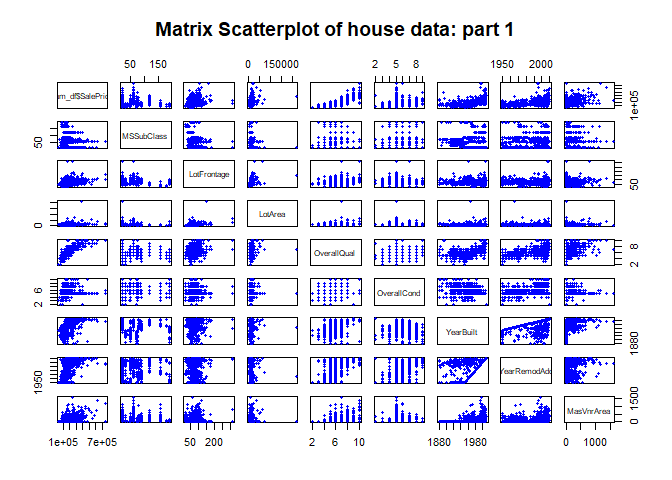

``` r
plot(num_df2,pch=20, col="blue", main="Matrix Scatterplot of house data: part 2")
```

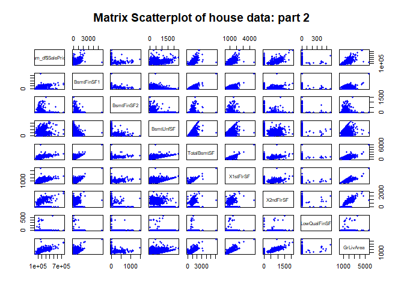

``` r
plot(num_df3,pch=20, col="blue", main="Matrix Scatterplot of house data: part 3")
```

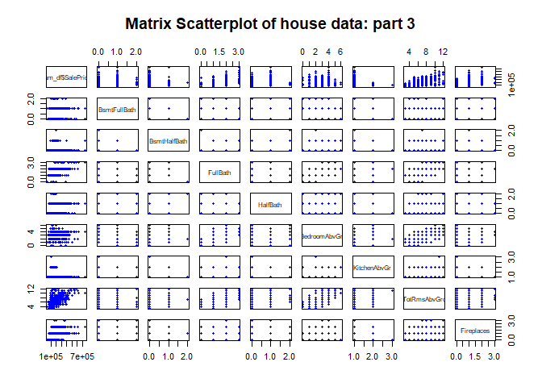

``` r
plot(num_df4,pch=20, col="blue", main="Matrix Scatterplot of house data: part 4")
```

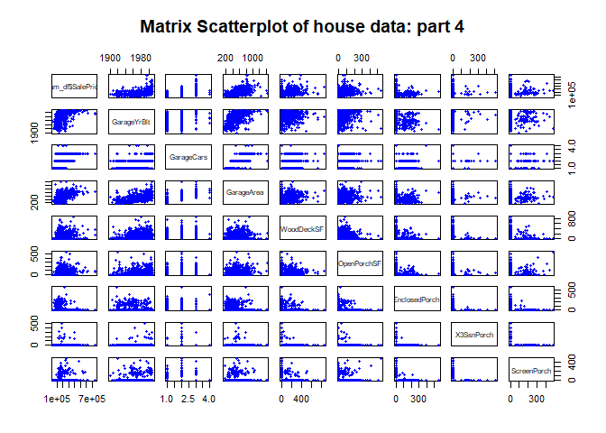

``` r
plot(num_df5,pch=20, col="blue", main="Matrix Scatterplot of house data: part 5")
```

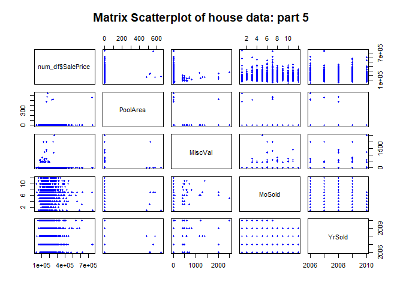

**Select Features**

``` r
#colnames(num_df)

# pick continuous variables which seems having linear relation to saleprice 
lin_var <-  c("LotFrontage", "LotArea", "OverallQual", "OverallCond", "YearBuilt","YearRemodAdd" , "MasVnrArea", "BsmtFinSF1","BsmtFinSF2", "BsmtUnfSF" , "TotalBsmtSF", "X1stFlrSF", "X2ndFlrSF" , "LowQualFinSF","GrLivArea" , "GarageYrBlt" , "GarageCars","GarageArea", "WoodDeckSF", "OpenPorchSF" )

#in the selected linear relation, there are some variables has large number of 0. 
exclude_var <- c("MasVnrArea","BsmtFinSF1","BsmtFinSF2","X2ndFlrSF","WoodDeckSF","OpenPorchSF")

# numeric categorical variables
num_cat <- c( "BsmtFullBath", "BsmtHalfBath", "FullBath","HalfBath","BedroomAbvGr", "KitchenAbvGr", "TotRmsAbvGrd", "Fireplaces", "GarageCars", "MoSold" , "YrSold") 

# numeric categorical variables which seems having linear relation to saleprice 
lin_numcat <- c("FullBath","TotRmsAbvGrd" )
```

#### Linear Regression Model

``` r
cat_col <- colnames(house)[!colnames(house) %in% colnames(num_df_0)]  
# Create the formula 
fmla <- paste("SalePrice", "~", paste(c(lin_var,cat_col[1:2],cat_col[4:5],cat_col[7:38],cat_col[42:43]), collapse = " + "))  # only the categorical variables can fit the model were selected

# Fit the model
model_lin <- lm(fmla,house)

# Print bloodpressure_model and call summary() 
summary(model_lin) 
```

    ## 
    ## Call:
    ## lm(formula = fmla, data = house)
    ## 
    ## Residuals:
    ##     Min      1Q  Median      3Q     Max 
    ## -165949  -10874       0   10890  165949 
    ## 
    ## Coefficients: (3 not defined because of singularities)
    ##                        Estimate Std. Error t value Pr(>|t|)    
    ## (Intercept)          -1.311e+06  5.810e+05  -2.257 0.024566 *  
    ## LotFrontage           2.189e+02  9.529e+01   2.297 0.022115 *  
    ## LotArea               7.823e-01  3.044e-01   2.570 0.010535 *  
    ## OverallQual           1.063e+04  2.617e+03   4.062 5.88e-05 ***
    ## OverallCond           1.009e+04  2.532e+03   3.986 8.00e-05 ***
    ## YearBuilt             1.757e+02  2.682e+02   0.655 0.512710    
    ## YearRemodAdd          5.788e+01  1.706e+02   0.339 0.734528    
    ## MasVnrArea            1.889e+01  1.038e+01   1.820 0.069556 .  
    ## BsmtFinSF1            5.150e+01  1.250e+01   4.119 4.64e-05 ***
    ## BsmtFinSF2            4.721e+01  2.145e+01   2.200 0.028366 *  
    ## BsmtUnfSF             2.876e+01  1.211e+01   2.374 0.018057 *  
    ## TotalBsmtSF                  NA         NA      NA       NA    
    ## X1stFlrSF             4.731e+01  1.288e+01   3.673 0.000273 ***
    ## X2ndFlrSF             7.983e+01  1.037e+01   7.701 1.11e-13 ***
    ## LowQualFinSF          2.759e+01  5.875e+01   0.470 0.638890    
    ## GrLivArea                    NA         NA      NA       NA    
    ## GarageYrBlt          -5.479e+01  1.815e+02  -0.302 0.762949    
    ## GarageCars            3.110e+03  5.621e+03   0.553 0.580311    
    ## GarageArea            2.218e+01  1.740e+01   1.275 0.203229    
    ## WoodDeckSF            4.364e+00  1.338e+01   0.326 0.744424    
    ## OpenPorchSF          -2.280e+01  2.849e+01  -0.800 0.423905    
    ## MSZoningFV            6.611e+04  5.650e+04   1.170 0.242666    
    ## MSZoningRL            4.360e+04  5.520e+04   0.790 0.430043    
    ## MSZoningRM            4.776e+04  5.267e+04   0.907 0.365058    
    ## StreetPave            6.345e+04  3.840e+04   1.652 0.099302 .  
    ## LotShapeIR2           6.889e+03  1.081e+04   0.637 0.524370    
    ## LotShapeIR3           7.297e+03  1.835e+04   0.398 0.691066    
    ## LotShapeReg           4.707e+03  3.770e+03   1.249 0.212488    
    ## LandContourHLS        2.008e+04  1.336e+04   1.503 0.133538    
    ## LandContourLow       -3.064e+04  2.085e+04  -1.469 0.142571    
    ## LandContourLvl        2.037e+04  1.078e+04   1.890 0.059467 .  
    ## LotConfigCulDSac      2.173e+04  8.757e+03   2.482 0.013484 *  
    ## LotConfigFR2         -2.007e+04  1.092e+04  -1.837 0.066943 .  
    ## LotConfigFR3         -4.390e+04  2.445e+04  -1.795 0.073385 .  
    ## LotConfigInside      -1.078e+03  4.443e+03  -0.243 0.808509    
    ## LandSlopeMod          1.104e+04  1.052e+04   1.050 0.294425    
    ## LandSlopeSev         -2.124e+04  3.838e+04  -0.554 0.580192    
    ## NeighborhoodBlueste  -1.442e+04  3.371e+04  -0.428 0.669138    
    ## NeighborhoodBrDale   -1.240e+04  4.279e+04  -0.290 0.772205    
    ## NeighborhoodBrkSide  -2.231e+04  2.483e+04  -0.899 0.369412    
    ## NeighborhoodClearCr  -2.514e+04  2.455e+04  -1.024 0.306536    
    ## NeighborhoodCollgCr  -8.529e+03  1.336e+04  -0.639 0.523495    
    ## NeighborhoodCrawfor   2.340e+03  1.896e+04   0.123 0.901816    
    ## NeighborhoodEdwards  -4.579e+04  1.790e+04  -2.557 0.010919 *  
    ## NeighborhoodGilbert  -4.977e+03  1.464e+04  -0.340 0.734040    
    ## NeighborhoodIDOTRR   -1.123e+04  3.175e+04  -0.354 0.723697    
    ## NeighborhoodMeadowV  -3.906e+04  2.782e+04  -1.404 0.161119    
    ## NeighborhoodMitchel  -1.895e+04  1.913e+04  -0.991 0.322531    
    ## NeighborhoodNAmes    -3.325e+04  1.688e+04  -1.970 0.049567 *  
    ## NeighborhoodNoRidge   1.311e+04  1.490e+04   0.880 0.379401    
    ## NeighborhoodNPkVill   1.442e+03  3.623e+04   0.040 0.968277    
    ## NeighborhoodNridgHt   1.580e+04  1.289e+04   1.226 0.220970    
    ## NeighborhoodNWAmes   -3.049e+04  1.646e+04  -1.852 0.064767 .  
    ## NeighborhoodOldTown  -3.244e+04  2.635e+04  -1.231 0.219094    
    ## NeighborhoodSawyer   -1.618e+04  1.745e+04  -0.927 0.354412    
    ## NeighborhoodSawyerW  -2.699e+03  1.541e+04  -0.175 0.861029    
    ## NeighborhoodSomerst  -1.013e+04  1.607e+04  -0.631 0.528701    
    ## NeighborhoodStoneBr   4.736e+04  1.488e+04   3.182 0.001577 ** 
    ## NeighborhoodSWISU    -3.025e+04  2.208e+04  -1.370 0.171446    
    ## NeighborhoodTimber   -1.424e+04  1.445e+04  -0.985 0.325009    
    ## NeighborhoodVeenker  -1.341e+03  2.015e+04  -0.067 0.946951    
    ## Condition1Feedr       8.758e+03  1.389e+04   0.631 0.528626    
    ## Condition1Norm        1.676e+04  1.075e+04   1.560 0.119634    
    ## Condition1PosA       -1.259e+04  2.902e+04  -0.434 0.664571    
    ## Condition1PosN       -8.926e+02  1.900e+04  -0.047 0.962551    
    ## Condition1RRAe        3.257e+02  2.929e+04   0.011 0.991135    
    ## Condition1RRAn        1.808e+04  1.488e+04   1.215 0.225149    
    ## Condition1RRNn       -9.095e+03  3.204e+04  -0.284 0.776673    
    ## Condition2Norm       -1.030e+04  5.489e+04  -0.188 0.851216    
    ## Condition2PosA        4.459e+04  7.856e+04   0.568 0.570586    
    ## Condition2PosN       -2.329e+05  6.323e+04  -3.683 0.000263 ***
    ## BldgType2fmCon       -1.627e+04  2.085e+04  -0.780 0.435615    
    ## BldgTypeDuplex       -6.618e+04  6.426e+04  -1.030 0.303688    
    ## BldgTypeTwnhs        -1.102e+04  1.605e+04  -0.687 0.492514    
    ## BldgTypeTwnhsE       -1.419e+04  8.145e+03  -1.742 0.082260 .  
    ## HouseStyle1.5Unf      1.671e+04  2.956e+04   0.565 0.572245    
    ## HouseStyle1Story      1.461e+04  1.092e+04   1.338 0.181816    
    ## HouseStyle2.5Fin     -3.178e+04  2.912e+04  -1.092 0.275716    
    ## HouseStyle2.5Unf     -1.163e+04  2.558e+04  -0.454 0.649793    
    ## HouseStyle2Story     -1.096e+04  8.848e+03  -1.238 0.216360    
    ## HouseStyleSFoyer      2.591e+04  2.753e+04   0.941 0.347327    
    ## HouseStyleSLvl        6.714e+03  1.267e+04   0.530 0.596375    
    ## RoofStyleGable        3.066e+04  4.490e+04   0.683 0.495077    
    ## RoofStyleGambrel      3.840e+04  4.957e+04   0.775 0.439051    
    ## RoofStyleHip          2.796e+04  4.487e+04   0.623 0.533481    
    ## RoofStyleMansard      8.907e+04  7.841e+04   1.136 0.256688    
    ## RoofMatlCompShg       6.745e+05  5.877e+04  11.476  < 2e-16 ***
    ## RoofMatlMembran       7.361e+05  1.032e+05   7.134 4.73e-12 ***
    ## RoofMatlTar&Grv       6.880e+05  7.137e+04   9.639  < 2e-16 ***
    ## RoofMatlWdShake       6.229e+05  9.323e+04   6.681 8.12e-11 ***
    ## RoofMatlWdShngl       7.590e+05  6.078e+04  12.489  < 2e-16 ***
    ## Exterior1stBrkFace    2.068e+04  5.722e+04   0.361 0.718068    
    ## Exterior1stCemntBd   -1.359e+04  6.252e+04  -0.217 0.828091    
    ## Exterior1stHdBoard   -1.103e+03  6.077e+04  -0.018 0.985531    
    ## Exterior1stImStucc   -9.949e+04  7.053e+04  -1.411 0.159168    
    ## Exterior1stMetalSd    8.756e+03  6.392e+04   0.137 0.891116    
    ## Exterior1stPlywood    1.915e+03  6.071e+04   0.032 0.974851    
    ## Exterior1stStone      8.497e+03  8.142e+04   0.104 0.916944    
    ## Exterior1stStucco     2.632e+04  6.143e+04   0.429 0.668520    
    ## Exterior1stVinylSd   -3.404e+04  6.697e+04  -0.508 0.611470    
    ## Exterior1stWd Sdng    6.922e+03  5.876e+04   0.118 0.906285    
    ## Exterior1stWdShing    2.465e+04  5.885e+04   0.419 0.675539    
    ## Exterior2ndAsphShn   -4.297e+04  9.675e+04  -0.444 0.657155    
    ## Exterior2ndBrk Cmn    5.555e+03  6.537e+04   0.085 0.932325    
    ## Exterior2ndBrkFace   -2.677e+03  5.174e+04  -0.052 0.958765    
    ## Exterior2ndCmentBd    2.344e+04  5.703e+04   0.411 0.681254    
    ## Exterior2ndHdBoard    3.861e+03  5.514e+04   0.070 0.944208    
    ## Exterior2ndImStucc    9.164e+04  5.703e+04   1.607 0.108880    
    ## Exterior2ndMetalSd   -1.153e+03  5.826e+04  -0.020 0.984222    
    ## Exterior2ndOther     -6.859e+03  7.073e+04  -0.097 0.922796    
    ## Exterior2ndPlywood   -5.740e+03  5.438e+04  -0.106 0.915991    
    ## Exterior2ndStone     -1.562e+04  6.494e+04  -0.240 0.810108    
    ## Exterior2ndStucco    -3.349e+04  5.567e+04  -0.602 0.547740    
    ## Exterior2ndVinylSd    4.233e+04  6.165e+04   0.687 0.492712    
    ## Exterior2ndWd Sdng   -1.903e+03  5.302e+04  -0.036 0.971392    
    ## Exterior2ndWd Shng   -1.870e+04  5.326e+04  -0.351 0.725636    
    ## MasVnrTypeBrkFace     1.462e+04  1.954e+04   0.748 0.454638    
    ## MasVnrTypeNone        1.466e+04  1.966e+04   0.746 0.456253    
    ## MasVnrTypeStone       2.449e+04  1.993e+04   1.229 0.219972    
    ## ExterQualFa           2.576e+03  5.710e+04   0.045 0.964043    
    ## ExterQualGd          -1.849e+04  8.079e+03  -2.289 0.022605 *  
    ## ExterQualTA          -1.389e+04  1.064e+04  -1.305 0.192496    
    ## ExterCondFa           2.256e+04  5.377e+04   0.420 0.675024    
    ## ExterCondGd           1.863e+04  4.227e+04   0.441 0.659750    
    ## ExterCondTA           2.543e+04  4.173e+04   0.610 0.542534    
    ## FoundationCBlock      1.050e+04  1.022e+04   1.027 0.304934    
    ## FoundationPConc       7.776e+03  1.025e+04   0.758 0.448671    
    ## FoundationStone      -1.173e+04  3.702e+04  -0.317 0.751459    
    ## BsmtQualFa            8.037e+03  1.683e+04   0.477 0.633281    
    ## BsmtQualGd           -9.693e+03  5.910e+03  -1.640 0.101804    
    ## BsmtQualTA           -4.278e+03  8.622e+03  -0.496 0.620005    
    ## BsmtCondGd           -4.622e+03  1.446e+04  -0.320 0.749367    
    ## BsmtCondTA           -2.427e+02  1.306e+04  -0.019 0.985180    
    ## BsmtExposureGd        1.045e+04  6.386e+03   1.636 0.102591    
    ## BsmtExposureMn       -9.061e+03  6.582e+03  -1.377 0.169417    
    ## BsmtExposureNo       -1.096e+04  4.621e+03  -2.372 0.018177 *  
    ## BsmtFinType1BLQ      -1.160e+03  7.571e+03  -0.153 0.878318    
    ## BsmtFinType1GLQ       1.060e+04  6.483e+03   1.634 0.103015    
    ## BsmtFinType1LwQ       2.101e+03  1.064e+04   0.198 0.843525    
    ## BsmtFinType1Rec       2.034e+03  8.244e+03   0.247 0.805250    
    ## BsmtFinType1Unf       4.870e+03  7.115e+03   0.684 0.494124    
    ## BsmtFinType2BLQ      -1.490e+04  2.069e+04  -0.720 0.471880    
    ## BsmtFinType2GLQ       2.439e+03  2.135e+04   0.114 0.909124    
    ## BsmtFinType2LwQ      -7.700e+03  2.006e+04  -0.384 0.701225    
    ## BsmtFinType2Rec      -6.532e+03  1.944e+04  -0.336 0.736989    
    ## BsmtFinType2Unf      -8.922e+02  1.979e+04  -0.045 0.964067    
    ## HeatingGasW          -2.279e+04  3.131e+04  -0.728 0.466985    
    ## HeatingOthW          -1.615e+04  5.485e+04  -0.294 0.768596    
    ## HeatingQCFa           2.631e+03  1.237e+04   0.213 0.831658    
    ## HeatingQCGd          -3.486e+03  5.101e+03  -0.683 0.494777    
    ## HeatingQCTA           1.935e+03  5.669e+03   0.341 0.733001    
    ## CentralAirY           2.460e+03  2.169e+04   0.113 0.909731    
    ## ElectricalFuseF      -9.610e+03  3.015e+04  -0.319 0.750131    
    ## ElectricalSBrkr      -1.432e+03  9.866e+03  -0.145 0.884658    
    ## KitchenQualFa        -1.607e+04  1.770e+04  -0.908 0.364510    
    ## KitchenQualGd        -2.190e+04  6.423e+03  -3.409 0.000718 ***
    ## KitchenQualTA        -1.739e+04  8.627e+03  -2.016 0.044499 *  
    ## FunctionalMaj2       -5.310e+04  4.282e+04  -1.240 0.215680    
    ## FunctionalMin1       -6.229e+03  2.176e+04  -0.286 0.774787    
    ## FunctionalMin2       -4.676e+03  2.183e+04  -0.214 0.830535    
    ## FunctionalMod         1.453e+04  3.474e+04   0.418 0.675964    
    ## FunctionalTyp        -5.085e+03  1.871e+04  -0.272 0.785919    
    ## FireplaceQuFa         2.390e+03  1.191e+04   0.201 0.841007    
    ## FireplaceQuGd         2.406e+03  8.498e+03   0.283 0.777187    
    ## FireplaceQuPo         5.442e+03  1.444e+04   0.377 0.706429    
    ## FireplaceQuTA         3.744e+03  9.185e+03   0.408 0.683782    
    ## GarageTypeAttchd     -7.802e+03  7.905e+03  -0.987 0.324234    
    ## GarageTypeBasment    -6.902e+03  1.747e+04  -0.395 0.692983    
    ## GarageTypeBuiltIn    -8.222e+03  9.903e+03  -0.830 0.406880    
    ## GarageTypeCarPort     2.584e+04  4.204e+04   0.615 0.539139    
    ## GarageTypeDetchd             NA         NA      NA       NA    
    ## GarageFinishRFn      -1.609e+03  4.145e+03  -0.388 0.698001    
    ## GarageFinishUnf      -5.230e+02  5.889e+03  -0.089 0.929280    
    ## GarageQualFa         -6.230e+04  5.333e+04  -1.168 0.243488    
    ## GarageQualGd         -5.947e+04  5.365e+04  -1.108 0.268385    
    ## GarageQualTA         -6.530e+04  5.146e+04  -1.269 0.205183    
    ## GarageCondFa          8.095e+04  6.818e+04   1.187 0.235806    
    ## GarageCondGd          5.464e+04  7.769e+04   0.703 0.482302    
    ## GarageCondPo          1.069e+05  7.746e+04   1.380 0.168494    
    ## GarageCondTA          8.419e+04  6.714e+04   1.254 0.210599    
    ## PavedDriveP          -1.247e+04  2.003e+04  -0.623 0.533861    
    ## PavedDriveY          -8.280e+03  1.606e+04  -0.516 0.606409    
    ## SaleTypeCon           3.832e+04  4.004e+04   0.957 0.339199    
    ## SaleTypeConLD        -1.414e+04  7.190e+04  -0.197 0.844220    
    ## SaleTypeConLI         3.799e+04  3.789e+04   1.003 0.316621    
    ## SaleTypeConLw         1.694e+03  2.720e+04   0.062 0.950371    
    ## SaleTypeCWD           3.073e+04  2.609e+04   1.178 0.239504    
    ## SaleTypeNew           5.263e+04  6.723e+04   0.783 0.434212    
    ## SaleTypeWD            3.573e+03  1.410e+04   0.253 0.800068    
    ## SaleConditionAlloca   3.836e+04  4.672e+04   0.821 0.412093    
    ## SaleConditionFamily  -2.104e+04  1.552e+04  -1.356 0.175980    
    ## SaleConditionNormal   8.654e+03  8.327e+03   1.039 0.299316    
    ## SaleConditionPartial -2.027e+04  6.641e+04  -0.305 0.760425    
    ## ---
    ## Signif. codes:  0 '***' 0.001 '**' 0.01 '*' 0.05 '.' 0.1 ' ' 1
    ## 
    ## Residual standard error: 31060 on 393 degrees of freedom
    ##   (877 observations deleted due to missingness)
    ## Multiple R-squared:  0.9237, Adjusted R-squared:  0.8869 
    ## F-statistic: 25.16 on 189 and 393 DF,  p-value: < 2.2e-16

``` r
features_df <- data.frame(summary(model_lin)$coef[summary(model_lin)$coef[,4] <= .05, 4])
features <- row.names(features_df)[-1]
features_num <- features[features %in% colnames(num_df_0)]  
features_cat <- features[!features %in% features_num]
features_cat <- c("Neighborhood","RoofMatl","KitchenQual") # select the variables which have more than one level with p<0.05

df_lin <- house[,colnames(house)%in%c("SalePrice",features_num,features_cat)]
#dim(df_lin)

df_lin <- na.omit(df_lin)
#dim(df_lin)
```

**split the data into train and test data set.seed**

``` r
#split the data into train and test data set.seed
(N <- nrow(df_lin))
```

    ## [1] 1201

``` r
# Calculate how many rows 75% of N should be and print it
(target <- round(0.75*N))
```

    ## [1] 901

``` r
# Create the vector of N uniform random variables: gp
gp <- runif(N)

# Use gp to create the training set: mpg_train (75% of data) and mpg_test (25% of data)
df_lin_train <- df_lin[gp < 0.75, ]
df_lin_test <- df_lin[gp >= 0.75, ]
```

**Train a model using test/train split**

``` r
# Create a formula to express cty as a function of hwy: fmla and print it.
fmla <- paste("SalePrice", "~", paste(c(features_num,features_cat), collapse = " + "))

# Now use lm() to build a model from df_lin_train that predicts SalePrice from the selected features 
model_lin <- lm(fmla,data=df_lin_train)

# Use summary() to examine the model
summary(model_lin)
```

    ## 
    ## Call:
    ## lm(formula = fmla, data = df_lin_train)
    ## 
    ## Residuals:
    ##     Min      1Q  Median      3Q     Max 
    ## -352885  -12449       0   11337  197523 
    ## 
    ## Coefficients:
    ##                       Estimate Std. Error t value Pr(>|t|)    
    ## (Intercept)         -6.281e+05  4.243e+04 -14.801  < 2e-16 ***
    ## LotFrontage          1.902e+02  5.986e+01   3.177 0.001543 ** 
    ## LotArea              5.542e-01  1.464e-01   3.785 0.000165 ***
    ## OverallQual          1.184e+04  1.449e+03   8.169 1.16e-15 ***
    ## OverallCond          4.637e+03  1.153e+03   4.021 6.33e-05 ***
    ## BsmtFinSF1           4.284e+01  5.157e+00   8.306 4.02e-16 ***
    ## BsmtFinSF2           2.575e+01  8.588e+00   2.999 0.002794 ** 
    ## BsmtUnfSF            1.356e+01  5.048e+00   2.687 0.007359 ** 
    ## X1stFlrSF            6.034e+01  5.859e+00  10.299  < 2e-16 ***
    ## X2ndFlrSF            5.301e+01  3.310e+00  16.014  < 2e-16 ***
    ## NeighborhoodBrDale  -2.344e+04  1.368e+04  -1.714 0.086960 .  
    ## NeighborhoodBrkSide -1.758e+04  1.191e+04  -1.476 0.140306    
    ## NeighborhoodClearCr -2.393e+04  1.466e+04  -1.632 0.103066    
    ## NeighborhoodCollgCr  1.096e+02  1.060e+04   0.010 0.991750    
    ## NeighborhoodCrawfor -2.638e+03  1.195e+04  -0.221 0.825391    
    ## NeighborhoodEdwards -3.001e+04  1.114e+04  -2.695 0.007184 ** 
    ## NeighborhoodGilbert  1.075e+02  1.172e+04   0.009 0.992684    
    ## NeighborhoodIDOTRR  -2.992e+04  1.243e+04  -2.408 0.016276 *  
    ## NeighborhoodMeadowV -2.306e+04  1.403e+04  -1.644 0.100653    
    ## NeighborhoodMitchel -1.648e+04  1.209e+04  -1.363 0.173266    
    ## NeighborhoodNAmes   -2.472e+04  1.091e+04  -2.266 0.023700 *  
    ## NeighborhoodNoRidge  4.465e+04  1.281e+04   3.486 0.000517 ***
    ## NeighborhoodNPkVill -1.597e+04  1.637e+04  -0.975 0.329625    
    ## NeighborhoodNridgHt  4.228e+04  1.108e+04   3.817 0.000145 ***
    ## NeighborhoodNWAmes  -2.423e+04  1.160e+04  -2.088 0.037122 *  
    ## NeighborhoodOldTown -3.605e+04  1.116e+04  -3.230 0.001288 ** 
    ## NeighborhoodSawyer  -2.320e+04  1.198e+04  -1.936 0.053225 .  
    ## NeighborhoodSawyerW -1.152e+04  1.124e+04  -1.025 0.305745    
    ## NeighborhoodSomerst  2.128e+04  1.077e+04   1.975 0.048546 *  
    ## NeighborhoodStoneBr  4.959e+04  1.320e+04   3.756 0.000185 ***
    ## NeighborhoodSWISU   -2.975e+04  1.308e+04  -2.275 0.023166 *  
    ## NeighborhoodTimber   1.017e+04  1.267e+04   0.803 0.422200    
    ## NeighborhoodVeenker  4.127e+03  1.936e+04   0.213 0.831199    
    ## RoofMatlCompShg      6.276e+05  3.801e+04  16.512  < 2e-16 ***
    ## RoofMatlRoll         6.040e+05  4.875e+04  12.391  < 2e-16 ***
    ## RoofMatlTar&Grv      6.073e+05  4.004e+04  15.170  < 2e-16 ***
    ## RoofMatlWdShake      6.322e+05  4.967e+04  12.730  < 2e-16 ***
    ## RoofMatlWdShngl      6.550e+05  4.102e+04  15.965  < 2e-16 ***
    ## KitchenQualFa       -4.719e+04  8.729e+03  -5.406 8.44e-08 ***
    ## KitchenQualGd       -4.024e+04  4.964e+03  -8.107 1.86e-15 ***
    ## KitchenQualTA       -4.859e+04  5.712e+03  -8.507  < 2e-16 ***
    ## ---
    ## Signif. codes:  0 '***' 0.001 '**' 0.01 '*' 0.05 '.' 0.1 ' ' 1
    ## 
    ## Residual standard error: 30950 on 827 degrees of freedom
    ## Multiple R-squared:  0.8726, Adjusted R-squared:  0.8665 
    ## F-statistic: 141.7 on 40 and 827 DF,  p-value: < 2.2e-16

``` r
#Evaluate the model using test/train split

# predict cty from hwy for the training set
df_lin_train$pred <- predict(model_lin,df_lin_train)

# predict SalePrice from the selected features for the testing set
# df_lin_test$pred <- predict(model_lin,df_lin_test)
```

Then an error occured after commanding the prediction for the testing set: Error in eval(predvars, data, env) : object 'LotFrontage\_clean' not found

Because some levels of categorical data in the testing data don't appear in the training data, the model crashed. So vtreat package will be used to one-hot-encode the categorical variable.

``` r
# Create and print a vector of variable names
vars <-c("SalePrice",features_num,features_cat)

# Create the treatment plan
treatplan <- designTreatmentsZ(df_lin, vars)
```

    ## [1] "designing treatments Thu Dec 28 00:02:11 2017"
    ## [1] "designing treatments Thu Dec 28 00:02:11 2017"
    ## [1] " have level statistics Thu Dec 28 00:02:11 2017"
    ## [1] "design var SalePrice Thu Dec 28 00:02:11 2017"
    ## [1] "design var LotFrontage Thu Dec 28 00:02:11 2017"
    ## [1] "design var LotArea Thu Dec 28 00:02:11 2017"
    ## [1] "design var OverallQual Thu Dec 28 00:02:11 2017"
    ## [1] "design var OverallCond Thu Dec 28 00:02:11 2017"
    ## [1] "design var BsmtFinSF1 Thu Dec 28 00:02:11 2017"
    ## [1] "design var BsmtFinSF2 Thu Dec 28 00:02:11 2017"
    ## [1] "design var BsmtUnfSF Thu Dec 28 00:02:11 2017"
    ## [1] "design var X1stFlrSF Thu Dec 28 00:02:11 2017"
    ## [1] "design var X2ndFlrSF Thu Dec 28 00:02:11 2017"
    ## [1] "design var Neighborhood Thu Dec 28 00:02:11 2017"
    ## [1] "design var RoofMatl Thu Dec 28 00:02:11 2017"
    ## [1] "design var KitchenQual Thu Dec 28 00:02:11 2017"
    ## [1] " scoring treatments Thu Dec 28 00:02:12 2017"
    ## [1] "have treatment plan Thu Dec 28 00:02:12 2017"

``` r
# Examine the scoreFrame
scoreFrame <- treatplan %>%
    use_series(scoreFrame) %>%
    dplyr::select(varName, origName, code)


# We only want the rows with codes "clean" or "lev"
newvars <- scoreFrame %>%
    filter(code %in% c("clean", "lev")) %>%
    use_series(varName)


# Use prepare() to one-hot-encode training data
trainframe.treat <- prepare(treatplan, df_lin_train, varRestriction = newvars)
head(trainframe.treat,5)
```

    ##   SalePrice_clean LotFrontage_clean LotArea_clean OverallQual_clean
    ## 1          208500                65          8450                 7
    ## 2          181500                80          9600                 6
    ## 3          223500                68         11250                 7
    ## 4          140000                60          9550                 7
    ## 5          250000                84         14260                 8
    ##   OverallCond_clean BsmtFinSF1_clean BsmtFinSF2_clean BsmtUnfSF_clean
    ## 1                 5              706                0             150
    ## 2                 8              978                0             284
    ## 3                 5              486                0             434
    ## 4                 5              216                0             540
    ## 5                 5              655                0             490
    ##   X1stFlrSF_clean X2ndFlrSF_clean Neighborhood_lev_x.BrkSide
    ## 1             856             854                          0
    ## 2            1262               0                          0
    ## 3             920             866                          0
    ## 4             961             756                          0
    ## 5            1145            1053                          0
    ##   Neighborhood_lev_x.CollgCr Neighborhood_lev_x.Crawfor
    ## 1                          1                          0
    ## 2                          0                          0
    ## 3                          1                          0
    ## 4                          0                          1
    ## 5                          0                          0
    ##   Neighborhood_lev_x.Edwards Neighborhood_lev_x.Gilbert
    ## 1                          0                          0
    ## 2                          0                          0
    ## 3                          0                          0
    ## 4                          0                          0
    ## 5                          0                          0
    ##   Neighborhood_lev_x.IDOTRR Neighborhood_lev_x.Mitchel
    ## 1                         0                          0
    ## 2                         0                          0
    ## 3                         0                          0
    ## 4                         0                          0
    ## 5                         0                          0
    ##   Neighborhood_lev_x.NAmes Neighborhood_lev_x.NoRidge
    ## 1                        0                          0
    ## 2                        0                          0
    ## 3                        0                          0
    ## 4                        0                          0
    ## 5                        0                          1
    ##   Neighborhood_lev_x.NridgHt Neighborhood_lev_x.NWAmes
    ## 1                          0                         0
    ## 2                          0                         0
    ## 3                          0                         0
    ## 4                          0                         0
    ## 5                          0                         0
    ##   Neighborhood_lev_x.OldTown Neighborhood_lev_x.Sawyer
    ## 1                          0                         0
    ## 2                          0                         0
    ## 3                          0                         0
    ## 4                          0                         0
    ## 5                          0                         0
    ##   Neighborhood_lev_x.SawyerW Neighborhood_lev_x.Somerst
    ## 1                          0                          0
    ## 2                          0                          0
    ## 3                          0                          0
    ## 4                          0                          0
    ## 5                          0                          0
    ##   Neighborhood_lev_x.Timber RoofMatl_lev_x.CompShg KitchenQual_lev_x.Ex
    ## 1                         0                      1                    0
    ## 2                         0                      1                    0
    ## 3                         0                      1                    0
    ## 4                         0                      1                    0
    ## 5                         0                      1                    0
    ##   KitchenQual_lev_x.Fa KitchenQual_lev_x.Gd KitchenQual_lev_x.TA
    ## 1                    0                    1                    0
    ## 2                    0                    0                    1
    ## 3                    0                    1                    0
    ## 4                    0                    1                    0
    ## 5                    0                    1                    0

``` r
# Use prepare() to one-hot-encode test data
testframe.treat <- prepare(treatplan, df_lin_test, varRestriction = newvars)
head(testframe.treat,5)
```

    ##   SalePrice_clean LotFrontage_clean LotArea_clean OverallQual_clean
    ## 1          129900                51          6120                 7
    ## 2          279500                91         10652                 7
    ## 3          325300               101         14215                 8
    ## 4          230000                75          9742                 8
    ## 5          256300               110         14230                 8
    ##   OverallCond_clean BsmtFinSF1_clean BsmtFinSF2_clean BsmtUnfSF_clean
    ## 1                 5                0                0             952
    ## 2                 5                0                0            1494
    ## 3                 5                0                0            1158
    ## 4                 5                0                0            1777
    ## 5                 5                0                0            1566
    ##   X1stFlrSF_clean X2ndFlrSF_clean Neighborhood_lev_x.BrkSide
    ## 1            1022             752                          0
    ## 2            1494               0                          0
    ## 3            1158            1218                          0
    ## 4            1795               0                          0
    ## 5            1600               0                          0
    ##   Neighborhood_lev_x.CollgCr Neighborhood_lev_x.Crawfor
    ## 1                          0                          0
    ## 2                          1                          0
    ## 3                          0                          0
    ## 4                          1                          0
    ## 5                          0                          0
    ##   Neighborhood_lev_x.Edwards Neighborhood_lev_x.Gilbert
    ## 1                          0                          0
    ## 2                          0                          0
    ## 3                          0                          0
    ## 4                          0                          0
    ## 5                          0                          0
    ##   Neighborhood_lev_x.IDOTRR Neighborhood_lev_x.Mitchel
    ## 1                         0                          0
    ## 2                         0                          0
    ## 3                         0                          0
    ## 4                         0                          0
    ## 5                         0                          0
    ##   Neighborhood_lev_x.NAmes Neighborhood_lev_x.NoRidge
    ## 1                        0                          0
    ## 2                        0                          0
    ## 3                        0                          0
    ## 4                        0                          0
    ## 5                        0                          0
    ##   Neighborhood_lev_x.NridgHt Neighborhood_lev_x.NWAmes
    ## 1                          0                         0
    ## 2                          0                         0
    ## 3                          1                         0
    ## 4                          0                         0
    ## 5                          1                         0
    ##   Neighborhood_lev_x.OldTown Neighborhood_lev_x.Sawyer
    ## 1                          1                         0
    ## 2                          0                         0
    ## 3                          0                         0
    ## 4                          0                         0
    ## 5                          0                         0
    ##   Neighborhood_lev_x.SawyerW Neighborhood_lev_x.Somerst
    ## 1                          0                          0
    ## 2                          0                          0
    ## 3                          0                          0
    ## 4                          0                          0
    ## 5                          0                          0
    ##   Neighborhood_lev_x.Timber RoofMatl_lev_x.CompShg KitchenQual_lev_x.Ex
    ## 1                         0                      1                    0
    ## 2                         0                      1                    0
    ## 3                         0                      1                    0
    ## 4                         0                      1                    0
    ## 5                         0                      1                    0
    ##   KitchenQual_lev_x.Fa KitchenQual_lev_x.Gd KitchenQual_lev_x.TA
    ## 1                    0                    0                    1
    ## 2                    0                    1                    0
    ## 3                    0                    1                    0
    ## 4                    0                    1                    0
    ## 5                    0                    1                    0

``` r
#Train a model using test/train split

# Create a formula to express cty as a function of hwy: fmla and print it.
fmla <- paste("SalePrice_clean", "~", paste(colnames(trainframe.treat)[-1], collapse = " + "))

# Now use lm() to build a model from df_lin_train that predicts SalePrice from the selected features 
model_lin <- lm(fmla,data=trainframe.treat)

# Use summary() to examine the model
summary(model_lin)
```

    ## 
    ## Call:
    ## lm(formula = fmla, data = trainframe.treat)
    ## 
    ## Residuals:
    ##     Min      1Q  Median      3Q     Max 
    ## -426696  -14643   -1158   13314  211451 
    ## 
    ## Coefficients: (1 not defined because of singularities)
    ##                              Estimate Std. Error t value Pr(>|t|)    
    ## (Intercept)                -8.729e+04  1.678e+04  -5.202 2.48e-07 ***
    ## LotFrontage_clean           1.780e+00  6.743e+01   0.026 0.978951    
    ## LotArea_clean               7.416e-01  1.697e-01   4.371 1.39e-05 ***
    ## OverallQual_clean           1.734e+04  1.628e+03  10.651  < 2e-16 ***
    ## OverallCond_clean           2.947e+03  1.328e+03   2.219 0.026738 *  
    ## BsmtFinSF1_clean            1.398e+01  5.656e+00   2.472 0.013637 *  
    ## BsmtFinSF2_clean            7.362e+00  1.004e+01   0.733 0.463677    
    ## BsmtUnfSF_clean            -6.185e+00  5.774e+00  -1.071 0.284463    
    ## X1stFlrSF_clean             6.223e+01  6.878e+00   9.047  < 2e-16 ***
    ## X2ndFlrSF_clean             3.966e+01  3.757e+00  10.557  < 2e-16 ***
    ## Neighborhood_lev_x.BrkSide -8.617e+03  7.821e+03  -1.102 0.270920    
    ## Neighborhood_lev_x.CollgCr  7.479e+03  6.040e+03   1.238 0.215922    
    ## Neighborhood_lev_x.Crawfor  9.855e+03  8.133e+03   1.212 0.225997    
    ## Neighborhood_lev_x.Edwards -2.592e+04  6.254e+03  -4.144 3.77e-05 ***
    ## Neighborhood_lev_x.Gilbert  7.928e+03  8.097e+03   0.979 0.327796    
    ## Neighborhood_lev_x.IDOTRR  -2.118e+04  8.997e+03  -2.354 0.018779 *  
    ## Neighborhood_lev_x.Mitchel -5.147e+03  8.570e+03  -0.601 0.548330    
    ## Neighborhood_lev_x.NAmes   -9.537e+03  5.580e+03  -1.709 0.087797 .  
    ## Neighborhood_lev_x.NoRidge  6.735e+04  1.000e+04   6.732 3.10e-11 ***
    ## Neighborhood_lev_x.NridgHt  5.077e+04  7.234e+03   7.018 4.65e-12 ***
    ## Neighborhood_lev_x.NWAmes  -6.622e+03  7.386e+03  -0.897 0.370187    
    ## Neighborhood_lev_x.OldTown -2.549e+04  6.132e+03  -4.157 3.55e-05 ***
    ## Neighborhood_lev_x.Sawyer  -8.275e+03  7.975e+03  -1.038 0.299782    
    ## Neighborhood_lev_x.SawyerW -4.381e+03  7.302e+03  -0.600 0.548705    
    ## Neighborhood_lev_x.Somerst  2.215e+04  6.769e+03   3.272 0.001112 ** 
    ## Neighborhood_lev_x.Timber   1.729e+04  1.012e+04   1.709 0.087873 .  
    ## RoofMatl_lev_x.CompShg      4.020e+04  1.141e+04   3.522 0.000451 ***
    ## KitchenQual_lev_x.Ex        5.813e+04  6.572e+03   8.846  < 2e-16 ***
    ## KitchenQual_lev_x.Fa        1.084e+03  7.592e+03   0.143 0.886443    
    ## KitchenQual_lev_x.Gd        1.286e+04  3.553e+03   3.620 0.000312 ***
    ## KitchenQual_lev_x.TA               NA         NA      NA       NA    
    ## ---
    ## Signif. codes:  0 '***' 0.001 '**' 0.01 '*' 0.05 '.' 0.1 ' ' 1
    ## 
    ## Residual standard error: 36640 on 838 degrees of freedom
    ## Multiple R-squared:  0.8192, Adjusted R-squared:  0.8129 
    ## F-statistic: 130.9 on 29 and 838 DF,  p-value: < 2.2e-16

``` r
#Evaluate the model using test/train split

# predict SalePrice from selected features(vars) for the training set
trainframe.treat$pred_lin <- predict(model_lin,trainframe.treat)
```

    ## Warning in predict.lm(model_lin, trainframe.treat): prediction from a rank-
    ## deficient fit may be misleading

``` r
# predict SalePrice from the selected features for the test set
testframe.treat$pred_lin <- predict(model_lin,testframe.treat)
```

    ## Warning in predict.lm(model_lin, testframe.treat): prediction from a rank-
    ## deficient fit may be misleading

``` r
# Evaluate the RMSE on both training and test data and print them
trainframe.treat %>%
  mutate(residuals = SalePrice_clean - pred_lin) %>%
  summarize(rmse_train = sqrt(mean(residuals^2)))
```

    ##   rmse_train
    ## 1   35999.51

``` r
testframe.treat %>%
  mutate(residuals = SalePrice_clean - pred_lin) %>%
  summarize(rmse_test = sqrt(mean(residuals^2)))
```

    ##   rmse_test
    ## 1  35285.05

``` r
#examine how well the model fits the data
r2_lin <- glance(model_lin)$r.squared
cat("R^2 for testing set with Linear Regression model is ", r2_lin)
```

    ## R^2 for testing set with Linear Regression model is  0.8191842

``` r
#plot predictions (on x-axis) versus the SalePrice
p <- ggplot(testframe.treat, aes(x = pred_lin, y = SalePrice_clean)) 
p <- p + geom_point() 
p + geom_abline()
```

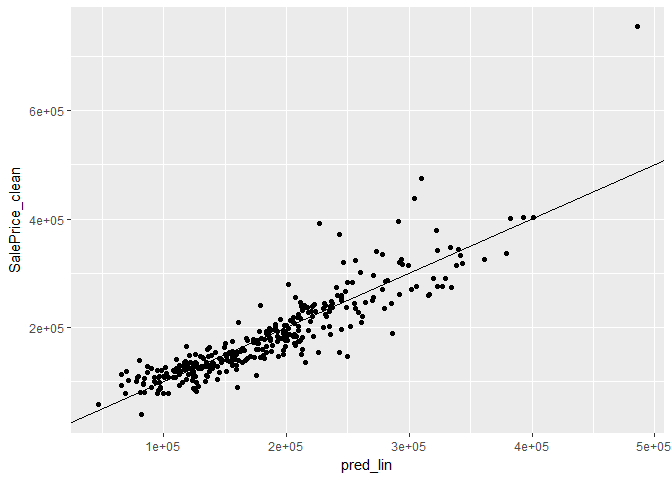

``` r
testframe.copy <- testframe.treat
testframe.copy$residuals <- testframe.copy$SalePrice_clean - testframe.copy$pred_lin 

#plot predictions (on x-axis) versus the residuals
p <- ggplot(testframe.copy, aes(x = pred_lin, y = residuals)) 
p <- p + geom_pointrange(aes(ymin = 0, ymax = residuals))
p <- p + geom_hline(yintercept = 0, linetype = 3) 
p + ggtitle("residuals vs. linear model prediction")
```

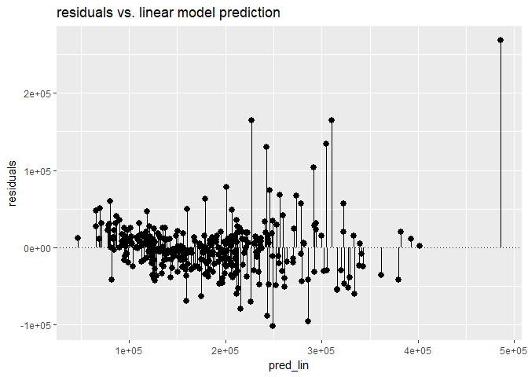

``` r
# Plot predictions and actual SalePrice as a function of LotArea
testframe.treat %>% 
  gather(key = valuetype, value = value, SalePrice_clean, pred_lin) %>%
  ggplot(aes(x = LotArea_clean, y = value, color = valuetype, linetype = valuetype)) + 
  geom_point() + 
  geom_line() + 
  scale_x_continuous("LotArea_clean", breaks = 0:10, labels = 0:10) + 
  scale_color_brewer(palette = "Set1") + 
  coord_trans(x = "log10") +
  ggtitle("Predicted SalePrice, linear regression model")
```

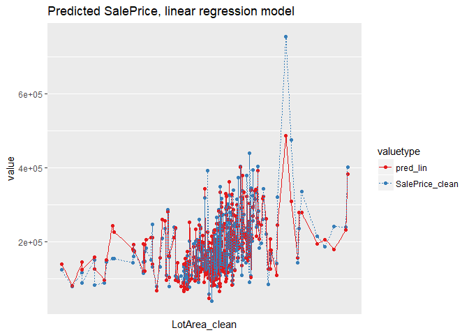

#### Random Forest Model

``` r
# Fit the random forest model
model_rf <- ranger(fmla, 
                    trainframe.treat, 
                    num.trees = 500, 
                    respect.unordered.factors = "order", 
                    seed = 123 )

#Predict SalePirce with the random forest model
testframe.treat$pred_rf <- predict(model_rf, testframe.treat)$predictions 

# Calculate the RMSE of the predictions
testframe.treat %>% 
  mutate(residual_rf = SalePrice_clean - pred_rf)  %>% 
  summarize(rmse_rf  = sqrt(mean(residual_rf^2)))      
```

    ##    rmse_rf
    ## 1 32419.41

``` r
#examine how well the model fits the data: calculate R-squared: rsq.
slpr_mean <- mean(testframe.treat$SalePrice_clean)
tss <- sum((testframe.treat$SalePrice_clean - slpr_mean)^2)
rss <- sum((testframe.treat$SalePrice_clean - testframe.treat$pred_rf)^2)
rsq <- 1-rss/tss
cat("R^2 for testing set with Random Forest model is ", rsq)
```

    ## R^2 for testing set with Random Forest model is  0.8351472

``` r
# Plot actual outcome vs predictions (predictions on x-axis)
ggplot(testframe.treat, aes(x = pred_rf, y = SalePrice_clean)) + 
  geom_point() + 
  geom_abline()
```

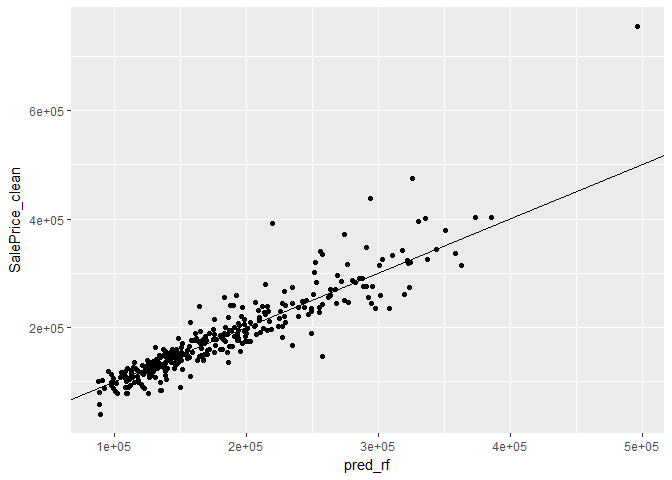

#### Gradient Boost Model

``` r
#Find the right number of trees for a gradient boosting machine
cv <- xgb.cv(data = as.matrix(trainframe.treat),
             label = trainframe.treat$SalePrice_clean,
             nrounds = 100,
             nfold = 5,
             objective = "reg:linear",
             eta = 0.3,
             max_depth = 6,
             early_stopping_rounds = 10,
             verbose = 0    # silent
             )

# Get the evaluation log 
elog <- as.data.frame(cv$evaluation_log)

# Determine and print how many trees minimize training and test error
ntrees <- elog %>% 
  summarize(ntrees.train = which.min(elog$train_rmse_mean),
            ntrees.test  = which.min(elog$test_rmse_mean))  

#Fit an xgboost bike rental model and predict
model_gb <- xgboost(data = as.matrix(trainframe.treat),
                    label = trainframe.treat$SalePrice_clean, 
                    nrounds = ntrees[,'ntrees.train'],
                    objective =  "reg:linear", 
                    eta = 0.3,
                    depth = 6,
                    verbose = 0)


# Make predictions
testframe.treat$pred_gb <- predict(model_gb, as.matrix(testframe.treat))

# Plot predictions (on x axis) vs actual SalePrice
ggplot(testframe.treat, aes(x = pred_gb, y = SalePrice_clean)) + 
  geom_point() + 
  geom_abline()
```

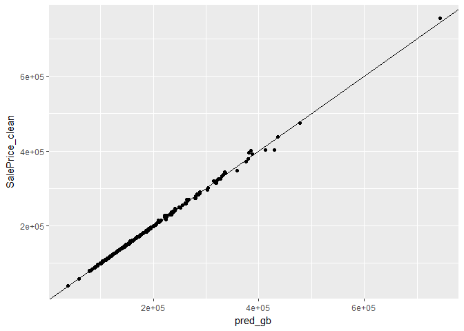

``` r
#Evaluate the xgboost house SalePrice model

# Calculate RMSE
testframe.treat %>%
  mutate(residuals_gb = SalePrice_clean - pred_gb) %>%
  summarize(rmse_gb = sqrt(mean(residuals_gb^2)))
```

    ##    rmse_gb
    ## 1 2805.041

``` r
#examine how well the model fits the data: calculate R-squared: rsq.
slpr_mean <- mean(testframe.treat$SalePrice_clean)
tss <- sum((testframe.treat$SalePrice_clean - slpr_mean)^2)
rss <- sum((testframe.treat$SalePrice_clean - testframe.treat$pred_gb)^2)
rsq_gb <- 1-rss/tss
cat("R^2 for testing set with Gradient Boost model is ", rsq_gb)
```

    ## R^2 for testing set with Gradient Boost model is  0.9987659

``` r
#Visualize the xgboost model
# Plot predictions and actual SalePrice as a function of LotArea
testframe.treat %>% 
  gather(key = valuetype, value = value, SalePrice_clean, pred_gb) %>%
  ggplot(aes(x = LotArea_clean, y = value, color = valuetype, linetype = valuetype)) + 
  geom_point() + 
  geom_line() + 
  scale_x_continuous("LotArea_clean", breaks = 0:10, labels = 0:10) + 
  scale_color_brewer(palette = "Dark2") + 
  coord_trans(x = "log10") +
  ggtitle("Predicted SalePrice, Gradient Boost model")
```

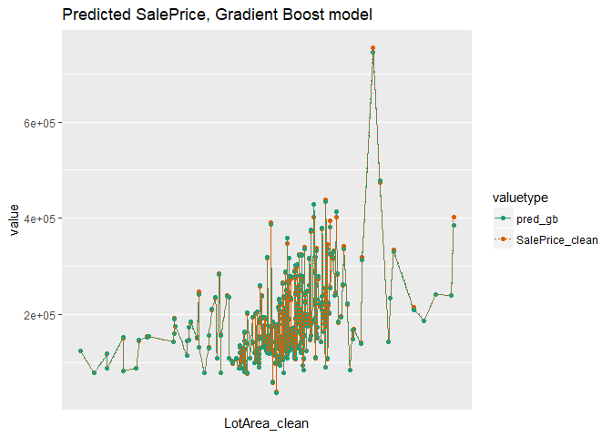

``` r
# Gather the predictions into a "long" dataset
testframe.treat_long <- testframe.treat %>%
  gather(key = modeltype, value = pred, pred_lin, pred_rf,pred_gb)

# Compare the predictions against actual SalePrice on the test data
testframe.treat_long %>%
  ggplot(aes(x = LotArea_clean)) +                          
  geom_point(aes(y = SalePrice_clean)) +                 
  geom_point(aes(y = pred, color = modeltype)) +  
  geom_line(aes(y = pred, color = modeltype, linetype = modeltype))+
  scale_x_log10() 
```

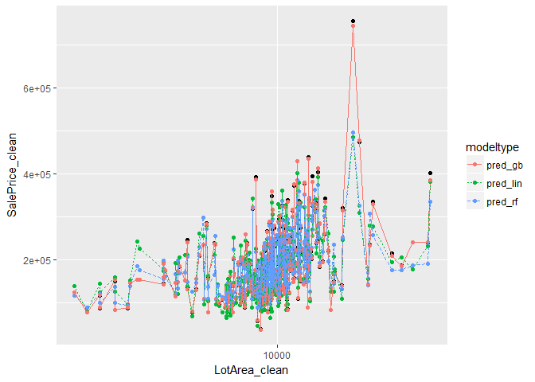

### Kaggle competetion

``` r
features_df <- data.frame(summary(model_lin)$coef[summary(model_lin)$coef[,4] <= .05, 4])
features <- row.names(features_df)[-1]
features_num <- features[features %in% colnames(num_df_0)]  
features_cat <- features[!features %in% features_num]
features_cat <- c("Neighborhood","RoofMatl","KitchenQual") # select the variables which have more than one level with p<0.05

df_lin <- house[,colnames(house)%in%c("SalePrice",features_num,features_cat)]

# train and test data are splited by Kaggle competetion: House Prices-Advanced Regression Techniques

# Use gp to create the training set: mpg_train (75% of data) and mpg_test (25% of data)
df_lin_train <-  read.csv('https://raw.githubusercontent.com/YunMai-SPS/DATA605_homework/master/data605_final_project/train.csv')
df_lin_test <- read.csv('https://raw.githubusercontent.com/YunMai-SPS/DATA605_homework/master/data605_final_project/test.csv')
```

#### Linear Regression Model

``` r
# Create  a vector of variable names
vars <-c("SalePrice",features_num,features_cat)
vars_test <-c("Id",features_num,features_cat)

# Create the treatment plan
treatplan <- designTreatmentsZ(df_lin_train, vars)
```

    ## [1] "designing treatments Thu Dec 28 00:02:23 2017"
    ## [1] "designing treatments Thu Dec 28 00:02:23 2017"
    ## [1] " have level statistics Thu Dec 28 00:02:23 2017"
    ## [1] "design var SalePrice Thu Dec 28 00:02:23 2017"
    ## [1] "design var Neighborhood Thu Dec 28 00:02:23 2017"
    ## [1] "design var RoofMatl Thu Dec 28 00:02:23 2017"
    ## [1] "design var KitchenQual Thu Dec 28 00:02:23 2017"
    ## [1] " scoring treatments Thu Dec 28 00:02:23 2017"
    ## [1] "have treatment plan Thu Dec 28 00:02:23 2017"

``` r
treatplan_test <- designTreatmentsZ(df_lin_test, vars_test)
```

    ## [1] "designing treatments Thu Dec 28 00:02:23 2017"
    ## [1] "designing treatments Thu Dec 28 00:02:23 2017"
    ## [1] " have level statistics Thu Dec 28 00:02:23 2017"
    ## [1] "design var Id Thu Dec 28 00:02:23 2017"
    ## [1] "design var Neighborhood Thu Dec 28 00:02:23 2017"
    ## [1] "design var RoofMatl Thu Dec 28 00:02:23 2017"
    ## [1] "design var KitchenQual Thu Dec 28 00:02:23 2017"
    ## [1] " scoring treatments Thu Dec 28 00:02:23 2017"
    ## [1] "have treatment plan Thu Dec 28 00:02:23 2017"

``` r
# Examine the scoreFrame
scoreFrame <- treatplan %>%
    use_series(scoreFrame) %>%
    dplyr::select(varName, origName, code)


# We only want the rows with codes "clean" or "lev"
newvars <- scoreFrame %>%
    filter(code %in% c("clean", "lev")) %>%
    use_series(varName)


# Use prepare() to one-hot-encode training data
trainframe.treat <- prepare(treatplan, df_lin_train, varRestriction = newvars)

# Examine the scoreFrame
scoreFrame_test <- treatplan_test %>%
    use_series(scoreFrame) %>%
    dplyr::select(varName, origName, code)


# We only want the rows with codes "clean" or "lev"
newvars_test <- scoreFrame_test %>%
    filter(code %in% c("clean", "lev")) %>%
    use_series(varName)

# Use prepare() to one-hot-encode testframe
testframe.treat <- prepare(treatplan_test, df_lin_test, varRestriction = newvars_test)


#Train a model using train data

# Create a formula to express cty as a function of hwy: fmla and print it.
fmla <- paste("SalePrice_clean", "~", paste(colnames(trainframe.treat)[-1], collapse = " + "))

# use lm() to build a model from df_lin_train 
model_lin <- lm(fmla,data=trainframe.treat)

# predict SalePrice from selected features(vars) for the training set
trainframe.treat$pred_lin <- predict(model_lin,trainframe.treat)
```

    ## Warning in predict.lm(model_lin, trainframe.treat): prediction from a rank-
    ## deficient fit may be misleading

``` r
# predict SalePrice from the selected features for the test set
testframe.treat$pred_lin <- predict(model_lin,testframe.treat)
```

    ## Warning in predict.lm(model_lin, testframe.treat): prediction from a rank-
    ## deficient fit may be misleading

``` r
# evaluate the RMSE on training data
trainframe.treat %>%
  mutate(residuals_lin = SalePrice_clean - pred_lin) %>%
  summarize(rmse_lin = sqrt(mean(residuals_lin^2)))
```

    ##   rmse_lin
    ## 1 48613.49

``` r
# examine how well the model fits the data
r2_lin <- glance(model_lin)$r.squared
cat("The R^2 for the training data with Random Forest model is ",r2_lin)
```

    ## The R^2 for the training data with Random Forest model is  0.6252813

``` r
resultsdf_lin <- testframe.treat[,c('Id_clean','pred_lin')]
colnames(resultsdf_lin) <- c('Id','SalePrice')
write.csv(resultsdf_lin,file='houseprice_linear.csv')
```

#### Random Forest Model

``` r
# Fit the random forest model
model_rf <- ranger(fmla, 
                    trainframe.treat, 
                    num.trees = 500, 
                    respect.unordered.factors = "order", 
                    seed = 123 )

#Predict SalePirce with the random forest model
trainframe.treat$pred_rf <- predict(model_rf, trainframe.treat)$predictions 
testframe.treat$pred_rf <- predict(model_rf, testframe.treat)$predictions 

# evaluate the RMSE on training data
trainframe.treat %>%
  mutate(residuals_rf = SalePrice_clean - pred_rf) %>%
  summarize(rmse_rf = sqrt(mean(residuals_rf^2)))
```

    ##    rmse_rf
    ## 1 47086.99

``` r
#examine how well the model fits the data: calculate R-squared: rsq.
slpr_mean <- mean(trainframe.treat$SalePrice_clean)
tss <- sum((trainframe.treat$SalePrice_clean - slpr_mean)^2)
rss <- sum((trainframe.treat$SalePrice_clean - trainframe.treat$pred_rf)^2)
rsq_rf <- 1-rss/tss
cat("R^2 for testing set with Random Forest model is ", rsq_rf)
```

    ## R^2 for testing set with Random Forest model is  0.6484448

``` r
resultsdf_rf <- testframe.treat[,c('Id_clean','pred_rf')]
colnames(resultsdf_rf) <- c('Id','SalePrice')
write.csv(resultsdf_rf,file='houseprice_RandomForest.csv')
```

#### Gradient Boost Model

``` r
#Find the right number of trees for a gradient boosting machine
cv <- xgb.cv(data = as.matrix(trainframe.treat),
             label = trainframe.treat$SalePrice_clean,
             nrounds = 100,
             nfold = 5,
             objective = "reg:linear",
             eta = 0.3,
             max_depth = 6,
             early_stopping_rounds = 10,
             verbose = 0    # silent
             )

# Get the evaluation log 
elog <- as.data.frame(cv$evaluation_log)

# Determine and print how many trees minimize training and test error
ntrees <- elog %>% 
  summarize(ntrees.train = which.min(elog$train_rmse_mean),
            ntrees.test  = which.min(elog$test_rmse_mean))  

#Fit an xgboost bike rental model and predict
model_gb <- xgboost(data = as.matrix(trainframe.treat),
                    label = trainframe.treat$SalePrice_clean, 
                    nrounds = ntrees[,'ntrees.train'],
                    objective =  "reg:linear", 
                    eta = 0.3,
                    depth = 6,
                    verbose = 0)


# Make predictions
trainframe.treat$pred_gb <- predict(model_gb, as.matrix(trainframe.treat))
testframe.treat$pred_gb <- predict(model_gb, as.matrix(testframe.treat))

#Evaluate the xgboost house SalePrice model

# Calculate RMSE
trainframe.treat %>%
  mutate(residuals_gb = SalePrice_clean - pred_gb) %>%
  summarize(rmse_gb = sqrt(mean(residuals_gb^2)))
```

    ##    rmse_gb
    ## 1 212.9439

``` r
#examine how well the model fits the data: calculate R-squared: rsq.
slpr_mean <- mean(trainframe.treat$SalePrice_clean)
tss <- sum((trainframe.treat$SalePrice_clean - slpr_mean)^2)
rss <- sum((trainframe.treat$SalePrice_clean - trainframe.treat$pred_gb)^2)
rsq_gb <- 1-rss/tss
cat("R^2 for testing set with Gradient Boost model is ", rsq_gb)
```

    ## R^2 for testing set with Gradient Boost model is  0.9999928

``` r
resultsdf_gb <- testframe.treat[,c('Id_clean','pred_gb')]
colnames(resultsdf_gb) <- c('Id','SalePrice')
write.csv(resultsdf_gb,file='houseprice_GradientBoost.csv')
```

    Kaggle Score
    Username: YunM
    Best Score: 0.16222


    

Summary
-------

In this project, a house price data set were used to study the probability, descriptive and inferential statistics, linear algebra and correlation, calculus-based probability & statistics and regression model.

In the part-2, I used three methods: linear regression, random forest, and gradient boost to build the regression model. First I tried to manually split the data into train and test in order to train the data set. But there were some levels of the categorical variables are rare and failed to show up in training data but only appeared in the testing data. This crashed the linear regression model. So I used the vtreat package to one-hot-encode the data. To deal with this issue, I used vtreat for one-hot-encoding as it can manage novel levels safely. It is a bonus find that vtreat also manages missing values in the data (both categorical and continuous).

The Box-Cox transformations in part 1 suggested that log-logistic distribution fit the input variable(LotArea) best. Because I wanted to build a multivariate regression, I plotted the variables to see which variables are non-linear and therefore need to transform. OverallQual seems to be non-linear but the trend is not very strong, so I did not do transform it. The variables with the p-value less than 0.05 in the linear regression model were selected as features or inputs.

For the three models, Gradient Boost showed the lowest RMSE and the highest R square, 0.99 and Linear Regression showed the highest RMSE and the lowest R square, 0.82. The performance of the Random Forest model was between above mentioned two models. But one thing I did not understand was that the predicted sale prices by the Gradient Boost model for the test set from Kaggle were 1/10 of those predicted by the other two models. There must be something needed to be adjusted.
